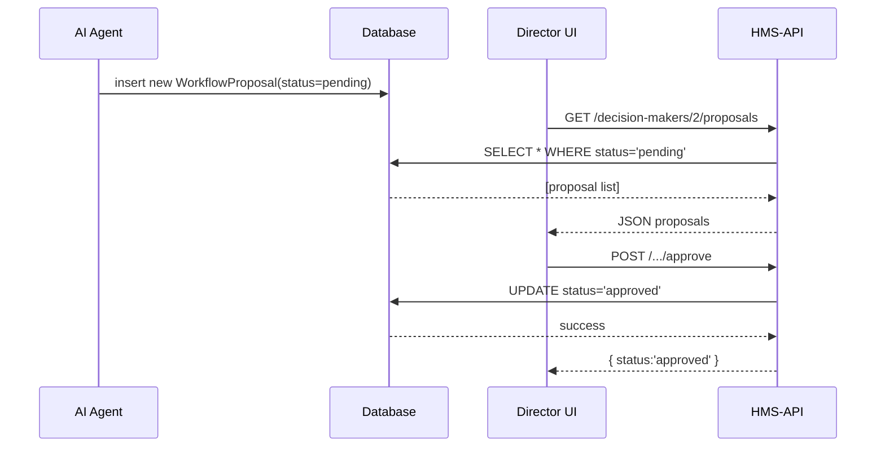

# Chapter 9: Human Decision Maker

In [Chapter 8: Governance Layer](08_governance_layer_.md) we added policies and audit logs around every change. Now we’ll introduce the **Human Decision Maker**—a real person who reviews, approves, or overrides the AI’s suggestions before anything goes live.

---

## Why a Human Decision Maker?

Imagine the National Institute of Justice (NIJ) AI Agent proposes a faster way to handle grant applications. Before rolling it out, a department director must review and sign off on that change. This is the **Human Decision Maker**—an official or manager assigned to:

- Review AI-generated **Workflow Proposals**  
- Approve safe, ethical changes  
- Override or send back suggestions that need revision  

**Central Use Case**  
> The AI Agent suggests “Run background check in parallel with eligibility check.” The NIJ Director logs in, reviews the proposal, and then either:
> 1. Approves it so it’s deployed  
> 2. Rejects it with comments (“Need legal review first”)  

---

## Key Concepts

1. **Decision Maker Model**  
   Represents the official who signs off.  

2. **Proposal Assignment**  
   Each `WorkflowProposal` is linked to one Decision Maker.  

3. **Review Status**  
   Tracks whether a proposal is `pending`, `approved`, or `rejected`.

4. **Approve vs. Override**  
   - *Approve*: Accept the AI’s change  
   - *Override*: Block or modify the suggestion  

---

## Quick Start: Reviewing Proposals

1. Register routes in `routes/api.php`:

   ```php
   Route::get(
     'decision-makers/{id}/proposals',
     [HumanDecisionMakerController::class, 'list']
   );
   Route::post(
     'decision-makers/{id}/proposals/{pid}/approve',
     [HumanDecisionMakerController::class, 'approve']
   );
   Route::post(
     'decision-makers/{id}/proposals/{pid}/reject',
     [HumanDecisionMakerController::class, 'reject']
   );
   ```

   *Explanation:* We expose three endpoints: list pending proposals, approve one, and reject one.

2. Fetch pending proposals:

   ```
   GET /api/decision-makers/2/proposals
   → [
     { "id":5, "action":"parallelize_review", "detail": "...", "status":"pending" },
     …
   ]
   ```

3. Approve a proposal:

   ```
   POST /api/decision-makers/2/proposals/5/approve
   → { "id":5, "status":"approved" }
   ```

4. Reject with a comment:

   ```
   POST /api/decision-makers/2/proposals/5/reject
   Body: { "comment":"Need legal review" }
   → { "id":5, "status":"rejected", "comment":"Need legal review" }
   ```

---

## What Happens Step-by-Step



1. The AI Agent creates pending proposals in the database.  
2. The Decision Maker’s UI fetches all pending proposals.  
3. The Director approves or rejects a proposal via the API.  
4. The API updates the proposal’s status.

---

## Under the Hood: Core Code

### Decision Maker Model

```php
// app/Models/Governance/HumanDecisionMaker.php
namespace App\Models\Governance;

use Illuminate\Database\Eloquent\Model;

class HumanDecisionMaker extends Model
{
    protected $fillable = ['name','email','department'];
    public function proposals()
    {
        return $this->hasMany(
          \App\Models\WorkflowProposal::class,
          'decision_maker_id'
        );
    }
}
```

*Explanation:* Defines a `HumanDecisionMaker` with a one-to-many link to `WorkflowProposal`.

### Controller Methods

```php
// app/Http/Controllers/HumanDecisionMakerController.php
namespace App\Http\Controllers;

use App\Models\Governance\HumanDecisionMaker;
use Illuminate\Http\Request;

class HumanDecisionMakerController extends Controller
{
    public function list($id)
    {
        return HumanDecisionMaker::findOrFail($id)
            ->proposals()
            ->where('status','pending')
            ->get();
    }

    public function approve($id, $pid)
    {
        $p = HumanDecisionMaker::find($id)
            ->proposals()->findOrFail($pid);
        $p->update(['status'=>'approved']);
        return $p;
    }

    public function reject(Request $req, $id, $pid)
    {
        $p = HumanDecisionMaker::find($id)
            ->proposals()->findOrFail($pid);
        $p->update([
          'status'=>'rejected',
          'comment'=>$req->input('comment')
        ]);
        return $p;
    }
}
```

*Explanation:*  
- `list()`: returns pending proposals for that Decision Maker.  
- `approve()`: marks a proposal approved.  
- `reject()`: marks it rejected and saves a comment.

---

## Recap

In this chapter you learned:

- **What** a Human Decision Maker is: an official who signs off on AI-generated proposals.  
- **Key concepts**: the Decision Maker model, proposal assignment, status transitions.  
- **How** to list, approve, and reject proposals via simple API endpoints.  
- **What’s under the hood**: model relationships and controller logic.

Next up, we’ll see how to build a full **Human-in-the-Loop Override** flow where humans can step in at any point.  
[Next Chapter: Human-in-the-Loop Override](10_human_in_the_loop_override_.md)

---

Generated by [AI Codebase Knowledge Builder](https://github.com/The-Pocket/Tutorial-Codebase-Knowledge)