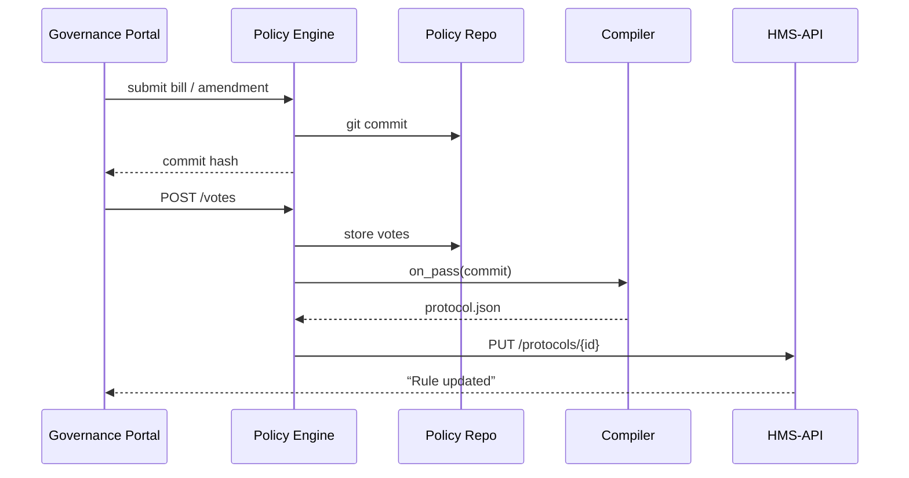

# Chapter 9: Policy Engine (HMS-CDF)


[← Back to “Activity Orchestrator (HMS-ACT)”](08_activity_orchestrator__hms_act__.md)

---

## 1. Why Do We Need a “GitHub for Laws”? – A 2-Minute Story  

The **Tennessee Valley Authority (TVA)** wants to raise the income cap for its *Low-Cost Electricity Rebate* from **$55 000 → $65 000**.

Today that means:

1. A policy officer edits a Word doc.  
2. Ten other offices reply with redlines.  
3. Somebody merges the edits by hand.  
4. IT staff update dozens of rule engines—months later.

Result: legislators, auditors, and citizens all see **different** rules.

**Policy Engine (HMS-CDF)** turns policy text into **version-controlled code**:

```
Bill (draft) ➜ Amendments ➜ Roll-Call Vote ➜ “git commit” ➜ Compiled Protocol
```

By treating each change like a Git branch, every agency computer—and every human—reads **the same single source of truth**.

---

## 2. Quick Glossary (Plain English)

| Term            | Think of it as…                                           |
|-----------------|-----------------------------------------------------------|
| Bill            | The *initial* proposal (e.g., “raise cap to \$65 000”).    |
| Amendment       | A line-by-line edit to the Bill.                          |
| Roll-Call Vote  | List of “yea / nay”—decides which version wins.           |
| Commit Hash     | A unique ID like in Git (`cafebabe42`).                   |
| Compiled Protocol | Machine-ready rule file used by HMS-API services.       |

If you can follow a pull request in GitHub, you already understand CDF!

---

## 3. First Hands-On: Raising the TVA Cap in 14 Lines  

Create a file `raise_cap.bill`:

```toml
# raise_cap.bill (14 ≤ lines)
title = "Increase Rebate Income Cap"
program = "Low-Cost Electricity Rebate"
summary = "Raise household income cap from $55k to $65k."
changes = [
  { field = "income_cap", from = 55000, to = 65000 }
]
sponsor = "Rep. Jones"
```

Now compile & stage it:

```bash
# one-liner CLI (ships with HMS-CDF docker image)
cdf submit raise_cap.bill
```

CLI output:

```
✔ Parsed Bill
✔ Created commit cafebabe42
✔ Waiting for amendments & vote (status=pending)
```

What you did:

1. Wrote policy in **structured text**.  
2. The engine stored it under commit `cafebabe42`.  
3. Everyone else can now file amendments **against the same hash**—no e-mail clutter.

---

## 4. Adding an Amendment (8 Lines)

Jane from NIDCR thinks \$60 000 is safer. She creates `limit_fix.amend`:

```toml
parent = "cafebabe42"
summary = "Lower cap to 60k for fiscal prudence."
change  = { field = "income_cap", to = 60000 }
author  = "Rep. Smith"
```

```bash
cdf amend limit_fix.amend
```

Output shows a new branch:

```
✔ Amendment stored as 1f00ba11 (parent cafebabe42)
```

---

## 5. Seeing the Family Tree

```bash
cdf log --graph
```

```
* 1f00ba11 Amend: Lower cap to 60k  (pending vote)
|\
| * cafebabe42 Bill: Raise cap to 65k (pending vote)
* 00000000 main
```

Colored graph = Git for laws.  

---

## 6. Holding a Roll-Call Vote (Simulated)

For the demo we’ll cast 3 votes—2 for the amendment, 1 against.

```bash
cdf vote 1f00ba11 --yea  "Rep. Smith"
cdf vote 1f00ba11 --yea  "Rep. Clark"
cdf vote 1f00ba11 --nay  "Rep. Jones"
```

Check status:

```bash
cdf status 1f00ba11
```

Result:

```
Votes: 2 yea / 1 nay  ➜ PASSED
```

---

## 7. Auto-Compile to a Protocol

The engine triggers automatically:

```text
1f00ba11 (PASSED) ➜    compiles to ➜    protocol_tva_income_cap_v3.json
```

Inside `protocol_tva_income_cap_v3.json` lives:

```json
{
  "program": "Low-Cost Electricity Rebate",
  "rule":    {"income_cap": 60000},
  "effective_date": "2024-07-01"
}
```

That file flows directly into:

* [Program Registry](01_program_registry__program_model__.md) – updates program metadata.  
* [HMS-ACT](08_activity_orchestrator__hms_act__.md) – schedules new SLA reminders.  
* [Compliance Reasoner](10_compliance_reasoner__hms_esq__.md) – validates future applications.

No human had to re-type “\$60 000” anywhere!

---

## 8. What Happens Under the Hood? (10-Step Visual)



Only **five** actors; easy to audit.

---

## 9. Peeking Inside the Rust Code (Never >15 Lines)

### 9.1  Core Structs

```rust
// src/model.rs  (under 15 lines)
#[derive(Serialize, Deserialize)]
pub struct Bill {
    pub title: String,
    pub program: String,
    pub changes: Vec<Change>,
    pub sponsor: String,
}

#[derive(Serialize, Deserialize)]
pub struct Change {
    pub field: String,
    pub from: Option<Value>,
    pub to:   Value,
}
```

Beginners note: these structs map 1-to-1 with the `.bill` TOML keys.

---

### 9.2  Tiny Compiler Function

```rust
// src/compile.rs (≃ 18 lines)
pub fn compile(commit: &Commit) -> Protocol {
    let bill: Bill = toml::from_str(&commit.content).unwrap();

    // only one change for demo
    let change = &bill.changes[0];

    Protocol {
        program: bill.program,
        rule: json!({ change.field.clone(): change.to.clone() }),
        effective_date: Utc::now().date_naive(),
    }
}
```

• Reads TOML → Rust struct → JSON protocol.  
• Real code validates types, but the concept is identical.

---

## 10. Where Does CDF Fit With Other Chapters?

| Task                           | Who Handles It | Chapter Link |
|--------------------------------|----------------|--------------|
| Store the compiled JSON        | Program & Protocol DB | [Protocol Blueprint](02_protocol_blueprint__protocol_model__.md) |
| Show redline diff to humans    | Governance Portal | [Governance Portal](04_governance_portal__hms_gov_interface__.md) |
| Run SLA timers on effective date | Activity Orchestrator | [Activity Orchestrator](08_activity_orchestrator__hms_act__.md) |
| Check incoming applications    | Compliance Reasoner | [Compliance Reasoner](10_compliance_reasoner__hms_esq__.md) |

Everything begins with a **commit hash** —the barcode on every rule.

---

## 11. Hands-On Exercise (15 min)

1. Run the dockerized engine:

   ```bash
   docker run --rm -v $PWD:/data hms/cdf:latest
   ```

2. Re-play the Bill → Amendment → Vote flow above.  
3. Locate the generated `protocol_*.json` under `./data/build/`.  
4. Open it—confirm the income cap is \$60 000.  
5. Call the mock API to see it live:

   ```bash
   curl http://localhost:9000/programs/lowcost-electricity | jq .rules.income_cap
   # → 60000
   ```

You just legislated—without a single committee hearing!

---

## 12. Government Analogy Cheat-Sheet

• Git commit = **Clerk stamps a page into the Congressional Record**  
• Amendment branch = **Senator’s handwritten margin note**  
• Roll-Call vote = **Counting hands on the chamber floor**  
• Compiler = **Office of the Federal Register** formatting the law book  
• Protocol JSON = **Official CFR page** every agency must obey  

---

## 13. What You Learned

✔ Why treating policy text like version-controlled code removes ambiguity.  
✔ How Bills, Amendments, and Votes flow into a **single commit hash**.  
✔ How the Rust compiler turns human text into machine-executable Protocols.  
✔ Where CDF plugs into the wider HMS-API ecosystem.

Ready to find out **whether incoming citizen requests actually comply with these freshly-baked rules**?  
Continue to [Compliance Reasoner (HMS-ESQ)](10_compliance_reasoner__hms_esq__.md)  

---

---

Generated by [AI Codebase Knowledge Builder](https://github.com/The-Pocket/Tutorial-Codebase-Knowledge)