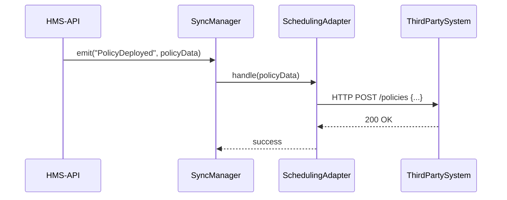

# Chapter 10: External System Sync

Welcome back! In [Chapter 9: Governance Module](09_governance_module_.md), you learned how HMS-API audits and approves every change. Now that policies are live, we need to **notify** other systems—like scheduling tools or data warehouses—so everyone stays up to date. That’s where **External System Sync** comes in.

## Why External System Sync Matters

Imagine the Federal Emergency Management Agency (FEMA) updates its “Disaster Relief Grant” eligibility. Grant‐processing platforms, state dashboards, and reporting tools all need the new rules **right away**. Without a sync layer, each system would work from stale data—causing confusion and delays.

**External System Sync** provides a set of adapters and connectors that:

- Listen for events in HMS (e.g., new policy deployed)  
- Transform HMS data into the format third‐party APIs expect  
- Push updates in real time, with retries and error handling  

It’s like a digital interagency mailroom that forwards each new policy to every partner agency as soon as it’s signed into law.

## Key Concepts

1. **Event Emitter**  
   HMS-API fires events when core actions happen (e.g., `PolicyDeployed`, `ProgramUpdated`).

2. **Sync Adapter**  
   A small module that knows how to talk to one external system. It implements a common interface.

3. **Sync Manager**  
   Central service that picks the right adapters for each event and invokes them.

4. **Retry & Error Handling**  
   If a push fails (e.g., network down), adapters can retry or log failures for later review.

5. **Configuration**  
   A simple config file lists which adapters are active and their credentials.

---

## Using External System Sync

Below is a minimal example showing how to register an adapter and trigger a sync after deploying a policy.

```php
use App\Services\SyncManager;
use App\Adapters\SchedulingPlatformAdapter;

// 1. Register our adapter (once at startup)
SyncManager::registerAdapter(new SchedulingPlatformAdapter([
  'api_key'    => 'SCHED-1234',
  'endpoint'   => 'https://scheduling.agency.gov/api/sync'
]));

// 2. After policy deployment, fire the event
$policy = PolicyDeploymentService::deploy($request);
SyncManager::emit('PolicyDeployed', $policy->toArray());
```

Explanation:  
- We register a `SchedulingPlatformAdapter` with its credentials.  
- When a `PolicyDeployed` event occurs, `SyncManager` calls each adapter’s `handle()` method, passing the policy data.

---

## High-Level Flow

Here’s what happens when HMS-API deploys a policy and syncs it out:



1. **HMS-API** emits an event with the policy payload.  
2. **SyncManager** finds all adapters for `PolicyDeployed`.  
3. Each adapter transforms and sends the data to its target.  
4. The third-party system acknowledges receipt.  

---

## Under the Hood: Implementation

### 1. Configuration

File: `config/sync.php`

```php
return [
  'adapters' => [
    // List adapter class names to load
    \App\Adapters\SchedulingPlatformAdapter::class,
    \App\Adapters\DataWarehouseAdapter::class,
  ],
];
```

This simple file tells `SyncManager` which adapters to bootstrap.

### 2. SyncManager

File: `app/Services/SyncManager.php`

```php
<?php
namespace App\Services;

class SyncManager
{
    protected static $adapters = [];

    public static function registerAdapter($adapter)
    {
        static::$adapters[] = $adapter;
    }

    // Called by framework bootstrapping
    public static function loadConfigAdapters()
    {
        $classes = config('sync.adapters');
        foreach ($classes as $class) {
            static::registerAdapter(new $class());
        }
    }

    public static function emit(string $event, array $data)
    {
        foreach (static::$adapters as $adapter) {
            if ($adapter->supports($event)) {
                $adapter->handle($event, $data);
            }
        }
    }
}
```

- `registerAdapter()`: adds an adapter instance.  
- `loadConfigAdapters()`: reads `config/sync.php` and registers each one.  
- `emit()`: for a given event, finds adapters that `supports()` it and calls `handle()`.

### 3. SyncAdapter Interface

File: `app/Adapters/SyncAdapterInterface.php`

```php
<?php
namespace App\Adapters;

interface SyncAdapterInterface
{
    // Does this adapter handle the given event name?
    public function supports(string $event): bool;

    // Sends the data to the external system
    public function handle(string $event, array $data): void;
}
```

Every adapter implements these two methods.

### 4. Example Adapter

File: `app/Adapters/SchedulingPlatformAdapter.php`

```php
<?php
namespace App\Adapters;

use Illuminate\Support\Facades\Http;

class SchedulingPlatformAdapter implements SyncAdapterInterface
{
    protected $endpoint, $apiKey;

    public function __construct(array $config = [])
    {
        $this->endpoint = $config['endpoint'] ?? env('SCHED_ENDPOINT');
        $this->apiKey   = $config['api_key'] ?? env('SCHED_API_KEY');
    }

    public function supports(string $event): bool
    {
        return $event === 'PolicyDeployed';
    }

    public function handle(string $event, array $data): void
    {
        // Transform HMS fields into the scheduling API format
        $payload = [
          'policy_id'   => $data['id'],
          'title'       => $data['name'],
          'effective'   => $data['effective_date'],
        ];

        // Fire the HTTP request, retry on failure
        Http::withToken($this->apiKey)
            ->retry(3, 100)                  // retry up to 3 times
            ->post("{$this->endpoint}/policies", $payload);
    }
}
```

- `supports()`: only handles `PolicyDeployed`.  
- `handle()`: maps HMS data into the external format and POSTS it, with simple retry logic.

---

## Real-World Analogy

Think of HMS-API as the Pentagon’s press office. Whenever a new directive is issued:

1. The press office types up a memo (event payload).  
2. They have a list of partner agencies (adapters).  
3. Each partner desk “subscribes” to certain memos and mails them to their press corps.  
4. If a letter fails to deliver, they try again or log an error.

**External System Sync** works the same way for digital policy updates.

---

## Conclusion

In this chapter you learned how to:

- Configure and register **Sync Adapters** in `config/sync.php`  
- Use the **SyncManager** to emit events and call adapters  
- Build a simple **SyncAdapterInterface** and example adapter for a scheduling platform  
- Ensure reliable delivery with retries and transformations  

Now that external systems see your live policies automatically, we’ll move on to building the user‐facing side: the [Frontend Interface](11_frontend_interface.md) in the next chapter.

---

Generated by [AI Codebase Knowledge Builder](https://github.com/The-Pocket/Tutorial-Codebase-Knowledge)