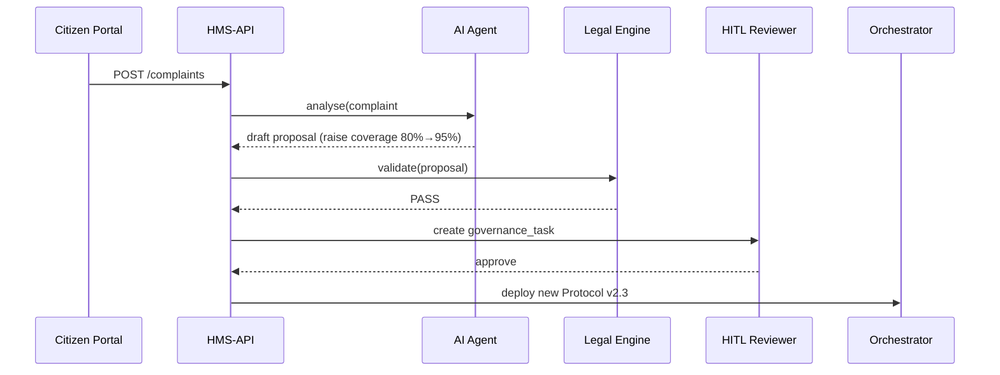

# Chapter 10: Policy Proposal Pipeline

*(Just finished reading about the legal-safety net in [Compliance & Legal Reasoning Engine (HMS-ESQ)](09_compliance___legal_reasoning_engine__hms_esq__.md)?  
Great—now let’s see **how every moving piece you’ve met so far clicks together into one “conveyor belt” that turns a citizen’s complaint into a safely-deployed policy change!)*  

---

## 1. Motivation – “From Complaint → Law-Compliant Fix … in Days, Not Months”

### Real-World Story  
1. A parent files a **safety complaint** on the National Highway Traffic Safety Administration (NHTSA) portal:  
   “The rear seat-belt sensor in Model-Z cars fails when a child booster seat is used.”  
2. NHTSA wants to **raise the mandatory test-coverage threshold** in its inspection Protocol from **80 % → 95 %**—ASAP.  
3. Doing that the old way means:  
   * Manual data crunching  
   * Weeks of legal paperwork  
   * Endless email threads for approval  
4. With HMS-API, one **Policy Proposal Pipeline** takes the complaint, runs AI analysis, checks the law, routes for human sign-off, and deploys the new Protocol—sometimes the **same day**.

> Analogy: Picture a **mail-sorting conveyor** at the U.S. Postal Service: letter comes in one end, gets stamped, sorted, and lands in the right truck—all without anyone losing track of it.  
> The **Policy Proposal Pipeline** is that conveyor for rule changes.

---

## 2. Key Concepts (One-Sentence Definitions)

| Word | Think “mail-belt” part |
|------|-----------------------|
| **Intake** | Slot where complaints/ideas are dropped in |
| **Draft Proposal** | AI-generated suggested change |
| **Legal Vet** | HMS-ESQ rubber-stamp station |
| **HITL Review** | Human supervisor can pause/modify |
| **Roll-Out** | HMS-ACT publishes the new Protocol |
| **Trace File** | Immutable log of every belt movement |

We will walk every parcel (proposal) through these five stops.

---

## 3. Quick Peek – End-to-End Flow (High-Level)



One belt, six hands-offs, 100 % traceable.

---

## 4. Hands-On: Submitting & Watching a Proposal

### 4.1 A Citizen Files the Complaint (8 lines)

```bash
curl -X POST https://api.hms.gov/complaints \
     -H "Content-Type: application/json" \
     -d '{"program_id":12,"summary":"Seat-belt sensor fails with booster"}'
```

Returns:

```json
{ "complaint_id": 99, "status": "received" }
```

*Friendly explanation* – This simply drops a card in the “Intake” slot.

---

### 4.2 AI Generates a Draft Proposal (Admin or Cron, 15 lines)

```bash
curl -X POST https://api.hms.gov/pipeline/propose \
     -H "Authorization: Bearer $ADMIN_JWT" \
     -H "Content-Type: application/json" \
     -d '{ "complaint_id": 99 }'
```

Response:

```json
{
  "proposal_id": 502,
  "status": "drafted",
  "suggestion": {
    "protocol_id": 7,
    "field": "tasks[2].coverageThreshold",
    "old": 0.80,
    "new": 0.95
  }
}
```

What just happened?  
* HMS-AGT read historical failure rates and drafted the change.  
* Belt moves parcel to the **Legal Vet** station.

---

### 4.3 View Legal Findings (10 lines)

```bash
curl https://api.hms.gov/pipeline/proposals/502/findings
```

Returns (if all good):

```json
{ "status": "pass", "findings": [] }
```

Or returns blocking findings like the example in the previous chapter.

---

### 4.4 Human Approval in GOV Portal (React snippet, 18 lines)

```jsx
function ApproveCard({p, jwt}) {
  const ok = () => fetch(`/api/pipeline/proposals/${p.id}/approve`, {
      method:'POST', headers:{Authorization:`Bearer ${jwt}`}
  });
  return (
    <div>
      <h3>Proposal #{p.id}</h3>
      <p>Raise coverage to 95 %</p>
      <button onClick={ok}>Approve & Deploy</button>
    </div>
  );
}
```

Pressing the button:

1. Closes the **HITL Review** station.  
2. Parcel zooms to **Roll-Out**.

---

### 4.5 Publish & Verify (8 lines)

```bash
curl https://api.hms.gov/protocols/7   # after a few seconds
```

```json
{ "version":"2.3", "coverageThreshold":0.95 }
```

Success! NHTSA’s inspection Protocol is live.

---

## 5. What Happens Under the Hood?

### 5.1 Belt Mechanics Step-by-Step

1. **complaints** table stores the citizen’s issue.  
2. `ProposerJob` pulls unprocessed complaints → calls HMS-AGT.  
3. `proposals` table gets a new row with *status=drafted*.  
4. Model event triggers HMS-ESQ validation; findings saved to `legal_dossiers`.  
5. If **PASS**, a `gov_tasks` row appears for officers.  
6. Officer approval triggers `DeployJob` which:  
   * Creates new Protocol version  
   * Signals HMS-ACT to start rollout  
7. `trace_files` row accumulates every timestamp, user, and diff.

### 5.2 File Layout (trimmed)

```
app/
├─ Jobs/
│  ├─ ProposerJob.php       # step 2
│  └─ DeployJob.php         # step 6
├─ Models/
│  ├─ Complaint.php
│  ├─ Proposal.php
│  └─ TraceFile.php
└─ Http/Controllers/
    └─ PipelineController.php   # routes above
```

### 5.3 12-Line DeployJob Snippet

```php
class DeployJob implements ShouldQueue {
  public function handle(Proposal $p){
      // 1. Create new Protocol version
      $proto = Protocol::find($p->protocol_id);
      $proto->definition['tasks'][2]['coverageThreshold']=0.95;
      $proto->version = '2.3';
      $proto->save();

      // 2. Kick HMS-ACT
      ActFacade::deployProtocol($proto);

      // 3. Stamp trace
      TraceFile::log($p->id,'deployed',now());
  }
}
```

Read-through: straight, boring CRUD + one facade call—easy for beginners.

---

## 6. How Each Earlier Chapter Shows Up on the Belt

| Belt Station | Powered By | Chapter |
|--------------|-----------|---------|
| Intake | `complaints` endpoint | [Backend API Gateway](03_backend_api_gateway__hms_api___hms_svc__.md) |
| Draft Proposal | HMS-AGT | [AI Representative Agent](06_ai_representative_agent__hms_agt___hms_agx__.md) |
| Legal Vet | HMS-ESQ | [Compliance & Legal Reasoning Engine](09_compliance___legal_reasoning_engine__hms_esq__.md) |
| HITL Review | GOV Portal + Override Flow | [Human-In-The-Loop](08_human_in_the_loop__hitl__override_flow_.md) |
| Roll-Out | HMS-ACT | [Agent Action Orchestration](07_agent_action_orchestration__hms_act__.md) |
| Trace File | Central DB | **Next Chapter!** |

Every parcel hits every station—no shortcuts, no mystery steps.

---

## 7. Best-Practice Checklist

1. **Small Diffs Only** – Proposals limited to one Protocol field → easy to reason about.  
2. **Timeouts** – If GOV officers don’t act in *X* days, auto-queue a reminder.  
3. **Immutable Trace** – Store SHA-256 hash of each Trace File row nightly in S3.  
4. **Public Dashboard** – Number of proposals, approvals, overrides—fed into [Metrics & Monitoring](12_metrics___monitoring__hms_ops__.md).  
5. **Citizen Feedback Loop** – When a complaint drives a successful change, auto-email the citizen (“Thank you! Fix deployed.”).

---

## 8. Recap & What’s Next

You learned how the **Policy Proposal Pipeline**:

* Links every abstraction you’ve studied into a single conveyor belt.  
* Starts at a citizen’s complaint and ends in a live, legally-compliant Protocol update.  
* Maintains transparency through immutable Trace Files.

Curious where those Trace Files—and every other record—are actually stored, queried, and backed up?  
Let’s open the vault in [Central Data Repository (HMS-DTA)](11_central_data_repository__hms_dta__.md).

---

Generated by [AI Codebase Knowledge Builder](https://github.com/The-Pocket/Tutorial-Codebase-Knowledge)