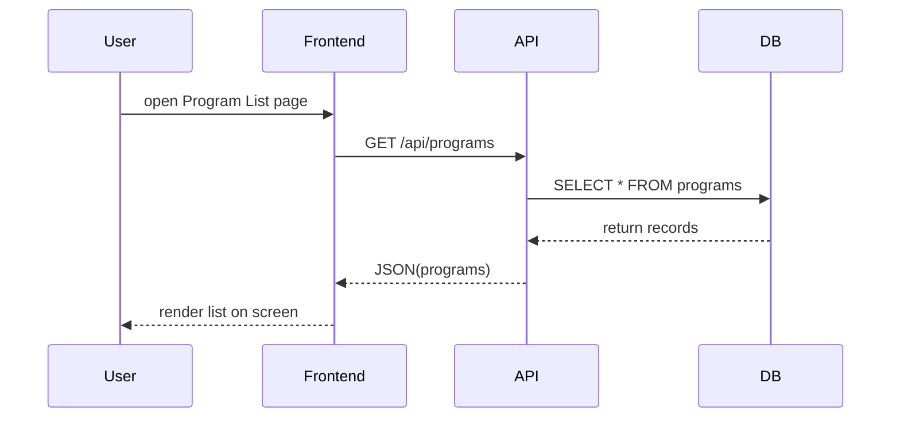

# Chapter 11: Frontend Interface

In [Chapter 10: External System Sync](10_external_system_sync_.md), we saw how HMS-API notifies external systems when policies go live. Now we’ll build the **Frontend Interface**—the user-facing web or mobile apps (like **HMS-MFE** for citizens or **HMS-GOV** for administrators) where people actually interact with Programs, Protocols, and applications.

---

## Why a Frontend Interface Matters

Central Use Case  
A citizen wants to apply for the new “Electric Bus Grant.” They open the **HMS-MFE** web portal, see a list of open programs, fill out the application form, and submit. Behind the scenes the portal:

1. Fetches program data from HMS-API  
2. Renders an online form for the citizen  
3. Sends the filled form back to the API  
4. Shows status updates (submitted, under review, approved)

Without a frontend, all those API calls would be hidden behind the curtain—nobody could actually apply!

---

## Key Concepts

1. Pages & Components  
   - A **page** is a full screen (e.g., Program List, Application Form).  
   - A **component** is a reusable widget (e.g., ProgramCard, InputField).

2. API Service  
   A small module that wraps calls to HMS-API (GET /programs, POST /applications).

3. State Management  
   Keeping fetched data (programs, form inputs) in memory so the UI updates when data arrives.

4. Forms & Validation  
   Building HTML forms with inputs, then checking required fields before sending to the API.

---

## Building a Simple Program List

Let’s create a minimal React app page that lists all Programs.

1. Create an API service:  
   File: `src/api/programs.js`

   ```js
   // Wraps the GET /programs call
   export async function fetchPrograms() {
     const res = await fetch('/api/programs', {
       headers: { 'Authorization': 'Bearer TOKEN' }
     });
     return res.json(); // returns an array of {id, name, description}
   }
   ```

   This helper hides the fetch details and returns JSON data.

2. Make a ProgramList component:  
   File: `src/components/ProgramList.js`

   ```js
   import React, { useState, useEffect } from 'react';
   import { fetchPrograms } from '../api/programs';

   function ProgramList() {
     const [programs, setPrograms] = useState([]);

     useEffect(() => {
       fetchPrograms().then(data => setPrograms(data));
     }, []);

     return (
       <ul>
         {programs.map(p =>
           <li key={p.id}>{p.name}</li>
         )}
       </ul>
     );
   }

   export default ProgramList;
   ```

   We call `fetchPrograms()` once on load and display each program’s name in a list.

3. Render it in your App:  
   File: `src/App.js`

   ```js
   import React from 'react';
   import ProgramList from './components/ProgramList';

   function App() {
     return (
       <div>
         <h1>Open Programs</h1>
         <ProgramList />
       </div>
     );
   }

   export default App;
   ```

   Now when you run `npm start`, you’ll see a header and the list of programs from HMS.

---

## What Happens Under the Hood



1. The browser loads your React app.  
2. `ProgramList` calls HMS-API to fetch programs.  
3. HMS-API queries the database and returns JSON.  
4. The component updates its state and re-renders the list.

---

## Digging Deeper: File Structure

A typical minimal frontend might look like:

```
src/
 ├─ api/
 │   └─ programs.js       # wrappers for all API calls
 ├─ components/
 │   ├─ ProgramList.js    # list view
 │   └─ ProgramForm.js    # application form (next)
 └─ App.js                # main entry point
```

Later you’d add `ProgramForm.js` to let citizens submit applications:

```js
// handle form inputs, then POST to /api/applications
fetch('/api/applications', { method:'POST', body: JSON.stringify(data) })
```

And you’d reuse your API module to keep things consistent.

---

## Real-World Analogy

Think of the **Frontend Interface** as the customer-service counter at City Hall:

- The **window** (page) shows you what services are open (ProgramList).  
- You fill out a **form** (ProgramForm) with your info.  
- The clerk (API service) checks your input, stamps it, and gives you a receipt.  
- You watch a **dashboard** screen to see status updates on your request.

---

## Conclusion

In this chapter you learned how to:

- Structure a simple frontend for HMS-API using **pages** and **components**  
- Wrap API calls in a clean **service module**  
- Manage **state** in React to fetch and display data  
- Glue everything together in `App.js`  

Next up, we’ll collect and process user feedback through the [Stakeholder Feedback](12_stakeholder_feedback_.md) module—making sure the frontend captures citizen comments and sends them back into our system.

---

Generated by [AI Codebase Knowledge Builder](https://github.com/The-Pocket/Tutorial-Codebase-Knowledge)