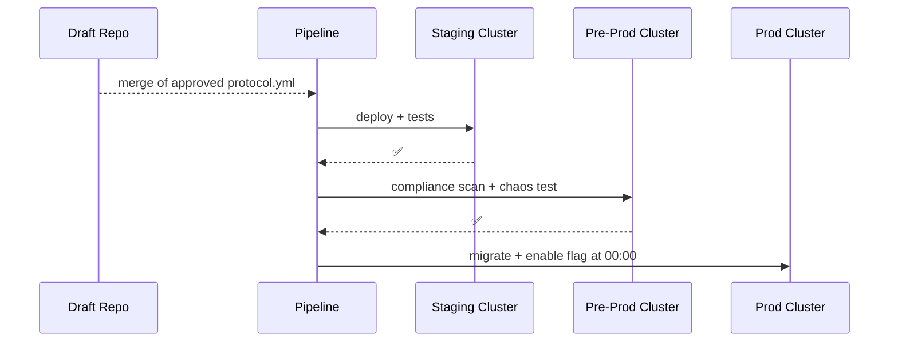

# Chapter 11: Policy Deployment Pipeline
[⬅︎ Back to Chapter 10: Human-in-the-Loop Governance (HITL)](10_human_in_the_loop_governance__hitl__.md)

---

## 1. Why do we need a “Policy Deployment Pipeline”?

Picture the Medicaid and CHIP Payment and Access Commission (MACPAC) approving a **new income cap** for children’s CHIP coverage.  
Everybody expects the rule to become enforceable **tonight at 12:01 AM**, but:

* Developers still have yesterday’s code in **staging**.  
* Security wants a **privacy scan** before anything touches production.  
* Operations must prove a **rollback script** exists.  

The **Policy Deployment Pipeline** is the CI/CD-style conveyor belt that:

1. **Packages** the approved Protocol (from HITL).  
2. **Tests & scans** it in isolated clusters.  
3. **Migrates** the change through *staging → pre-prod → prod*.  
4. **Publishes** the final version—digital twin of the Federal Register hitting the streets.

Beginners can think of it as the **“Printing Press & Delivery Trucks”** for policy.

---

## 2. High-level Flow (5 actors, 10 seconds)



If any step fails, PIPE runs `rollback.sh` and stops.

---

## 3. Key Concepts (plain English)

| Term              | What it really means                               | Analogy                        |
|-------------------|----------------------------------------------------|--------------------------------|
| Build Stage       | Bundle Protocol + version metadata                 | Printing the rule book         |
| Compliance Scan   | Privacy + ethics linters                           | Legal counsel review           |
| Chaos Test        | Inject random faults to prove stability            | Fire drill in the agency       |
| Promotion Gate    | Only passes if *all* checks green (🔒)             | Clerk’s stamp “Approved”       |
| Rollback Script   | One-click revert to previous version               | “Recall all copies” order      |

Keep these five in mind; the rest is just wiring.

---

## 4. A Tiny Pipeline File (YAML, 19 lines)

```yaml
# .hms-ci/policy-pipeline.yml
stages: [build, test, compliance, chaos, deploy]

build:
  script: hms policy pack protocol.yml --out pkg.tgz

test:
  script: hms policy test pkg.tgz                # unit + integration

compliance:
  script: hms scan pkg.tgz --rules privacy,ethics

chaos:
  script: hms chaos run --target staging --time 5m

deploy:
  script: hms promote pkg.tgz --targets staging,preprod,prod \
          --rollback rollback.sh --schedule "00:00"
```

Explanation  
1. **build** bundles the YAML.  
2. **test** runs fast checks in Docker.  
3. **compliance** lints for PII leaks & bias.  
4. **chaos** kills random pods for 5 min.  
5. **deploy** promotes through the three clusters and schedules the flag flip at midnight.

---

## 5. Running It Locally in 3 Commands

```bash
# 1. Start mini clusters (kind ≈ Kubernetes-in-Docker)
./scripts/start-kind.sh            # staging, preprod, prod

# 2. Trigger the pipeline
hms ci run .hms-ci/policy-pipeline.yml
```

Expected console:

```
[build]  📦  pkg.tgz created
[test]   ✅  42 tests
[comp]   ✅  privacy(0) ethics(0)
[chaos]  ✅  survived faults
[deploy]   staging ✅  pre-prod ✅  prod SCHEDULED@00:00
```

At 00:00:

```
[deploy]   prod ✅  live version v4.2
```

---

## 6. What Happens Under the Hood?

1. **Package** – hashes the Protocol and records the hash in the audit table.  
2. **Push to Staging** – applies a Kubernetes `ConfigMap` + restarts pods.  
3. **Test Pods** – API smoke test hits `/healthz` & key endpoints.  
4. **Compliance Job** – container runs `opa` (Open Policy Agent) rules.  
5. **Chaos Monkey** – randomly deletes 10 % of pods; health must stay > 99 %.  
6. **Promotion Gate** – only if *all* `*.status == "success"`.  
7. **Prod Flag** – a feature flag toggles new version exactly at given `--schedule`.  
8. **Rollback** – if any check fails **or** on manual abort, `rollback.sh` re-applies the previous `ConfigMap`.

---

## 7. Peek at the Rollback Script (bash, 12 lines)

```bash
#!/usr/bin/env bash
set -e
VERS=$(kubectl get cm policy -n prod -o json | jq -r '.data.prev')
echo "⏪  Rolling back to $VERS"
kubectl apply -n prod -f "$VERS"
kubectl rollout restart deploy/hms-api -n prod
echo "✅  Rollback complete"
```

Explanation  
* Saves the last good version in `policy.data.prev`.  
* Re-applies it and restarts `hms-api` pods.  
* All under 12 lines—easy to audit.

---

## 8. Linking to Earlier Chapters

* **Approved Protocols** arrive from [HITL](10_human_in_the_loop_governance__hitl__.md).  
* IAM tokens used by the pipeline come from [Zero-Trust IAM](04_access___identity_control__zero_trust_iam__.md) with scope `policy:deploy`.  
* Post-deploy health metrics are fed into the [Metrics & Monitoring Feedback Loop](12_metrics___monitoring_feedback_loop_.md).

---

## 9. Common Pitfalls & Quick Fixes

| Pitfall                           | Quick Fix                                    |
|-----------------------------------|----------------------------------------------|
| Compliance scan too slow          | Cache rule bundles locally; parallel scan    |
| Midnight deploy overlaps backup   | Use `--schedule` offset or maintenance window|
| Rollback script forgotten         | CI fails if `rollback.sh` absent or non-executable |
| “Works in staging, fails in prod” | Run **chaos test** in pre-prod, not just staging |

---

## 10. Summary & Next Steps

You just learned how HMS turns an approved rule into a **live, enforceable policy** without late-night heroics:

✓ Pack → Test → Scan → Chaos → Deploy → Audit  
✓ Automatic gates keep government data safe and compliant  
✓ One-click rollback guarantees midnight peace of mind  

Next we’ll see **how we know everything is still healthy the morning after**.  
Head over to [Chapter 12: Metrics & Monitoring Feedback Loop](12_metrics___monitoring_feedback_loop_.md) to close the loop!

---

---

Generated by [AI Codebase Knowledge Builder](https://github.com/The-Pocket/Tutorial-Codebase-Knowledge)