# Chapter 12: Inter-Agency Bridge (HMS-A2A)

*[← Back to “External System Sync Bus”](11_external_system_sync_bus_.md)*  

---

## 1. Why Build a Bridge at All? – A 60-Second Story

A mother in **Atlanta** applies for **CHIP** (Children’s Health Insurance).

1. HHS must **ask Social Security** for the child’s verified *SSN & income history*.  
2. After approval, **Treasury** must **push** a “✅ payment completed” receipt back to HHS.  
3. Every message must be encrypted, logged, and understood **without** humans coding a new point-to-point script every time.

That is exactly what **Inter-Agency Bridge (HMS-A2A)** does—think of it as the **secure, standardized drawbridge** that lets any federal system exchange data with any other federal system the moment both lower the gate.

---

## 2. Key Concepts (Plain English)

| Concept | What It Really Means | Emoji |
|---------|----------------------|-------|
| Agency Node | One agency’s “A2A gateway” container | 🏢 |
| Contract Catalog | JSON schemas each node promises to understand (e.g., `SSA.Person.v1`) | 📑 |
| Secure Handshake | Mutual TLS + signed JWT that proves *who* is at the other end | 🤝 |
| Envelope | Tiny header (`contract`, `msg_id`, `sig`) wrapped around the real payload | ✉️ |
| Broker-of-Brokers | A lightweight router that copies envelopes from Node A’s queue to Node B’s queue | 🚚 |

If you have ever mailed a certified letter (envelope + tracking + signature), you already “get” HMS-A2A.

---

## 3. The Minimum Happy Path

Below is the *shortest* possible flow between **HHS** and **SSA**:

```mermaid
sequenceDiagram
    participant HHS as HHS Node
    participant BB  as Broker-of-Brokers
    participant SSA as SSA Node
    HHS->>BB: PUBLISH  ✉️  {contract: "SSA.Person.v1", ssn:"123-45-6789"}
    BB-->>SSA: FORWARD same ✉️
    SSA->>BB: ACK
    SSA-->>BB: PUBLISH ✉️ {contract:"SSA.Person.v1.Response", income:42000}
    BB-->>HHS: FORWARD response ✉️
    HHS->>BB: ACK
```



No custom script, no IP whitelisting gymnastics—each Node only speaks “A2A”.

---

## 4. Bootstrapping a New Agency Node (14 Lines)

Create `node.yaml`:

```yaml
agency: "Department of Health & Human Services"
node_id: "HHS_NODE_01"
contracts_accepted:
  - "SSA.Person.v1"
  - "TREAS.PayConfirm.v2"
tls_cert_path: "/etc/a2a/certs/hhs.crt"
tls_key_path:  "/etc/a2a/certs/hhs.key"
broker: "kafka://broker-of-brokers:9092"
```

Then start the container:

```bash
docker run -v $PWD/node.yaml:/cfg.yaml hms/a2a-node:latest
```

Explanation  
1. **agency / node_id** – human-readable + unique identifier.  
2. **contracts_accepted** – the *Contract Catalog* (what we can parse).  
3. **tls\_cert / key** – used during the **Secure Handshake**.  
4. **broker** – where this node publishes / subscribes.

---

## 5. Sending a Query (HHS → SSA) – 18 Lines PHP

```php
use HMS\A2A\Client;
use HMS\A2A\Envelope;

// 1. Build the payload
$payload = ['ssn' => '123-45-6789'];

// 2. Wrap it in an Envelope
$env = new Envelope(
    contract: 'SSA.Person.v1',
    body: $payload
);

// 3. Publish via our local Node
Client::to('localhost:7700')   // HHS Node REST port
      ->publish($env);
```

What happens?  
• The Node signs the envelope, opens an mTLS tunnel to the Broker, and drops the message onto topic `SSA.Person.v1`.  
• Once SSA pulls & ACKs, your Node writes a log entry under `/var/log/a2a/hhs-node.log`.

---

### 5.1 Receiving the Response – 12 Lines

```php
$client = Client::to('localhost:7700');

$resp = $client->consume(
    contract: 'SSA.Person.v1.Response',
    timeoutSeconds: 30
);

if ($resp) {
    print "Income verified: $".$resp->body['income'];
} else {
    print "SSA did not respond in time.";
}
```

Every envelope is **schema-validated** before your code touches `$resp->body`.

---

## 6. Under the Hood – Five Steps in Plain English

1. **Secure Handshake** – Nodes exchange certificates; a signed JWT proves identity and allowed contracts.  
2. **Envelope Validation** – The sending Node JSON-schemas the body and signs the header.  
3. **Broker-of-Brokers** – Forwards bytes; never looks at PII.  
4. **Recipient Validation** – Receiving Node checks signature, schema, then deposits the body in a local queue.  
5. **Ack Chain** – Final ACK recorded on both sides; duplicates are automatically dropped.

No handshake → no message—it’s that strict.

---

## 7. Tiny Code Peek (≤ 18 Lines Each)

### 7.1  Envelope Class – `src/Envelope.php`

```php
class Envelope
{
    public function __construct(
        public string $contract,
        public array  $body,
        public string $msg_id = '',
        public string $sig     = ''
    ){
        $this->msg_id = $this->msg_id ?: uniqid('a2a_', true);
    }
}
```

### 7.2  Node Handshake Stub – `src/Handshake.php`

```php
class Handshake
{
    public static function verify($jwt, $remoteCert): bool
    {
        // 1. Verify JWT signature matches remoteCert
        // 2. Check 'contracts_allowed' claim vs our catalog
        // 3. Return true if both pass
        return openssl_verify($jwt, $remoteCert) && self::contractsOk($jwt);
    }
}
```

### 7.3  Contract Registry Helper – `src/Contracts.php`

```php
class Contracts
{
    public static function schema(string $name): string
    {
        return file_get_contents(__DIR__."/schemas/$name.json");
    }
}
```

Each schema lives in `schemas/SSA.Person.v1.json`, typically generated from your agency’s **[Program Registry](01_program_registry__program_model__.md)** models.

---

## 8. Hands-On Mini Lab (15 Min)

1. Clone the demo:

```bash
git clone https://github.com/hms-demo/a2a-lab && cd a2a-lab
docker compose up -d        # spins Broker + 2 Nodes (HHS & SSA)
```

2. Run the test query:

```bash
php examples/query-ssa.php
# → Income verified: $42000
```

3. Kill SSA Node (`docker stop a2a_ssa`), rerun the script, and watch the timeout path trigger—**exactly-once delivery** prevented any half answers.

4. Inspect logs:

```bash
docker logs a2a_hhs | tail -20
```

See `ACK_RECEIVED` lines? That’s your audit trail for FOIA.

---

## 9. How A2A Talks to Other HMS Layers

| Purpose | Connected Chapter |
|---------|-------------------|
| Uses Program & Contract names | [Program Registry](01_program_registry__program_model__.md) |
| Applies policy about *who may share what* | [Policy Engine](09_policy_engine__hms_cdf__.md) |
| Encrypts & signs based on legal clearance | [Compliance Reasoner](10_compliance_reasoner__hms_esq__.md) |
| Emits traffic metrics | [Operations & Monitoring Layer](16_operations___monitoring_layer__hms_ops__.md) |
| Can replay failed envelopes | [Central Data Lake](15_central_data_lake__hms_dta__.md) |

---

## 10. Government Analogy Cheat-Sheet

| Real-World Item | A2A Equivalent |
|-----------------|----------------|
| Diplomatic pouch with tamper-evident seal | Signed Envelope |
| Exchange of ambassador credentials | Secure Handshake |
| State Department courier route | Broker-of-Brokers |
| Customs stamp “Received” | ACK |
| List of topics the embassy may discuss | Contract Catalog |

---

## 11. What You Learned

✔ The pain A2A solves: **secure, zero-code data exchange between agencies**.  
✔ Core building blocks: **Agency Node, Contract Catalog, Secure Handshake, Envelope, Broker-of-Brokers**.  
✔ How to spin up a Node, publish a query, and consume a response in **under 20 lines** each.  
✔ The strict step-by-step flow that guarantees **exactly-once & schema-validated** messages.

Ready to see how HMS talks to *international* health-care systems and private insurers?  
Continue to [Universal Health Care Adapter (HMS-UHC)](13_universal_health_care_adapter__hms_uhc__.md)  

---

---

Generated by [AI Codebase Knowledge Builder](https://github.com/The-Pocket/Tutorial-Codebase-Knowledge)