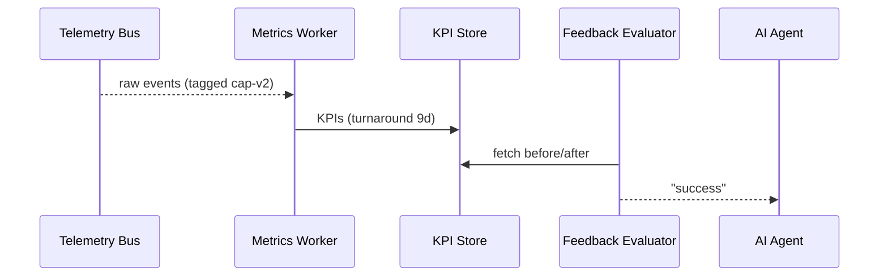

# Chapter 12: Metrics & Monitoring Feedback Loop
[⬅︎ Back to Chapter 11: Policy Deployment Pipeline](11_policy_deployment_pipeline_.md)

---

## 1. Why watch every heartbeat?

Imagine the **Harry S. Truman Scholarship Foundation** just bumped its application income-cap rule.  
At 12:01 AM the new **Protocol** went live through the deployment pipeline.  
By 07:00 AM Congress wants to know:

* Did average **review time** drop?  
* Did **complaint volume** rise?  
* Did the AI Agent’s change actually help low-income students?

We can only answer if every click, sync, and API call is **recorded, measured, and looped back** into HMS-API.  
That nervous system is the **Metrics & Monitoring Feedback Loop**.

Think of it as a **Fitbit for government software**: collect data → show dashboards → adjust habits.

---

## 2. Key concepts in plain English

| Term                | What it really means                              | Analogy                 |
|---------------------|---------------------------------------------------|-------------------------|
| Telemetry Bus       | One Kafka-ish pipe where *every* service dumps logs| Highway traffic counter |
| KPI Dashboard       | Grafana/Metabase board that tracks goals          | Dashboard in war-room   |
| Alert Rule          | “If X > threshold, yell”                          | Smoke alarm             |
| Experiment Tag      | Extra label `version=cap-v2` on each event        | Colored wristband       |
| Feedback Evaluator  | Tiny job that compares **before vs. after**       | GAO analyst with Excel  |

Keep these five in mind—everything else is wiring.

---

## 3. A 60-second success story

1. **00:01**—New income cap (cap-v2) hits production.  
2. Services auto-tag every related event `version=cap-v2`.  
3. **01:00**—Dashboard shows *median decision time* falling from **14 → 9 days**.  
4. Alert rule notices **complaints** stay flat → no red flags.  
5. **02:00**—AI Agent reads the metrics, declares “✅ Optimization succeeded.”  
6. HITL board receives the report—no extra work for staff.

---

## 4. How do we collect the data?

### 4.1 Add one line to every service

```ts
// src/lib/telemetry.ts
export function log(event, meta = {}) {
  fetch('http://telemetry-bus:7700', {
    method:'POST',
    body: JSON.stringify({ ts:Date.now(), event, ...meta })
  });
}
```

Explanation  
•  Under 10 lines—call `log('claim.submitted', { program:'truman', version:'cap-v2' })`.  
•  Ships JSON to a central **Telemetry Bus** (HTTP in dev, Kafka in prod).

### 4.2 Example from HMS-API endpoint

```ts
// Inside POST /applications
await log('application.created', {
  program:'truman',
  applicant:req.body.applicantId,
  version:process.env.CAP_VERSION    // auto-injected by pipeline
});
```

Result: every new application now carries the experiment tag!

---

## 5. From raw logs → friendly KPIs

A **Metrics Worker** consumes the bus and writes aggregates every minute.

```js
// workers/metrics.js  (16 lines)
import { consume } from './bus.js';
import { incr, gauge } from './store.js';   // wraps Redis / Prometheus

consume(msg => {
  incr(`count.${msg.event}`, 1);
  if (msg.event === 'claim.closed')
    gauge('claim.turnaround', Date.now() - msg.openedAt);
});
```

Explanation  
1. `incr` bumps counters (`count.claim.closed`).  
2. `gauge` tracks durations (`claim.turnaround`).  

Dashboards simply read these series—no heavy SQL.

---

## 6. Alert when things go sideways

```yaml
# alerting/complaints.yml   (8 lines)
alert: High_Complaints
expr:  rate(count.complaint[1h]) > 5
for:   30m
labels:
  severity: page
annotations:
  summary: "Complaints spiking past 5/hour"
```

If 5+ complaints per hour persist for 30 min, on-call staff get paged.  
Rules live right beside code, version-controlled like everything else.

---

## 7. Closing the loop: did our change work?



Only five actors—easy to trace in logs.

---

## 8. Tiny Feedback Evaluator (Python, 18 lines)

```py
# evaluator.py
import time, requests

def diff(kpi, tag_old, tag_new):
    old = requests.get(f'http://kpi-store/{kpi}?tag={tag_old}').json()
    new = requests.get(f'http://kpi-store/{kpi}?tag={tag_new}').json()
    return new['median'] < old['median']

while True:
    if diff('claim.turnaround', 'cap-v1', 'cap-v2'):
        requests.post('http://hms-a2a/report',
                      json={'kpi':'claim.turnaround','result':'better'})
    time.sleep(3600)
```

Explanation  
• Fetches median turnaround for **v1** vs **v2** every hour.  
• Posts a success report back to the AI Agent, which files it in HMS-GOV.

---

## 9. Glue points with earlier chapters

* **Experiment Tag** is injected by the [Policy Deployment Pipeline](11_policy_deployment_pipeline_.md).  
* AI Agent reads the KPI store (see [AI Representative Agent](09_ai_representative_agent__hms_a2a__.md)).  
* Alerts can open a new **HITL draft** if a change performs poorly ([Human-in-the-Loop Governance](10_human_in_the_loop_governance__hitl__.md)).  
* Raw logs help auditors trace identity via claims stamped by [Zero-Trust IAM](04_access___identity_control__zero_trust_iam__.md).

---

## 10. Common pitfalls & quick fixes

| Pitfall | Quick fix |
|---------|-----------|
| “Too much data, disk full” | Rotate bus topics daily; keep only aggregates past 30 days. |
| Missing experiment tags | Pipeline unit test fails if `CAP_VERSION` env is missing. |
| Alert fatigue | Route low-severity alerts to chat, reserve “page” for critical. |
| Silent evaluator crash | Supervisor process restarts if script exits non-zero. |

---

## 11. What you learned

✓ Why a **metrics nervous system** is essential after every policy change  
✓ Five key pieces: Bus → Worker → Dashboard → Alert → Evaluator  
✓ Added <20-line snippets for logging, aggregating, and evaluating  
✓ Saw how the loop feeds AI Agents, humans, and auditors alike  

Congratulations—you now have a *living*, *self-aware* HMS that learns from its own data.  
When the next scholarship policy tweaks roll out, you’ll know exactly **what happened** and **whether it helped citizens**. 🎉

---

Generated by [AI Codebase Knowledge Builder](https://github.com/The-Pocket/Tutorial-Codebase-Knowledge)