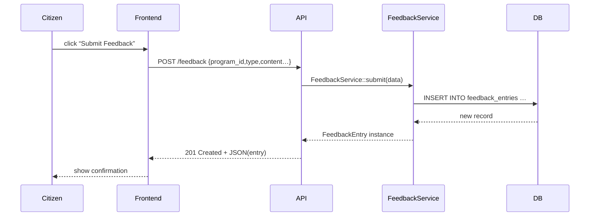

# Chapter 12: Stakeholder Feedback

In [Chapter 11: Frontend Interface](11_frontend_interface.md), we built the user-facing UI that lets citizens view programs and submit forms. Now it’s time to capture **real user voices**—their complaints, requests, and suggestions—so our AI agents and human reviewers know where the system hurts. This is the **Stakeholder Feedback** module.

## Why Stakeholder Feedback Matters

Central Use Case  
The Department of Transportation rolls out a new “Rural Electric Bus Grant.” After launch, drivers in remote towns report confusing form questions and missing guidance. We need a systematic way to collect those comments, tag them, and feed them back into our workflows. Think of it like a public-comment docket used for new regulations: it surfaces pain points so we can fix gaps quickly.

With Stakeholder Feedback you can:
1. Let citizens submit complaints or feature requests  
2. Store each entry with context (program, user, timestamp)  
3. Query and analyze trends for AI agents or human teams  

## Key Concepts

1. **FeedbackEntry**  
   The core data model representing one piece of feedback.  
   - `program_id` (which Program it’s about)  
   - `user_name` / `user_email` (optional contact info)  
   - `type` (e.g., “bug”, “request”, “praise”)  
   - `content` (the text of their comment)  
   - `metadata` (browser, app version, location)  
   - `status` (e.g., “new”, “reviewed”)  
   - `created_at`

2. **FeedbackService**  
   A simple API to submit and list feedback entries.

3. **Relationships**  
   You can fetch all feedback for a Program via a `feedback()` method on the Program model.

## Submitting Feedback: Example

Imagine a user sees a typo on the grant form and clicks “Report Issue.”

```php
use App\Services\FeedbackService;

$entry = FeedbackService::submit([
  'program_id' => 3,
  'type'       => 'bug',
  'content'    => 'The date picker won’t accept past dates.',
  'user_email' => 'jane.doe@example.com',
  'metadata'   => ['browser'=>'Firefox','version'=>'102.0']
]);

echo "Thank you! Your feedback ID is {$entry->id}";
```

Explanation:
- We call `FeedbackService::submit()` with minimal fields.
- The service stores the entry and returns a `FeedbackEntry` object.
- We show the user a confirmation with their feedback ID.

## Under the Hood: Request Flow



1. The citizen’s browser calls `POST /feedback`.  
2. The API layer hands data to `FeedbackService`.  
3. The service writes to the database.  
4. We return the saved feedback back to the UI.

## Implementation Details

### FeedbackEntry Model  
File: `app/Models/Core/FeedbackEntry.php`

```php
<?php
namespace App\Models\Core;

class FeedbackEntry
{
    protected $attributes = [];

    public function __construct(array $attrs = [])
    {
        $this->attributes = $attrs;
    }

    public function save()
    {
        // Pseudo: write $this->attributes to DB and set id & timestamps
    }

    // Example relationship back to Program
    public function program()
    {
        // Pseudo: return Program::find($this->attributes['program_id'])
    }
}
```

### FeedbackService  
File: `app/Services/FeedbackService.php`

```php
<?php
namespace App\Services;

use App\Models\Core\FeedbackEntry;

class FeedbackService
{
    public static function submit(array $data)
    {
        $entry = new FeedbackEntry($data);
        $entry->save();
        return $entry;
    }

    public static function listByProgram(int $programId)
    {
        // Pseudo: return DB::table('feedback_entries')
        //         ->where('program_id',$programId)->get();
    }
}
```

- `submit()` wraps creation and saving of feedback.  
- `listByProgram()` fetches all entries for a given Program.

## Real-World Analogy

Stakeholder Feedback is like a town-hall suggestion box:

- Citizens drop in notes (feedback entries).  
- Staff collect and tag each note by topic (type, program).  
- Teams (AI agents or human reviewers) read the box weekly, summarize pain points, and propose improvements.

## Conclusion

In this chapter you learned how to:
- Collect and store citizen comments via **Stakeholder Feedback**  
- Use `FeedbackService::submit()` and `listByProgram()` to work with feedback  
- Understand the internal flow with a simple mermaid sequence diagram  
- See the minimal model and service code for handling feedback

You’re now ready to loop these insights back into your AI agents or human workflows. That wraps up our core tutorial—thank you for following along!

---

Generated by [AI Codebase Knowledge Builder](https://github.com/The-Pocket/Tutorial-Codebase-Knowledge)