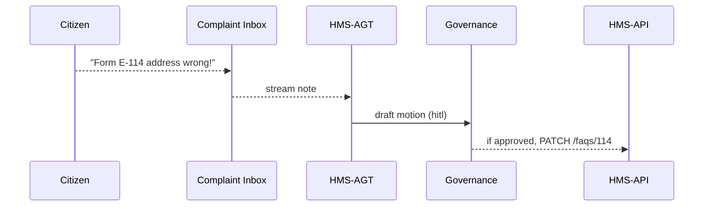

# Chapter 13: AI Representative Agent (HMS-AGT / AGX)

*(jumped in from [Management Layer (HMS-ACT / OMS / OPS)](12_management_layer__hms_act___oms___ops__.md))*  

---

## 1 — Why Do We Need a “24/7 Policy Analyst”?

Picture the **Center for Nutrition Policy and Promotion (CNPP)**.  
Every night thousands of citizens submit *Supplemental Nutrition Assistance* questions:

* “Why was my benefit reduced?”  
* “Where do I send form E-114?”  

By dawn a human team must:

1. Read every complaint.  
2. Update FAQs or intake procedures.  
3. Push the change to the public portal.  

That costs **overtime and coffee**.

**HMS-AGT (nick-name “AGX”)** is a **virtual policy analyst who never sleeps**. It:

1. **Listens** to complaints, logs, and metrics.  
2. **Drafts** procedure or text changes.  
3. **Submits** them to [HMS-API](04_backend_api_gateway__hms_api___hms_svc__.md).  
4. Awaits *human* approval (or automatic rules).  

To the portal it looks like **Siri for policy**.  
To admins it is just a **privileged service account** with tight permissions and override hooks.

---

## 2 — Key Ideas in Plain English

| Idea | Think of it as… |
|------|----------------|
| Agent Identity        | A government-issued badge for the bot. |
| Scope                 | “Areas this badge lets me enter.” |
| Proposal Draft        | A change packet (new FAQ, new Protocol step…). |
| HITL Gate             | Human-In-The-Loop review checkpoint. |
| Override Hook         | The red phone that can veto the bot instantly. |

Remember: **Identity → Scope → Draft → HITL → Override**.

---

## 3 — 60-Second Code Tour: From Complaint to Draft

Below is **all** you need to turn user feedback into a **Protocol patch**. *(≤ 20 lines each)*

### 3.1 Register the Agent

```python
# agents/register_agx.py
from hms_agt import Agent

agx = Agent.create(
    name        = "CNPP_Virtual_Analyst",
    scopes      = ["PROGRAM_READ","PROTOCOL_DRAFT"],
    override_to = "cnpp.supervisor@gov"      # red-phone target
)
print("🤖 AGX id =", agx.id)
```

**Explanation**

1. `scopes` define what the bot may touch.  
2. `override_to` is the email/PagerDuty user who can freeze AGX.

---

### 3.2 Listen to Complaints

```python
# agents/complaint_listener.py
from hms_agt import Inbox, Draft

for note in Inbox.stream(topic="complaints.cnpp"):
    if "form E-114 address" in note.text.lower():
        Draft.start(
            program_id = 77,               # SNAP
            change     = "Update FAQ address for form E-114",
            hitl       = True              # send to human gate
        )
```

**Explanation**

*Every* matching complaint triggers a **Draft** object with `hitl=True` so a human must bless it.

---

### 3.3 Submit the Draft → Governance

```python
# agents/draft_submit.py
from hms_agt import Draft

for d in Draft.pending():
    ticket = d.submit()          # goes to Governance Layer
    print("📑 Draft", d.id, "➡ motion", ticket.id)
```

**Outcome**

A **Motion** is created in the [Governance Layer](03_governance_layer__hms_sys___hms_cdf__.md). Humans (or rules) sign off before the change hits prod.

---

## 4 — What Happens Under the Hood?



1. Citizen files a complaint.  
2. AGX drafts a change.  
3. Governance reviews (HITL).  
4. Approved patch lands in HMS-API.

---

## 5 — Deep Dive: File Tour

```
hms-agt/
 ├─ agent.py           # identity & scopes
 ├─ inbox.py           # streams & filters
 ├─ draft.py           # create / submit change packets
 ├─ hooks.py           # override & throttle logic
 └─ examples/          # quick-start scripts
```

### 5.1 Permission Check (≤ 12 lines)

```python
# agent.py
def can(self, scope: str) -> bool:
    return scope in self.scopes and not is_frozen(self.id)
```

If `is_frozen()` (triggered by override hook) returns **True**, the agent is blocked.

### 5.2 Override Hook (≤ 15 lines)

```python
# hooks.py
def freeze(agent_id, reason):
    Flag.set(agent_id, "frozen", reason)
    Slack.post("#ops-alerts", f"🚫 AGX frozen: {reason}")
```

Called automatically when:

* A draft is rejected **3×** in 24 h.  
* The agent exceeds a change quota.  

---

## 6 — Beginner Pitfalls

1. **Too-wide scopes** – start with `*_DRAFT`, *not* `*_WRITE`.  
2. **No override contact** – Governance will block registration.  
3. **HITL missing** – Always set `hitl=True` for user-facing text.  
4. **Ignoring freeze alerts** – a frozen agent sits idle but still costs compute.

---

## 7 — Mini-Exercise

1. Register a test agent with scope `PROTOCOL_DRAFT`.  
2. Stream 3 fake complaints containing “lead paint step missing”.  
3. Verify AGX opens 3 Drafts.  
4. Reject them in Governance → watch AGX auto-freeze.  
5. Unfreeze with:

```bash
hms-agt unfreeze CNPP_Virtual_Analyst
```

Confirm new drafts now succeed.

---

## 8 — Government Analogy Cheat-Sheet

HMS-AGT Part  | Real-World Counterpart
--------------|-----------------------
Agent Identity| Federal employee badge  
Scope         | Building access level on the badge  
Draft         | Memo sent to the Deputy Director  
HITL Gate     | Deputy’s sign-off stamp  
Override Hook | Emergency recall letter from the Inspector General  

---

## 9 — Recap & Next Step

In this chapter you met **HMS-AGT / AGX**:

* A **virtual assistant** that listens, drafts, and proposes changes.  
* Works under a strict **permission + override** model.  
* Integrates smoothly with the **Governance** and **Management** layers.

Next we’ll see how AGX keeps its *own* context windows tiny and relevant with the [Model Context Protocol (HMS-MCP)](14_model_context_protocol__hms_mcp__.md).

---

Generated by [AI Codebase Knowledge Builder](https://github.com/The-Pocket/Tutorial-Codebase-Knowledge)