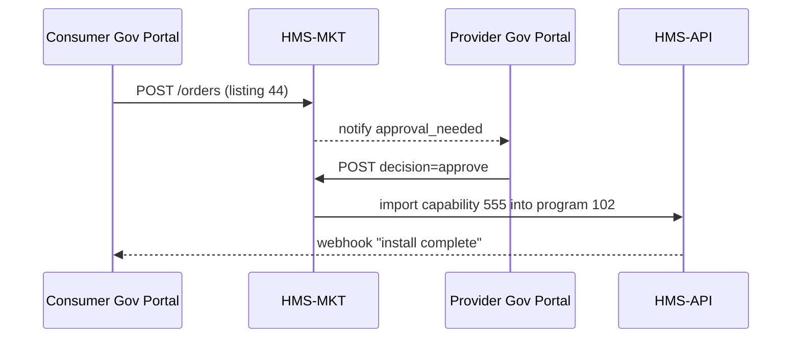

# Chapter 14: Marketplace & Capability Registry (HMS-MKT)

*(Coming from [External System Sync Adapter](13_external_system_sync_adapter_.md)?  
Perfect—now that HMS can speak COBOL, let’s discover **where agencies actually *get* the code, datasets, and micro-frontends they need.**)*  

---

## 1. Why Do We Need an “App Store for Government”?

### Hero Story — “Skip the 18-Month RFP”

The **Agency for Healthcare Research and Quality (AHRQ)** wants to show citizens a **Diabetes-Risk Calculator** on its public website.  
Instead of hiring a new vendor and waiting 18 months, the AHRQ policy team opens **HMS-MKT** and finds:

* A **Risk-Calculator micro-frontend** published last month by the Centers for Disease Control (CDC).  
* A matching **FHIR dataset** from the National Institutes of Health (NIH).  
* A pre-vetted **HIPAA compliance rule-pack** from the Office of Civil Rights.

With two clicks the team **installs** all three, and the calculator is live by Friday—no new contracts, no duplicated work.

> Analogy: It’s the **federal App Store**—but every “app” is a Protocol, dataset, or UI brick that already meets Uncle Sam’s security rules.

---

## 2. Key Concepts (Plain-English Glossary)

| Term | Friendly Meaning |
|------|------------------|
| **Listing** | A catalog card (“Diabetes-Risk Calculator v1.2”). |
| **Capability** | The *thing* you install: Protocol, dataset, micro-frontend, adapter, etc. |
| **Provider** | Agency that *owns* the capability. |
| **Consumer** | Agency that *installs* and uses it. |
| **Version & SemVer** | `1.2.3`—so upgrades are predictable. |
| **License Tier** | Free, Gov-wide, or Paid (intra-agency). |
| **Install Order** | Record that “AHRQ installed Calculator v1.2 on 2024-09-01”. |

Keep these seven handy; everything else hangs off them.

---

## 3. Hands-On Walk-Through — Installing the Student-Loan Forgiveness Protocol

### 3.1 Browse Listings (5 lines)

```bash
curl https://api.hms.gov/mkt/listings?search=loan+forgiveness
```

Sample response (trimmed):

```json
[
  { "listing_id": 44,
    "title": "Student-Loan Forgiveness Eligibility Protocol",
    "provider": "Dept. of Education",
    "version": "2.0.0",
    "price": 0 }
]
```

### 3.2 Place an Install Order (12 lines)

```bash
curl -X POST \
  -H "Authorization: Bearer $JWT" \
  -H "Content-Type: application/json" \
  https://api.hms.gov/mkt/orders \
  -d '{ "listing_id": 44,
        "target_program_id": 102,     /* your Program cabinet         */
        "notes": "Needed for FY24 pilot" }'
```

Response:

```json
{ "order_id": 901, "status": "pending_approval" }
```

What happened?

1. HMS-MKT created an **Install Order**.  
2. Notified the listing **Provider** (DoEd) for cross-agency approval.  
3. Your Governance Portal shows the order as *Pending*.

### 3.3 Provider Approves (Provider side, 9 lines)

```bash
curl -X POST https://api.hms.gov/mkt/orders/901/decision \
  -H "Authorization: Bearer $DOE_ADMIN_JWT" \
  -d '{ "decision": "approve" }'
```

Order now flips to:

```json
{ "status": "fulfilled", "capability_id": 555 }
```

### 3.4 Capability Becomes Yours (Auto-Magic)

Because the capability type is “Protocol”:

* HMS-API **imports** Protocol #555 into **Program 102**.  
* [Agent Action Orchestration](07_agent_action_orchestration__hms_act__.md) picks it up immediately.  
* [Metrics & Monitoring](12_metrics___monitoring__hms_ops__.md) starts collecting new KPIs.

You’re live—zero code written!

---

## 4. What Happens Behind the Curtain?



Only four actors, one round-trip approval.

---

## 5. Internal Code Peek (≤ 20 Lines Each)

### 5.1 Listing Model (Laravel, 12 lines)

```php
class Listing extends Model {
    protected $table = 'mkt_listings';
    protected $casts = ['metadata' => 'array']; // screenshots, tags
    public function capabilities() {
        return $this->hasMany(Capability::class);
    }
}
```

### 5.2 Order Controller (simplified, 18 lines)

```php
class OrderController {
  public function store(Request $r) {
    $order = Order::create([
       'listing_id'       => $r->listing_id,
       'consumer_program' => $r->target_program_id,
       'status'           => 'pending_approval',
       'notes'            => $r->notes,
       'requested_by'     => $r->user()->id
    ]);
    NotifyProvider::dispatch($order); // async e-mail / Slack
    return response(['order_id'=>$order->id], 201);
  }
}
```

### 5.3 Fulfillment Job (Python, 15 lines)

```python
def fulfill(order):
    cap = Capability.fetch(order.listing_id)
    if cap.type == 'protocol':
        HMSAPI.import_protocol(cap, order.consumer_program)
    elif cap.type == 'dataset':
        HMSAPI.grant_dataset(cap, order.consumer_program)
    # more types...
    order.status = 'fulfilled'
    order.save()
```

---

## 6. How Capabilities Show Up in Other HMS Pieces

| Capability Type | Where It Lands | Auto-Wired Chapter |
|-----------------|----------------|--------------------|
| Protocol        | `protocols` table under your Program | [Protocol](02_protocol__process_blueprint__.md) |
| Micro-frontend  | CDN registry entry & feature flag | [Micro-Frontend Layer](05_micro_frontend_experience_layer__hms_mfe__.md) |
| Dataset         | Access grant in HMS-DTA | [Central Data Repository](11_central_data_repository__hms_dta__.md) |
| Rule-pack       | YAML files in HMS-ESQ rules path | [Compliance Engine](09_compliance___legal_reasoning_engine__hms_esq__.md) |
| Sync Adapter    | YAML mapping + worker jar | [External System Sync Adapter](13_external_system_sync_adapter_.md) |

---

## 7. Best-Practice Checklist

1. **Tag Listings** (e.g., `health`, `education`, `finance`) so search is easy.  
2. **Semantic Versioning**—never break users on minor upgrades.  
3. **License Clarity**—put “Gov-wide-free” or cost center code in `metadata`.  
4. **Security Scans**—HMS-MKT runs an automated **FedRAMP-lite** scan before publish.  
5. **Deprecation Notices**—30-day heads-up e-mail when a version goes end-of-life.  

---

## 8. Where HMS-MKT Sits in the Universe

```mermaid
graph TD
    PUB[Provider Agencies] --> MKT[HMS-MKT]
    CON[Consumer Agencies] --> MKT
    MKT --> API[HMS-API]   %% installs
    MKT --> OPS[HMS-OPS]   %% metrics (installs, searches)
```

HMS-MKT is the **hub**; every other service benefits once a capability is installed.

---

## 9. Recap & What’s Next

You now know how to:

1. **Browse**, **order**, and **install** ready-made government capabilities.  
2. Follow the simple approval dance between Provider and Consumer.  
3. See how imported assets automatically plug into Programs, Protocols, datasets, and UI bricks.  
4. Understand the slim code models that power listings and orders.

Up next we’ll dive into **how large-language-model prompts remember *which* Program and *which* citizen they’re talking about**:  
[Model Context Protocol (HMS-MCP)](15_model_context_protocol__hms_mcp__.md)

Happy shopping—and may you never reinvent the wheel again!

---

Generated by [AI Codebase Knowledge Builder](https://github.com/The-Pocket/Tutorial-Codebase-Knowledge)