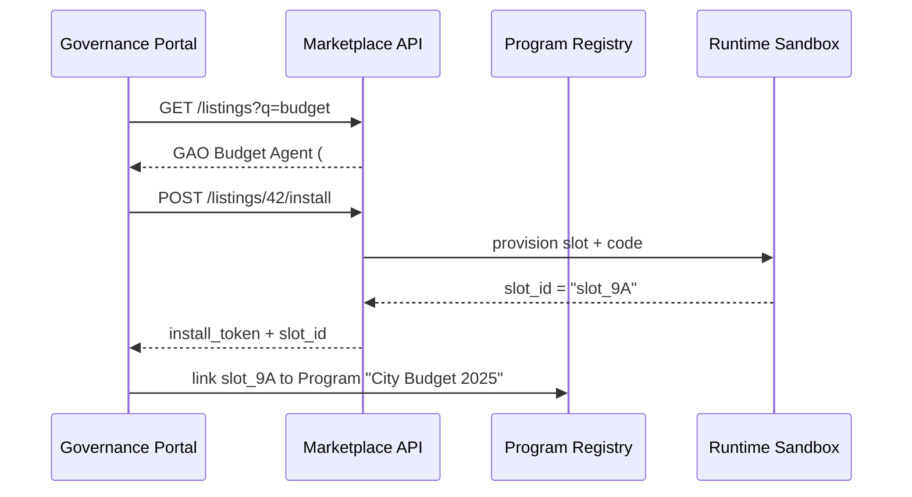
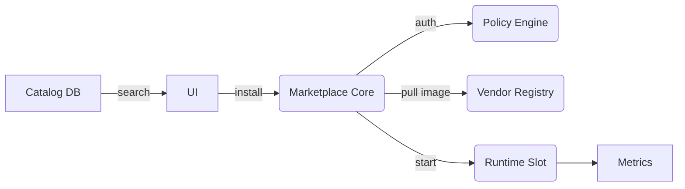

# Chapter 14: Service & Agent Marketplace (HMS-MKT)

[← Back to “Universal Health Care Adapter (HMS-UHC)”](13_universal_health_care_adapter__hms_uhc__.md)

---

## 1. Why Do We Need an “App Store for Government”?

A **2000-person city** wants to publish its annual budget online.  
Instead of hiring consultants, the clerk opens **HMS-MKT** and clicks:

```
Install  🧮  “GAO-Vetted Municipal Budget Agent”   →  $0  (open-source)
```

Ten seconds later:

1. The agent appears in the city’s dashboard.  
2. It pulls revenue data from the [Program Registry](01_program_registry__program_model__.md).  
3. Reports are auto-formatted to GAO guidelines.

No RFP, no month-long procurement—just **click, approve, run**.  
That is the problem HMS-MKT solves: **one-click discovery, vetting, and deployment of trusted data feeds, algorithms, and AI agents** across every level of government.

---

## 2. Key Concepts (Plain English)

| Term | Think of it as… | Emoji |
|------|-----------------|-------|
| Listing | The “app page” (title, version, screenshots) | 📄 |
| Certification Badge | “Approved by GAO” or “FedRAMP-High” | ✅ |
| Install Token | Digital receipt proving an agency owns the listing | 🎫 |
| Runtime Slot | Sandbox where the agent executes | 🛡️ |
| Update Channel | Stable (`v1`), Beta (`v1-beta`) … | 🔄 |
| Revenue Share | Optional payment split (e.g., 80 % vendor / 20 % Treasury) | 💰 |

If you have ever installed a phone app, you already understand 90 % of HMS-MKT.

---

## 3. A 60-Second Walk-Through – Installing the Budget Agent



Total human effort: two clicks.

---

## 4. Hands-On: Installing & Running an Agent (17 Lines)

```php
use HMS\MKT\Client;
use HMS\MKT\Runtime;

// 1️⃣ Search the catalog
$listings = Client::search('budget');

// 2️⃣ Take the first GAO-certified entry
$agentId = $listings->firstWhere('badge','GAO')->id;

// 3️⃣ Install it
$token = Client::install($agentId);   // returns install token

// 4️⃣ Run a job inside the sandbox
$result = Runtime::with($token)
          ->call('generateQuarterlyReport', [
              'program_id' => 123  // City Budget 2025
          ]);

echo $result['pdf_url'];
```

Explanation  
1. `Client::search()` hits HMS-MKT’s `/listings` endpoint.  
2. `install()` returns a **signed token**—proof you own one runtime slot.  
3. `Runtime::with()` sends work to that slot; output is a PDF link.

---

## 5. What Happens Under the Hood? (Step-By-Step)

1. **Discovery** – UI or API reads the public `listings` table.  
2. **License Check** – [Policy Engine](09_policy_engine__hms_cdf__.md) confirms the agency may install the listing.  
3. **Provisioning** – Marketplace pulls a Docker image from a **Vendor Registry**, creates an isolated **Runtime Slot**.  
4. **Billing** – If the listing is paid, a Stripe-like micro-service sends funds to Treasury.  
5. **Telemetry** – Usage stats stream to the [Operations Layer](16_operations___monitoring_layer__hms_ops__.md).



Only five actors; each step is logged.

---

## 6. A Peek Inside the Code (All ≤ 18 Lines)

### 6.1 Listing Model  – `app/Models/Mkt/Listing.php`

```php
class Listing extends Model
{
    protected $fillable = [
        'title','image','version',
        'badge','docker_tag','price_cents'
    ];

    public function scopeCertified($q, $badge){
        return $q->where('badge', $badge);
    }
}
```

### 6.2 Install Endpoint – `app/Http/Controllers/MktController.php`

```php
public function install($id)
{
    $listing = Listing::findOrFail($id);

    // (1) policy check
    if (!auth()->user()->can('install', $listing)) {
        return response('Forbidden', 403);
    }

    // (2) create runtime slot
    $slot = Runtime::provision($listing->docker_tag);

    // (3) emit install token
    $token = InstallToken::issue(
        listing: $listing->id,
        slot:    $slot->id,
        agency:  auth()->user()->agency_id
    );

    return ['install_token'=>$token,'slot_id'=>$slot->id];
}
```

Lines removed: billing & telemetry—focus is on the three key actions.

### 6.3 Runtime :: provision (11 Lines)

```php
class Runtime
{
    public static function provision(string $tag)
    {
        $slotId = 'slot_'.Str::uuid();
        passthru("docker run -d --name $slotId $tag");
        return (object)['id'=>$slotId];
    }

    public static function with(string $token): self
    {
        return new self(InstallToken::validate($token)->slot_id);
    }
    /* call() method omitted for brevity */
}
```

---

## 7. How HMS-MKT Fits With Other Chapters

| Purpose | Chapter |
|---------|---------|
| Verifies install permissions | [Policy Engine](09_policy_engine__hms_cdf__.md) |
| Runs human approvals before paid installs | [HITL Workflow](07_hitl_override_workflow_.md) |
| Logs every action | [Operations Layer](16_operations___monitoring_layer__hms_ops__.md) |
| Shares vendor images across agencies | [Inter-Agency Bridge](12_inter_agency_bridge__hms_a2a__.md) |
| Lets code-mappings be sold as listings | [Universal Health Care Adapter](13_universal_health_care_adapter__hms_uhc__.md) |

---

## 8. Hands-On Exercise (10 Minutes)

1. Start the demo stack:

```bash
docker compose -f demo/compose-mkt.yml up -d
```

2. List the catalog:

```bash
curl http://localhost:7000/api/listings | jq '.[] | {id,title,badge}'
```

3. Install **listing 42**:

```bash
curl -X POST -d '{}' http://localhost:7000/api/listings/42/install
# Save the returned install_token
```

4. Call the agent:

```bash
curl -X POST \
     -H "Authorization: Bearer <install_token>" \
     -d '{"action":"generateQuarterlyReport","program_id":123}' \
     http://localhost:7000/api/runtime/call
```

5. Open the printed `pdf_url`.  
You just installed and used a GAO-certified budgeting agent in under ten minutes!

---

## 9. Government Analogy Cheat-Sheet

| Real-World Thing | HMS-MKT Equivalent |
|------------------|--------------------|
| GSA Schedule Catalog | Marketplace Listing |
| FedRAMP ATO letter | Certification Badge |
| Purchase Order | Install Token |
| Secure SCIF room | Runtime Slot |
| Annual maintenance fee | Revenue Share |

---

## 10. What You Learned

✔ Why an **App-Store-like marketplace** speeds innovation for agencies.  
✔ Core pieces: **Listing, Certification Badge, Install Token, Runtime Slot, Update Channel**.  
✔ How to search, install, and execute an agent in **17 lines** of code.  
✔ Where HMS-MKT plugs into policy, billing, and logging layers.

Next we’ll see **where all the data generated by these agents finally lands**—the **Central Data Lake** that powers analytics, audits, and AI.

[Continue to “Central Data Lake (HMS-DTA)”](15_central_data_lake__hms_dta__.md)

---

Generated by [AI Codebase Knowledge Builder](https://github.com/The-Pocket/Tutorial-Codebase-Knowledge)