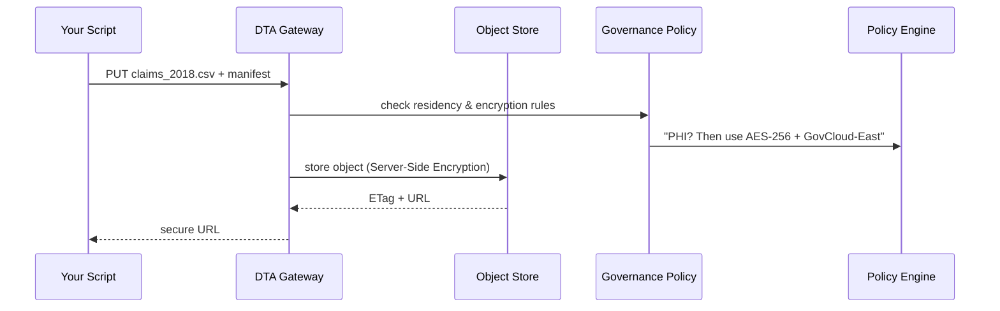

# Chapter 15: Central Data Lake (HMS-DTA)

[← Back to “Service & Agent Marketplace (HMS-MKT)”](14_service___agent_marketplace__hms_mkt__.md)

---

## 1. Why a “Giant Filing Cabinet” Is Needed – 2-Minute Story  

A **Centers for Disease Control (CDC)** epidemiologist wants to study childhood asthma:

1. Pull anonymized **Medicaid claims** from 2018-2023.  
2. Join them with **EPA air-quality sensors** near each ZIP code.  
3. Publish a public dashboard—but **NOT** the raw, HIPAA-protected rows.

Without a single, well-governed store you end up with:

* Dozens of copied CSVs on random laptops  
* Encryption settings that vary by team  
* No proof that data older than 6 years was ever deleted ✂️  

**Central Data Lake (HMS-DTA)** fixes this:

```
Raw upload  ➜  Automated tagging  ➜  Clean tables  ➜  Analytics outputs
              (encryption + residency + retention enforced)
```

Think of it as a **federal archive vault** where every dataset has its own sealed, bar-coded box.

---

## 2. Key Concepts (Plain English)

| Term                     | Think of it as…                                  |
|--------------------------|--------------------------------------------------|
| **Bucket**               | One top-level folder (e.g., `medicaid_raw_2018`) |
| **Zone**                 | A lane in the warehouse: *Raw*, *Clean*, *Analytics* |
| **Residency Policy**     | “Keep PHI only on GovCloud-East”                 |
| **Encryption Tier**      | `s3:KMS` vs `s3:SSE-S3`                          |
| **Retention Clock**      | Auto-delete after *N* years                      |
| **Manifest**             | Metadata JSON taped to the front of each box     |

If you can label and shelve a cardboard box, you already understand DTA. 📦

---

## 3. The Smallest Possible Upload (15 Lines)

Below is a **runnable** PHP snippet that uploads a CSV to the **Raw Zone**, adds metadata, and gets back a secure URL.

```php
use HMS\DTA\Lake;
use HMS\DTA\Manifest;

// 1️⃣  Open local file
$file = fopen('/tmp/claims_2018.csv', 'r');

// 2️⃣  Create a manifest (sticky note)
$meta = Manifest::make([
    'program'      => 'Medicaid',
    'contains_phs' => true,           // Protected Health Data?
    'schema'       => 'claims_v1',
]);

// 3️⃣  Upload to a Raw bucket
$url = Lake::bucket('medicaid_raw_2018')
           ->put('claims_2018.csv', $file, $meta);

echo "Stored at: $url\n";   // e.g. s3://gov-east/medicaid_raw_2018/...
```

Explanation  
1. `Lake::bucket()` auto-creates the bucket if missing and applies the right **encryption tier** from policy.  
2. The `Manifest` is persisted beside the object—tools can read it later.  
3. The return URL is **never** public; access is checked by HMS-DTA.

---

## 4. Moving Data from *Raw* ➜ *Clean* (16 Lines)

Imagine a script that redacts SSNs and writes a Parquet file into the **Clean Zone**.

```php
use HMS\DTA\Transform;

// 1️⃣  Read raw CSV
$raw = Lake::bucket('medicaid_raw_2018')
           ->get('claims_2018.csv');

// 2️⃣  Stream-transform (drops SSN)
$clean = Transform::csv($raw)
          ->dropColumn('ssn')
          ->toParquet();

// 3️⃣  Save into Clean Zone
Lake::bucket('medicaid_clean')
    ->put('claims_2018.parquet', $clean, [
        'derived_from' => $raw->etag,
        'schema'       => 'claims_safe_v1',
    ]);
```

Every **derived** object keeps a pointer (`derived_from`)—the audit trail is automatic.

---

## 5. What Happens Under the Hood? (Step-By-Step)



Only five actors; every step is logged to [Operations & Monitoring Layer](16_operations___monitoring_layer__hms_ops__.md).

---

## 6. Peeking Inside the Code (≤18 Lines Each)

### 6.1  Storage Driver – `app/DTA/S3Driver.php`

```php
class S3Driver
{
    public function put($bucket, $key, $stream, $meta)
    {
        $opts = [
            'Bucket' => $bucket,
            'Key'    => $key,
            'Body'   => $stream,
            'Metadata' => $meta,
            'ServerSideEncryption' => $meta['contains_phs'] ? 'aws:kms' : 'AES256',
        ];
        return $this->client->putObject($opts)->get('ObjectURL');
    }
}
```

Encryption is **decided in one ternary**—easy for beginners to follow.

### 6.2  Retention Sweeper – `app/Console/Commands/DtaSweep.php`

```php
class DtaSweep extends Command
{
    protected $signature = 'dta:sweep';

    public function handle()
    {
        Lake::buckets()->each(function($b){
            $b->objectsOlderThanYears($b->meta('retention_years'))
              ->each(fn($o) => $o->delete());
        });
    }
}
```

Add to scheduler:

```php
$schedule->command('dta:sweep')->daily();
```

Old boxes are shredded nightly—FOIA auditors rejoice. 🎉

---

## 7. Enforcing Residency: One SQL Table

```sql
CREATE TABLE lake_policies (
  bucket_pattern VARCHAR(50),
  region         VARCHAR(20),   -- e.g. 'us-gov-east-1'
  encryption     VARCHAR(10),   -- 'KMS' or 'AES256'
  retention_years INT
);
```

Administrators update this table; every new bucket inherits matching rules—no code deploy needed.

---

## 8. Hands-On Exercise (10 Minutes)

1. Run migrations & seed a demo policy:

```bash
php artisan migrate --path=database/migrations/dta
php artisan db:seed --class=DtaDemoPolicySeeder
```

2. Upload a sample file:

```bash
php artisan tinker
>>> Lake::bucket('epa_air_raw')
...     ->put('pm25_2023.csv', fopen('pm25.csv','r'), ['contains_phs'=>false]);
```

3. Check object metadata via AWS CLI (or MinIO):

```bash
aws s3api head-object --bucket epa_air_raw --key pm25_2023.csv
# Verify 'ServerSideEncryption': 'AES256'
```

4. Change the policy row to `encryption='KMS'`, re-upload, and watch encryption switch—proof that **governance lives in data, not code**.

---

## 9. How HMS-DTA Interfaces with Other Chapters

| Need | Chapter |
|------|---------|
| Program IDs & schemas for manifests | [Program Registry](01_program_registry__program_model__.md) |
| Policy rules (retention, residency) | [Policy Engine](09_policy_engine__hms_cdf__.md) |
| Legal compliance checks on new buckets | [Compliance Reasoner](10_compliance_reasoner__hms_esq__.md) |
| Agents that auto-clean or analyze data | [AI Representative Agent](06_ai_representative_agent__hms_agt___hms_agx__.md) |
| Publishing analytics dashboards | [Service & Agent Marketplace](14_service___agent_marketplace__hms_mkt__.md) |
| Usage / error metrics | [Operations & Monitoring Layer](16_operations___monitoring_layer__hms_ops__.md) |

---

## 10. Government Analogy Cheat-Sheet

| Real-World Archive | HMS-DTA Equivalent |
|--------------------|--------------------|
| National Archives pallet | Bucket |
| Reading Room vs Secure Vault | Zone (Clean vs Raw) |
| Barcode sticker on box | Manifest (`etag`) |
| GSA record retention schedule | Retention Clock |
| Physical shredding after 6 years | `dta:sweep` command |

---

## 11. Summary & What’s Next

In this chapter you:

✔ Uploaded data to the **Raw Zone** with automatic encryption.  
✔ Transformed it into a **Clean Zone** table while keeping lineage.  
✔ Learned how residency, encryption, and retention are enforced by **policy tables, not code**.  
✔ Saw where HMS-DTA feeds and is fed by other HMS layers.

Next we’ll peek at the **dashboard and alerting layer** that watches every bucket, job, and policy in real time:  
[Operations & Monitoring Layer (HMS-OPS)](16_operations___monitoring_layer__hms_ops__.md)

---

Generated by [AI Codebase Knowledge Builder](https://github.com/The-Pocket/Tutorial-Codebase-Knowledge)