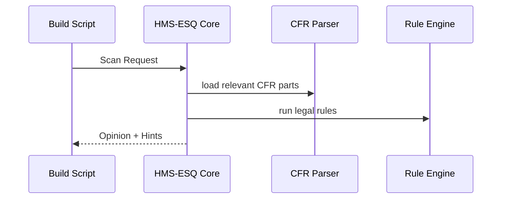

# Chapter 16: Legal Reasoning Service (HMS-ESQ)

*(arrived from [Human-In-the-Loop (HITL) Override](15_human_in_the_loop__hitl__override_.md))*  

---

## 1 — Why Does HMS Need an “In-House Counsel”?

A HUD data scientist is eager to ship a new **“Smart-Tenant Dashboard.”**

1. It will **merge housing inspections with IRS income files** so case-workers can spot at-risk families.  
2. The dashboard looks ready, and AGX already drafted the press release.  
3. Minutes before launch, a lawyer remembers:  
   *“IRS Title 26 data can’t be re-disclosed under the Privacy Act unless we cite a matching FOIA exemption.”*

If that rule is missed, the agency faces federal court **and** angry headlines.

**HMS-ESQ** is the platform’s **legal radar**.  
It automatically scans:

* Code & configuration (Protocols, API routes, Data Lake cards)  
* The **Code of Federal Regulations (CFR)**, recent court rulings, and FOIA exemptions  
* Planned data exchanges (A2A pouches, public portals)

…then warns **before** any launch that could break the law.

Think of it as a junior attorney who never sleeps.

---

## 2 — Key Concepts in Plain English

| Word               | Think of it as…                              |
|--------------------|----------------------------------------------|
| Scan Request       | “Does this thing break a law?” postcard      |
| Source Corpus      | Huge bookshelf of CFR titles & case law      |
| Legal Rule         | One sentence of law turned into code         |
| Opinion            | The lawyer’s answer: ✅ Safe / 🛑 Violation   |
| Fix-It Hint        | A sticky note telling devs how to comply     |

Keep these five words handy: **Request → Corpus → Rule → Opinion → Hint**.

---

## 3 — 60-Second Walk-Through: Flag a Privacy Violation

Below is **all** you need to stop the “Smart-Tenant Dashboard” at build time.

```python
# build/check_legal.py  (≤ 20 lines)
from hms_esq import scan

result = scan(
    title      = "Smart-Tenant Dashboard v1",
    artifact   = "protocol://tenant_dashboard",   # could also be /pouch/123
    tags       = ["privacy", "data_share"],
    preview_snippet = """
        SHARE tenants.* WITH external_portal
        JOIN irs_income_data ON ssn
    """
)

print(result.opinion)     # => "violation"
for hint in result.hints: # prints fixes
    print("⚠️", hint)
```

Expected output:

```
violation
⚠️ Privacy Act §552a(b) - IRS Title 26 data cannot be disclosed without specific consent.
⚠️ Add FOIA exemption (b)(3) reference or remove JOIN irs_income_data.
```

**Why it works**

1. `scan()` bundles your **code snippet + tags** into a *Scan Request*.  
2. HMS-ESQ matches it against **Legal Rules** parsed from CFR + court opinions.  
3. It returns an **Opinion** (`violation`) plus **Fix-It Hints**.

---

## 4 — What Happens Under the Hood?



Only **four** moving parts—easy to reason about.

---

## 5 — Inside HMS-ESQ (File Tour)

```
hms-esq/
 ├─ scan.py            # public facade
 ├─ corpus/            # raw CFR XML, court PDFs
 ├─ rules/             # each law as small Python rule
 │   └─ privacy_act.py
 ├─ engine.py          # loads corpus + runs rules
 ├─ hints/             # text templates for fixes
 └─ tests/             # sample violations
```

### 5.1  Tiny Rule Example (≤ 15 lines)

```python
# rules/privacy_act.py
def apply(snippet, tags):
    if "JOIN irs_income_data" in snippet:
        return {
            "violation": True,
            "statute": "Privacy Act §552a(b)",
            "hint": "Add FOIA (b)(3) exemption or drop IRS data."
        }
    return {"violation": False}
```

The **Rule Engine** loops over every file in `rules/`; if any returns
`violation: True`, the overall opinion is **“violation.”**

### 5.2  Scan Function (≤ 12 lines)

```python
# scan.py
from engine import run_rules

def scan(title, artifact, tags, preview_snippet):
    results = run_rules(preview_snippet, tags)
    opinion = "violation" if any(r["violation"] for r in results) else "safe"
    hints   = [r["hint"] for r in results if r.get("hint")]
    return SimpleNamespace(opinion=opinion, hints=hints)
```

---

## 6 — Hooking ESQ into Your CI Pipeline

```bash
# .github/workflows/ci.yml (excerpt ≤ 10 lines)
- name: Legal Scan
  run: |
    python build/check_legal.py
    if grep -q "violation" scan.log; then
      echo "❌ Legal violation — fix before merge"; exit 1
    fi
```

A single step: build fails if **any** violation is found.

---

## 7 — Common Pitfalls for Beginners

| Oops! | Why it happens | Quick Fix |
|-------|----------------|-----------|
| “No rules ran” | Forgot to add `tags` | Pass at least one tag (`privacy`, `labor`, …) |
| False positive | Rule too naive | Add precise regex or extra context lines |
| Huge scan time | Parsing all CFR volumes | Limit `tags` so only needed titles load |
| Hint is vague | Rule missing `hint` | Always return a human-readable hint |

---

## 8 — Government Analogy Cheat-Sheet

HMS-ESQ Thing | Real-World Counterpart
--------------|-----------------------
Source Corpus | Bookcase of CFR volumes in the agency law library  
Legal Rule    | Handwritten margin note “§552a(b) blocks IRS data share”  
Opinion       | Junior counsel memo: “Can’t do this.”  
Fix-It Hint   | Yellow sticky: “Add FOIA exemption.”  

---

## 9 — Mini-Exercise

1. Copy the code block from **§3**.  
2. Change the snippet to remove `JOIN irs_income_data`.  
3. Re-run; confirm **opinion = "safe"**.  
4. Now add `EXPORT social_security_numbers TO csv`.  
5. Watch ESQ flag a **new violation** (Privacy Act again).  
6. Add a rule file `rules/ssn_mask.py` to auto-suggest `MASK(ssn)`—verify hint appears.

---

## 10 — Recap & Next Stop

In this chapter you learned how **HMS-ESQ**:

* Reads your code/config and cross-checks it against live **federal law**.  
* Returns a simple **Opinion** plus friendly **Fix-It Hints**.  
* Fits into any build or runtime step with just a few lines of Python.  

Ready to see how new laws themselves get **codified** into the system?  
Head to [Legislative Workflow Engine (HMS-CDF Rust Kernel)](17_legislative_workflow_engine__hms_cdf_rust_kernel__.md).

---

Generated by [AI Codebase Knowledge Builder](https://github.com/The-Pocket/Tutorial-Codebase-Knowledge)