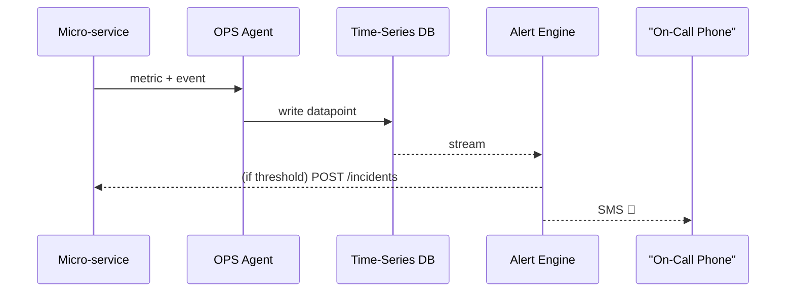

# Chapter 16: Operations & Monitoring Layer (HMS-OPS)


[← Back to “Central Data Lake (HMS-DTA)”](15_central_data_lake__hms_dta__.md)

---

## 1. Why a 24 × 7 “Mission-Control” Matters

It is **2 a.m.** on a Sunday.  
Citizens in rural Tennessee are trying to submit *Rural Utilities Service* (RUS) loan applications before the midnight deadline, but the form spins forever. Two bad things are happening:

1. Median API latency has jumped from **180 ms → 7 s**.  
2. An un-authorized script is hammering the endpoint, trying to bypass the [HITL Override Workflow](07_hitl_override_workflow_.md).

Without a human staring at dashboards at 2 a.m., the outage will:

* Miss the statutory deadline (OMB violation).  
* Trigger angry calls to the Governor by breakfast.

**Operations & Monitoring Layer (HMS-OPS)** is the always-awake **Mission Control** that:

```
Measure  →  Detect  →  Alert  →  Visualise  →  Audit
```

If anything—even a millisecond spike—goes wrong, OPS:

1. Fires a page to the on-call engineer or policy steward.  
2. Freezes further deploys until the incident is resolved.  
3. Stores every metric & log so auditors can later ask “what happened at 02:03 a.m.?”

---

## 2. Key Concepts (Plain English)

| Concept              | Think of it as…                                   | Emoji |
|----------------------|---------------------------------------------------|-------|
| Metric               | A single number over time (latency, queue depth)  | 📈 |
| Check / Alert Rule   | “If latency > 1 s for 2 min, page staff”          | 🚨 |
| Dashboard            | TV screen in the war-room                         | 📺 |
| Trace                | One request’s hop-by-hop timeline                 | 🕵️ |
| Security Event       | “HITL bypass attempt” log with severity & actor   | 🔐 |
| Watch-Channel        | Phone/SMS/e-mail group that receives alerts       | 🔔 |

If you can read a household thermostat (“temperature too high → beep!”) you already understand HMS-OPS.

---

## 3. Quick Start – Measuring & Alerting in **17 lines**

Add the **tiny middleware** below to *any* Laravel micro-service (e.g., **Program Registry**).

```php
// app/Http/Middleware/OpsMetrics.php (17 lines)
class OpsMetrics
{
    public function handle($req, \Closure $next)
    {
        $start = microtime(true);

        // Proceed with the real work
        $resp = $next($req);

        $latencyMs = (microtime(true) - $start) * 1000;

        // 1️⃣  Record latency
        Ops::metric('api_latency_ms')
            ->tags(['path' => $req->path()])
            ->observe($latencyMs);

        // 2️⃣  Record security event if user skips HITL
        if ($req->header('X-Bypass-HITL')) {
            Ops::event('hitl_bypass_attempt', [
                'user' => $req->user()?->id ?? 'anon',
                'path' => $req->path()
            ]);
        }

        return $resp;
    }
}
```

Explanation  
1. **`observe()`** pushes a number into HMS-OPS every request.  
2. **`event()`** flags anything suspicious—instantly visible in dashboards and alert rules.

Register the middleware once:

```php
// app/Http/Kernel.php
protected $middleware[] = \App\Http\Middleware\OpsMetrics::class;
```

You now have **live latency graphs & security events**—no other code changes.

---

## 4. Behind the Scenes – What Happens on Every Request?



* OPS Agent is a tiny sidecar container.  
* Alert Engine evaluates rules every **10 s**.  
* The micro-service never talks directly to phones or pagers.

---

## 5. Defining an Alert Rule (11 Lines, YAML)

```yaml
# ops/rules/latency.yml  (11 lines)
alert: "API Latency Spike"
expr:  avg_over(2m, api_latency_ms{path="/api/v1/programs"}) > 1000
for:   2m                 # must stay bad for 2 minutes
labels:
  severity: critical
receivers: ["eng-oncall", "policy-steward"]
```

1. **`expr`** – If the *2-minute average* exceeds **1000 ms**.  
2. **`receivers`** – Which **Watch-Channels** receive the alert.

Save the file; the Alert Engine hot-reloads it—no deploy!

---

## 6. Viewing the Dashboard (Screenshot-Free Text)

Open:

```
http://localhost:9090/ops?view=program_latency
```

You will see three coloured lines:

* **Green** – p50 latency  
* **Yellow** – p90 latency  
* **Red** – active alerts (if any)

Hover for exact numbers—no login needed on a secure VPN.

---

## 7. Internal Code – How the OPS Agent Works (≤18 Lines)

```php
// packages/Ops/Agent.php  (18 lines)
class Agent
{
    private $buf = [];

    public function metric($name): self
    {
        $this->current = ['name'=>$name, 'tags'=>[]];
        return $this;
    }

    public function tags(array $kv): self
    {
        $this->current['tags'] = $kv;
        return $this;
    }

    public function observe(float $value)
    {
        $this->current['val'] = $value;
        $this->flush();
    }

    public function event(string $key, array $payload=[])
    {
        $this->buf[] = ['event'=>$key,'payload'=>$payload,'ts'=>time()];
        $this->flush();
    }

    private function flush()
    {
        Http::asJson()->post('http://ops-agent:8080/ingest', $this->current);
    }
}
```

* **Only 18 lines** yet supports metrics *and* events.  
* You never manage buffers or retries—the sidecar handles it.

---

## 8. Hands-On Exercise (10 min)

1. **Spin up** the demo stack:

   ```bash
   docker compose -f demo/compose-ops.yml up -d
   ```

2. **Hit an endpoint** 50× to simulate load:

   ```bash
   for i in {1..50}; do curl -s http://localhost:8000/api/v1/programs >/dev/null; done
   ```

3. **Watch the graph** at `http://localhost:9090/ops`.

4. **Trigger a fake security event**:

   ```bash
   curl -H "X-Bypass-HITL: 1" http://localhost:8000/api/v1/programs/1
   ```

   Check the “Security Events” table—your event appears within seconds.

5. **Edit** `latency.yml`, drop threshold to `10` ms, save—observe an instant **critical page** to the terminal window running Alert Engine.

Congratulations! You just:

* Emitted metrics  
* Fired an alert  
* Visualised everything—no proprietary tools, no vendor lock-in.

---

## 9. How HMS-OPS Connects to Other Layers

| What OPS Watches                   | Source Chapter |
|------------------------------------|----------------|
| API latency & error codes          | [HMS-API Gateway](03_hms_api_gateway_.md) |
| HITL bypass attempts               | [HITL Override Workflow](07_hitl_override_workflow_.md) |
| Data-lake storage failures         | [Central Data Lake](15_central_data_lake__hms_dta__.md) |
| Cross-agency envelope errors       | [Inter-Agency Bridge](12_inter_agency_bridge__hms_a2a__.md) |
| AI agent crash logs                | [AI Representative Agent](06_ai_representative_agent__hms_agt___hms_agx__.md) |

OPS is the **single pane of glass** that stitches all these signals together.

---

## 10. Government Analogy Cheat-Sheet

| Real-World Thing                    | HMS-OPS Equivalent |
|------------------------------------|--------------------|
| NORAD command center radar wall     | OPS Dashboard      |
| Smoke detector in a federal archive | Alert Rule         |
| Federal Protective Service radio    | Watch-Channel SMS  |
| Sign-in logbook                     | Time-Series DB & Event Log |
| After-action report                 | Incident Timeline Export |

---

## 11. Summary

In this final chapter you learned how **HMS-OPS**:

1. Collects **metrics & security events** in just a few lines of middleware.  
2. Evaluates **alert rules** every 10 seconds and notifies on-call staff.  
3. Provides **dashboards** that even non-engineers can understand.  
4. Keeps a **forensic trail** for auditors, IGs, and FOIA officers.  
5. Integrates with every other HMS layer to form a true **mission-control**.

With HMS-OPS in place, you can sleep at night—knowing a 2 a.m. latency spike or policy-bypass attempt will ring the right phone before citizens ever notice.

**Congratulations, you’ve completed the HMS-API beginner tutorial!** 🎉

Feel free to revisit any chapter, experiment, and extend the platform to your agency’s mission. The command center is yours.

---

Generated by [AI Codebase Knowledge Builder](https://github.com/The-Pocket/Tutorial-Codebase-Knowledge)