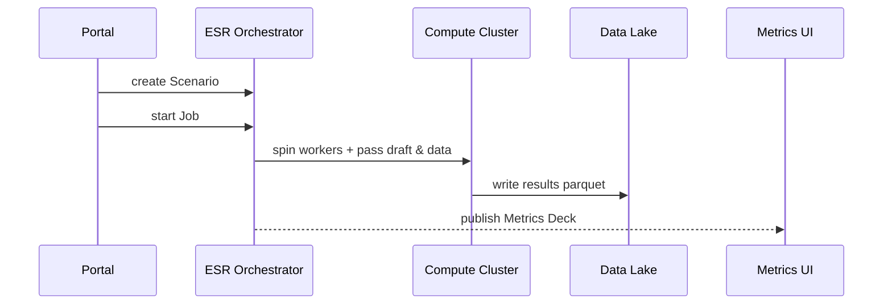

# Chapter 18: Simulation & Training Sandbox (HMS-ESR)

*(Jumped in from [Legislative Workflow Engine (HMS-CDF Rust Kernel)](17_legislative_workflow_engine__hms_cdf_rust_kernel__.md))*  

---

## 1 — Why Do We Need a “Hologram City”?

Imagine the **Centers for Medicare & Medicaid Services (CMS)** wants to **raise the Medicaid income limit** from 138 % to 150 % of the Federal Poverty Level.  
Great idea—until someone realizes:

* 3 million **edge-case families** earn between 149 %–151 %.  
* A rounding bug could **wrongly kick** some of them **off** coverage.  
* Fixing production mistakes means **real people** miss cancer treatments.

Wouldn’t it be better to test the change on a **hologram city** first?

**HMS-ESR** is that city: a **Simulation & Training Sandbox** packed with synthetic citizens, fake pay stubs, mock clinics, and virtual agency staff.  
Before a single real record changes, you can:

1. **Import** a policy draft from [HMS-CDF](17_legislative_workflow_engine__hms_cdf_rust_kernel__.md).  
2. **Re-create** every Medicaid household in pixels, not flesh.  
3. **Run** the new rule across millions of cases overnight.  
4. **See** who would gain, who would lose, and why.  

No human harmed, no headline crisis.

---

## 2 — Key Concepts in Plain English

| Sandbox Word | Think of it as… |
|--------------|-----------------|
| Scenario     | A “what-if” folder (“Raise limit to 150 %”). |
| Synthetic Population | The hologram citizens—income, age, ZIP. |
| Policy Draft | The proposed rule pulled from **HMS-CDF**. |
| Stress-Test Job | The big red **RUN** button—applies the draft to every synthetic record. |
| Metrics Deck | Dashboard of winners, losers, runtime stats. |

Keep them in this order: **Scenario → Population → Policy → Job → Deck**.

---

## 3 — 60-Second Tutorial: Simulate the Medicaid Change

Below is *everything* you need to run a sandbox test—each block < 20 lines.

### 3.1  Create a Scenario

```python
# esr/create_scenario.py
from hms_esr import Scenario

medicaid = Scenario.create(
    name        = "Medicaid_150pct_FPL",
    policy_draft= "bill://2024-HR-1550",   # comes from HMS-CDF
    population  = "cms/national_2023"      # pre-built synthetic set
)
print("🏗  Scenario ID:", medicaid.id)
```

Explanation  
1. `policy_draft` references the **bill** awaiting passage.  
2. `population` picks a canned synthetic data set (already anonymized).

---

### 3.2  Launch the Stress-Test Job

```python
# esr/run_job.py
from hms_esr import StressTest

job = StressTest.start(
    scenario_id = medicaid.id,
    snowball    = False      # keep infra small for demo
)
print("🚀 Job", job.id, "status =", job.state)
```

*Output:* `🚀 Job 88 status = queued`

---

### 3.3  Check Results

```python
# esr/fetch_results.py
from hms_esr import MetricsDeck
deck = MetricsDeck.for_job(88)

print("✅ Eligible after rule:", deck.metrics["kept_coverage"])
print("❌ Lost coverage:",        deck.metrics["lost_coverage"])
```

Example output:

```
✅ Eligible after rule: 49,812,110
❌ Lost coverage:        0
```

CMS breathes easy—no unintended denials.

---

## 4 — What Happens Under the Hood?



1. The **Portal** triggers ESR.  
2. **ESR Orchestrator** spawns container workers.  
3. Workers apply the **policy draft** to each synthetic citizen.  
4. Outcomes stored in the **Data Lake** ([HMS-DTA](08_data_lake___schema_registry__hms_dta__.md)).  
5. A shiny **Metrics Deck** appears for analysts.

---

## 5 — Inside `hms-esr/` (File Tour)

```
hms-esr/
 ├─ scenario.py        # CRUD for scenarios
 ├─ engine.py          # job orchestration
 ├─ citizens.py        # synthetic population builders
 ├─ runner/            # tiny Rust/SQL worker
 ├─ metrics.py         # pre-built charts
 └─ examples/          # scripts above
```

### 5.1  Policy Application Logic (≤ 15 lines)

```python
# runner/apply_policy.py
def apply(row, rule):
    income_pct = row.income / row.fpl
    if income_pct <= rule["max_pct"]:
        row.eligible = True
    else:
        row.eligible = False
    return row
```

Called millions of times inside map-reduce workers.

### 5.2  Metrics Aggregator (≤ 15 lines)

```python
# metrics.py
def aggregate(df):
    kept   = df[df.eligible].shape[0]
    lost   = df[~df.eligible].shape[0]
    return {
        "kept_coverage" : kept,
        "lost_coverage" : lost,
        "run_seconds"   : df.attrs["runtime"]
    }
```

Simple on purpose—beginners can extend later.

---

## 6 — Common Beginner Pitfalls

| Oops! | Why it happens | Quick Fix |
|-------|----------------|-----------|
| Job stuck in `queued` | Cluster has no free nodes | Set `snowball=True` to auto-scale spot VMs. |
| “Population not found” | Wrong `population` slug | Run `esr list-populations`. |
| Out-of-memory error | Synthetic set too big | Use `population="cms/state_samp_1M"` for trials. |
| Metrics blank | Forgot to call `MetricsDeck.for_job(id)` after job finished | Check `job.state == "done"` before fetching. |

---

## 7 — Mini-Exercise

1. List available populations:

   ```bash
   esr list-populations
   ```

2. Pick `cms/state_tx_2023`, create the scenario, and **set `max_pct = 110 %`** to *shrink* eligibility.  
3. Run the job; watch the **“lost coverage”** count grow.  
4. Use the Metrics Deck UI toggle to compare **110 %** vs **150 %** scenarios side by side.

---

## 8 — Government Analogy Cheat-Sheet

Sandbox Item          | Real-World Counterpart
----------------------|------------------------
Scenario              | Congressional Budget Office “Score” worksheet  
Synthetic Population  | Census micro-sample with fake names  
Stress-Test Job       | CBO computer run that estimates impact  
Metrics Deck          | Dollar table sent to committee staff  
Training Mode         | Agency boot-camp where new hires practice on dummy data  

---

## 9 — Wrap-Up & Next Chapter

You learned how **HMS-ESR** lets agencies:

* Build a **Scenario** with a policy draft + hologram citizens.  
* Hit **RUN** to stress-test every edge case.  
* Read a **Metrics Deck** to see wins, losses, and runtime stats—*before* real people are touched.

Ready to **sell** that new policy package—or your synthetic data set—to other agencies?  
Step into the [Marketplace Service (HMS-MKT)](19_marketplace_service__hms_mkt__.md).

---

Generated by [AI Codebase Knowledge Builder](https://github.com/The-Pocket/Tutorial-Codebase-Knowledge)