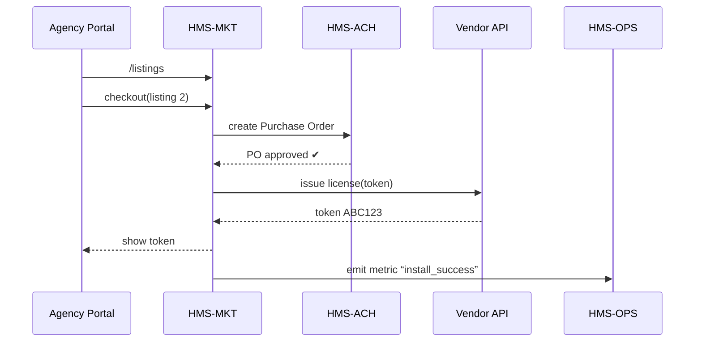

# Chapter 19: Marketplace Service (HMS-MKT)

*(jumped in from [Simulation & Training Sandbox (HMS-ESR)](18_simulation___training_sandbox__hms_esr__.md))*  

---

## 1 — Why Does HMS Need an “App Store for Government”?

Late on a Friday the **General Services Administration (GSA)** discovers a new
compliance deadline:

* All federal portals must publish **daily ESG*^1^* scores** for contractors  
  *starting next month.*

GSA engineers have three (bad) options:

1. Build an ESG scraper from scratch.  
2. Wait six months for a full-blown procurement.  
3. Email every agency begging for help.

Instead they open **HMS-MKT**—a one-click **Marketplace** where:

```
ESG Data Feed  ($0.04 / contractor / month)   ➜   [Install] button
Grant-Scoring Bot  (free trial)               ➜   [Install]
```

Ten minutes later:

* ESG numbers appear in GSA dashboards.  
* The contract is auto-booked in HMS financials.  
* The sandbox in [HMS-ESR](18_simulation___training_sandbox__hms_esr__.md) already has demo data.

No RFPs, no endless memos—just **plug-and-play upgrades**.

---

## 2 — Key Concepts in Plain English

| “App Store” Word | Think of it as…                              |
|------------------|----------------------------------------------|
| Listing          | The product card (“ESG Feed”, “Grant Bot”).  |
| Vendor           | The group publishing the listing.            |
| Cart             | Temporary basket before checkout.            |
| Purchase Order   | The approved contract row in HMS-ACH.        |
| License Token    | API key automatically scoped to your agency. |
| Sandbox Preview  | Free, read-only sample you can test in ESR.  |

Keep them in order: **Listing → Cart → Purchase Order → Token**.

---

## 3 — 60-Second Code Tour – From “Browse” to “Install”

Below are three **tiny** PHP routes (≤20 lines each).

### 3.1  Browse Listings

```php
// routes/api_v1.php
Route::get('/marketplace/listings', function () {
    return HMS\MKT\Listing::all(['id','name','price','vendor']);
});
```

Example response:

```json
[
  {"id":2,"name":"ESG Data Feed","price":0.04,"vendor":"GreenGov"},
  {"id":7,"name":"Grant-Scoring Bot","price":0.00,"vendor":"EDU-AI"}
]
```

*Explanation –* returns the product *cards* your agency can see.

---

### 3.2  Add to Cart & Checkout

```php
Route::post('/marketplace/cart', function () {
    $cart = HMS\MKT\Cart::forUser(auth()->id())
           ->add(listing_id: request('listing_id'))
           ->checkout();                    // auto-creates Purchase Order
    return $cart->purchaseOrder;            // JSON summary
});
```

Sample output:

```json
{
  "po_id": "PO-2024-00591",
  "amount": 4000,
  "status": "pending_approval"
}
```

*Explanation –* the **Purchase Order** funnels to governance & [HMS-ACH](09_financial_transaction_engine__hms_ach__.md).

---

### 3.3  Fetch Your License Token

```php
Route::get('/marketplace/tokens/{listing_id}', function ($id) {
    return HMS\MKT\License::forAgency(auth()->user()->agency_id, $id);
});
```

Response:

```json
{ "token": "MKT_ESG_ABC123HUD", "scope": "read_esg" }
```

*Explanation –* the **token** goes straight into your `.env` file—no emails.

---

## 4 — What Happens Under the Hood?



Five actors, automatic money trail.

---

## 5 — Inside the Marketplace (File Tour)

```
hms-mkt/
 ├─ Listing.php          # product ORM
 ├─ Cart.php             # per-user basket
 ├─ PurchaseOrder.php    # synced with HMS-ACH
 ├─ License.php          # token generator
 ├─ VendorWebhook.php    # notifies external seller
 └─ views/               # micro-front-end widgets
```

### 5.1  Token Generator (≤15 lines)

```php
// License.php
class License extends Model {
    public static function forAgency($agency, $listingId) {
        return static::firstOrCreate(
            compact('agency','listingId'),
            ['token' => Str::upper(Str::random(12))]
        );
    }
}
```

*Explanation –* every agency-listing pair gets **one** stable token.

---

## 6 — Sandbox Preview in One Line

Want to test before paying?

```bash
curl -H "Authorization: Bearer MKT_SANDBOX" \
     https://mkt.esr.gov/preview/esg?limit=10
```

The Marketplace pipes the request to the vendor’s sandbox and logs usage in **HMS-ESR**.

---

## 7 — Common Beginner Pitfalls

| Oops! | Why it happens | Quick Fix |
|-------|----------------|-----------|
| “PO stuck in `pending_approval`” | Governance motion not submitted | Click *Submit to Governance* or POST `/governance/motions`. |
| Token returns 403 at vendor | Using sandbox token in prod endpoint | Fetch the **production** token after PO is approved. |
| Duplicate purchases | Two team-mates buy same listing | Use `Cart::add()`—it auto-dedups by listing_id + agency. |
| Forgotten renewals | Annual PO expires silently | Enable **auto-renew** flag in the cart. |

---

## 8 — Mini-Exercise

1. `GET /marketplace/listings` – choose any free item.  
2. `POST /marketplace/cart` with its `listing_id`.  
3. Approve the PO in Governance → watch `status` flip to **active**.  
4. Call `/marketplace/tokens/{listing_id}` and hit the vendor’s sample URL.  
5. Open **HMS-OPS** dashboard → see metric `install_success = 1`.

---

## 9 — Government Analogy Cheat-Sheet

Marketplace Part | Real-World Counterpart
-----------------|-----------------------
Listing          | GSA “Schedule 70” catalog page  
Cart             | Procurement “shopping cart” in SAM.gov  
Purchase Order   | SF-1449 contract form  
License Token    | Contract clause giving you API credentials  
Sandbox Preview  | Vendor onsite demo before signing  

---

## 10 — Wrap-Up & What’s Next

You learned that **HMS-MKT** is the government’s **instant app store**:

* Browse **Listings**, add them to a **Cart**, and auto-generate a **Purchase Order**.  
* Receive a scoped **License Token** with zero manual emails.  
* Try before you buy through **Sandbox Preview** and audit everything in **HMS-OPS**.

Ready to see the helper functions that make every chapter’s code shorter and safer?  
Head to [Shared Utilities Library (HMS-UTL)](20_shared_utilities_library__hms_utl__.md).

---

*^1^  Environmental, Social, and Governance score.*

---

Generated by [AI Codebase Knowledge Builder](https://github.com/The-Pocket/Tutorial-Codebase-Knowledge)