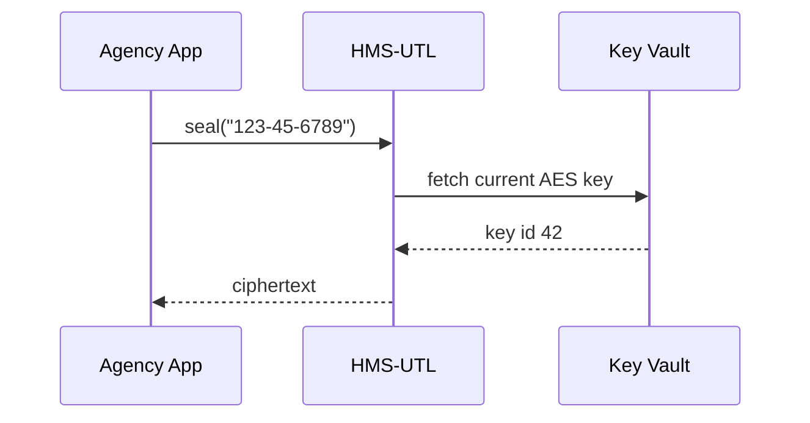

# Chapter 20: Shared Utilities Library (HMS-UTL)

*(jumped in from [Marketplace Service (HMS-MKT)](19_marketplace_service__hms_mkt__.md))*  

---

## 1 — Why Do We Need One “Federal Toolbox”?

Friday night at **Freddie Mac**:  
A dev finishes a script that must:

1. Encrypt borrowers’ SSNs before saving to S3, and  
2. Tag each record with the **correct fiscal-year quarter** so HUD can pull monthly reports Monday morning.

She opens GitHub and sees **six** different encryption snippets, **three** fiscal-year functions, and a mix of **UTC** and **EST** time zones.  
One typo means either:

* **FIPS** compliance is broken (hello, IG audit), or  
* HUD’s dashboards show **Q1 2025** numbers under **Q4 2024**.

The fix?  **HMS-UTL**—a **shared utilities library** every chapter of HMS depends on.  
It’s the boring but essential **toolbox** that guarantees every agency uses:

* The **same, FIPS-validated** crypto helpers,  
* The **same calendar math** (federal fiscal year = Oct 1 – Sep 30), and  
* Reusable **policy math** (poverty-level %, sliding-scale benefits, etc.).

“Use the toolbox, skip the wheel-reinvention.”

---

## 2 — Key Pieces of the Toolbox

| Tool Drawer | What’s inside (plain English) |
|-------------|--------------------------------|
| `crypto`    | AES-256-GCM & Ed25519 helpers already FIPS-tested |
| `dates`     | “Is Oct 1 inside FY 2025?” calculators |
| `policy`    | Small math snippets (poverty %, sliding grants, CPI adjust) |
| `ui`        | React/Vue components that wrap these helpers for portals |

Keep three words in mind: **crypto**, **dates**, **policy**.

---

## 3 — Quick 60-Second Code Tour

Below are **three** tiny scripts—each under 20 lines—using HMS-UTL in real agency work.

### 3.1 Encrypt a Social Security Number

```python
# scripts/encrypt_ssn.py
from hms_utl.crypto import seal, unseal

ssn_plain  = "123-45-6789"
ciphertext = seal(ssn_plain, label="SSN")    # AES-256-GCM
print(ciphertext)                            # gibberish 🔐

assert unseal(ciphertext, label="SSN") == ssn_plain
```

*Explanation*  
`seal()` auto-rotates keys stored in Vault; `label` helps auditors know **why** it was encrypted.

---

### 3.2 Tag the Correct Fiscal-Year Quarter

```javascript
// scripts/fy_quarter.js
import { fyQuarter } from "@hms-utl/dates";

console.log( fyQuarter("2024-12-15") );   // => "FY-2025 Q1"
console.log( fyQuarter("2025-07-01") );   // => "FY-2025 Q3"
```

*Explanation*  
The helper always uses the **federal** fiscal year (Oct 1 → Sep 30) so HUD, GSA, and Treasury agree.

---

### 3.3 Compute Sliding-Scale Benefit

```php
// scripts/benefit.php
require 'vendor/autoload.php';
use HMS\UTL\Policy\Benefit;

$incomePct = 142;                    // 142 % of poverty line
echo Benefit::snapMonthly($incomePct);   // => 143.50 (USD)
```

*Explanation*  
`Benefit::snapMonthly()` encodes the official SNAP sliding-scale formula so every state portal shows the **same** answer.

---

## 4 — What Happens Under the Hood?



* Five simple hops, all invisible to the beginner dev.  
* Replace `seal()` with `fyQuarter()` or `Benefit::…()`—call flow stays just as simple.

---

## 5 — Inside the Toolbox (File Tour)

```
hms-utl/
 ├─ crypto/
 │   ├─ seal.py          # Python
 │   ├─ seal.php         # PHP
 │   └─ seal.ts          # TypeScript
 ├─ dates/
 │   └─ fy.py | js       # fiscal-year helpers
 ├─ policy/
 │   └─ benefit.php      # grant / SNAP math
 ├─ ui/
 │   └─ <Button/> etc.   # micro-frontend pieces
 └─ tests/               # same test vectors in all langs
```

### 5.1 FIPS-Validated Seal (excerpt – 15 lines)

```python
# crypto/seal.py
from cryptography.hazmat.primitives.aead import AESGCM
from hms_utl.crypto.keys import active_key   # pulls from Vault

def seal(plaintext: str, *, label: str) -> str:
    key, kid = active_key()
    aes = AESGCM(key)
    nonce = os.urandom(12)
    ct = aes.encrypt(nonce, plaintext.encode(), label.encode())
    return f"{kid}:{base64.b64encode(nonce+ct).decode()}"
```

*Key points*  
• Keys live outside code.  
• Same test vectors in `tests/` prove every language binding matches.

---

## 6 — Government Analogy Cheat-Sheet

Software Thing        | Real-World Counterpart
----------------------|------------------------
`crypto.seal()`       | GSA-approved locking briefcase  
`dates.fyQuarter()`   | OMB wall-calendar colored by fiscal quarters  
`policy.benefit()`    | USDA worksheet page used by all 50 state offices  

---

## 7 — Common Beginner Pitfalls

1. **Copy-pasting your own crypto code**  
   ➜ Use `hms_utl.crypto` instead—already FIPS.  
2. **Assuming calendar = Jan 1 fiscal year**  
   ➜ Always call `fyQuarter()`; never hard-code.  
3. **Mismatched library versions**  
   ➜ Every HMS-service pins the same semver tag (`hms-utl ^1.6`).  
4. **Storing raw keys in `.env`**  
   ➜ `seal()` fetches from Vault—no keys in repo.

---

## 8 — Mini-Exercise

1. Install the library in any language you like (`pip install hms-utl` or `composer require hms-utl`).  
2. Encrypt `"TOP SECRET"` and immediately decrypt—verify round-trip.  
3. Pass **September 30, 2024** to `fyQuarter()`—should return **“FY-2024 Q4”**.  
4. Change the date to **October 1, 2024**—should flip to **“FY-2025 Q1.”**  
5. Input incomes of **90 %**, **130 %**, **200 %** into `Benefit::snapMonthly()` and observe the sliding amounts.

---

## 9 — Wrap-Up

You now have a **single, battle-tested toolbox** for:

* **Encryption** that survives FIPS audits,  
* **Date math** that never argues about what “Q1” means, and  
* **Policy formulas** you can drop into any chapter’s code.

No matter whether you’re wiring ACH payments, drafting AI letters, or running sandbox simulations, **HMS-UTL** is the quiet helper keeping every agency on the same page.

*(Congratulations — you’ve reached the final chapter of the beginner tour!  Explore the repo, open issues, and help make the toolbox even sharper.)*

---

Generated by [AI Codebase Knowledge Builder](https://github.com/The-Pocket/Tutorial-Codebase-Knowledge)