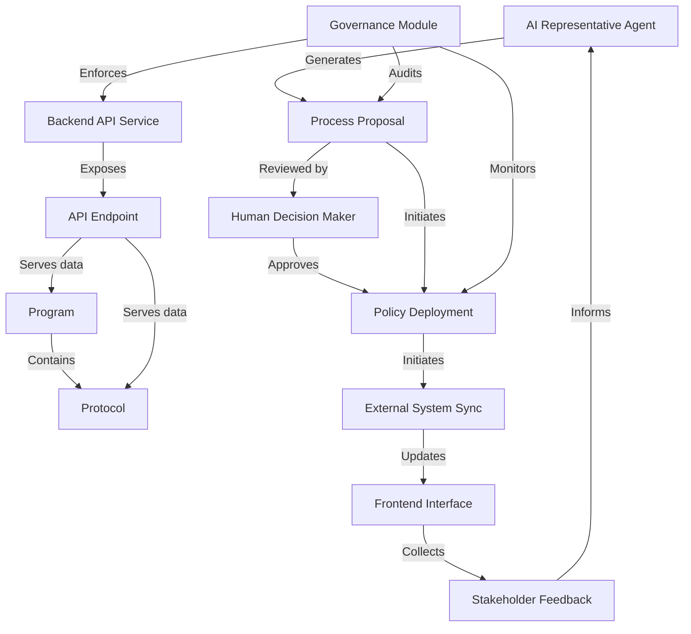

# Tutorial: HMS-API

The HMS-API is a **central backend** that powers a complete *AI-driven government services platform*.  
It manages **Programs** and **Protocols**, exposes **API Endpoints** for citizen and agency frontends,  
integrates **AI Agents** for *policy drafting*, and enforces **governance** to deliver  
transparent, efficient public services.

**Source Repository:** [None](None)

## Chapters

1. [Program
](01_program_.md)
2. [Protocol
](02_protocol_.md)
3. [Backend API Service
](03_backend_api_service_.md)
4. [API Endpoint
](04_api_endpoint_.md)
5. [AI Representative Agent
](05_ai_representative_agent_.md)
6. [Process Proposal
](06_process_proposal_.md)
7. [Human Decision Maker
](07_human_decision_maker_.md)
8. [Policy Deployment
](08_policy_deployment_.md)
9. [Governance Module
](09_governance_module_.md)
10. [External System Sync
](10_external_system_sync_.md)
11. [Frontend Interface
](11_frontend_interface_.md)
12. [Stakeholder Feedback
](12_stakeholder_feedback_.md)

---

Generated by [AI Codebase Knowledge Builder](https://github.com/The-Pocket/Tutorial-Codebase-Knowledge)