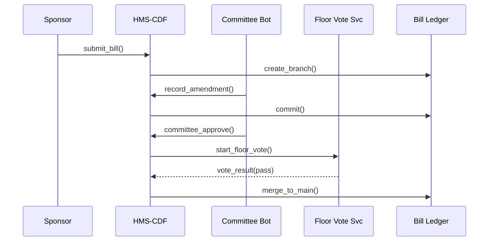

# Chapter 2: Codified Democracy Foundation Engine (HMS-CDF)

*(Transition from [Chapter 1: Governance Portal (HMS-GOV)](01_governance_portal__hms_gov__.md))*  
In Chapter 1 you saw where officials “click.”  
But *what* exactly happens after an elected representative clicks **“Submit New Bill”**?  
HMS-CDF is the engine that makes sure the bill travels through every constitutional checkpoint—no shortcuts, no missing pages, no “lost” amendments.

---

## 1. Why Does HMS-CDF Exist?

Picture Congress during a public-health emergency.  
An AI policy assistant drafts a *“National Rapid Vaccine Distribution Act.”* Lawmakers want to move fast **without** breaking procedure:

1. The bill must enter a committee.  
2. Members can propose amendments.  
3. A floor vote must occur.  
4. The final text must be published immutably.

The Codified Democracy Foundation Engine guarantees this path—**mathematically**—the same way GitHub guarantees every pull-request goes through review before merging.

---

## 2. Mental Model: “Git for Government”

| Legislative Step | Git Analogy | What HMS-CDF Does |
|------------------|-------------|-------------------|
| Bill introduced  | New branch  | Creates `bill/1234` branch in ledger |
| Amendment        | Commit      | Records change with signer’s ID |
| Committee vote   | Pull request review | Requires majority 👍 signatures |
| Floor vote       | Merge to `main` | Only merges if vote tally passes |
| Publication      | Release tag | Pushes signed PDF + machine file to public node |

---

## 3. Key Concepts (in Plain Words)

1. **Bill Ledger**  
   A tamper-proof database that stores every version, like a time-machine for laws.

2. **State Machine**  
   A locked-down flow: `Draft → Committee → Floor → Published`. You can *look* but you can’t *skip*.

3. **Amendment Chain**  
   Each edit points to the previous one, so you always know *who* changed *what* and *why*.

4. **Cryptographic Signatures**  
   Digital “wax seals” that prove votes and edits are genuine.

5. **Policy Hooks**  
   Call-outs to other HMS services—e.g., [Legal Reasoning & Compliance Engine (HMS-ESQ)](03_legal_reasoning___compliance_engine__hms_esq__.md)—for automatic statute checks.

---

## 4. Five-Minute Walk-Through

Let’s introduce a bill, add an amendment, and publish—all in fewer than 20 lines of code.

```rust
// examples/vaccine_bill.rs
use hms_cdf::*;

fn main() -> Result<()> {
    // 1. Sponsor files a new bill
    let bill = Bill::new("Rapid Vaccine Distribution Act")?
        .submit_by("rep.alvarez@house.gov")?;

    // 2. Committee adds an amendment
    bill.new_amendment("Allocate $50M to cold-chain")?
        .proposed_by("sen.chen@senate.gov")?
        .commit()?;                       // cryptographically signed

    // 3. Committee vote (simple majority)
    bill.committee_vote()?.approve(12, 3)?;

    // 4. Floor vote
    bill.floor_vote()?.approve(376, 59)?;

    // 5. Publish
    bill.publish()?;                      // immutable hash returned
    Ok(())
}
```

What happens on each line?

1. `Bill::new` opens a new *branch* in the ledger.  
2. `new_amendment` records a commit; `commit()` seals it.  
3. `committee_vote()` enforces the first checkpoint.  
4. `floor_vote()` can’t run unless the previous step passed.  
5. `publish()` merges to `main` and emits a public hash.

---

## 5. Under the Hood (Step-By-Step)



If any arrow fails (e.g., vote doesn’t pass), the machine halts and returns an error—so no one can quietly skip steps.

---

## 6. Implementation Peek

### 6.1 Minimal State Machine

```rust
// src/state.rs (simplified)
#[derive(Debug)]
pub enum Stage { Draft, Committee, Floor, Published }

impl Stage {
    pub fn next(self) -> Result<Stage> {
        use Stage::*;
        match self {
            Draft     => Ok(Committee),
            Committee => Ok(Floor),
            Floor     => Ok(Published),
            Published => Err("Already final".into()),
        }
    }
}
```

Explanation:  
• Only exact transitions are allowed.  
• Trying to jump from `Draft` straight to `Floor` will return an error.

### 6.2 Enforcing an Unbroken Amendment Chain

```rust
// src/amend.rs (trimmed)
pub struct Amendment {
    id: Uuid,
    parent_hash: Hash,
    diff: String,
    signer: PubKey,
}

pub fn commit(prev: &Hash, diff: &str, signer: &Key) -> Amendment {
    Amendment {
        id: Uuid::new_v4(),
        parent_hash: *prev,
        diff: diff.to_owned(),
        signer: signer.public(),
    }
}
```

Because every amendment stores the *hash of its parent*, deleting or reshuffling history would break the chain and be instantly detectable.

---

## 7. Frequently Asked Beginner Questions

**Q: Is this blockchain?**  
A: Internally HMS-CDF uses Merkle hashes like a blockchain, but it’s permissioned and optimized for legislative workflows, not open-ended cryptocurrencies.

**Q: Can a committee reopen a published law?**  
A: No. They must introduce a new *amendment bill* that starts again at `Draft`. Immutable means immutable.

**Q: Where do judges or auditors check the record?**  
A: Through [HMS-GOV’s](01_governance_portal__hms_gov__.md) “Legislative Ledger” tab, which simply reads the HMS-CDF hashes.

---

## 8. How HMS-CDF Talks to Other Components

• **Legal Checks** – Before a floor vote, the draft is auto-scanned by [HMS-ESQ](03_legal_reasoning___compliance_engine__hms_esq__.md) for conflicts with existing statutes.  
• **Human Oversight** – Overrides or emergency stops route through [Human-in-the-Loop Oversight (HITL)](07_human_in_the_loop_oversight__hitl__.md).  
• **Notifications** – The moment `publish()` succeeds, a signal is sent to [Micro-Frontend Interface Layer (HMS-MFE)](04_micro_frontend_interface_layer__hms_mfe__.md) so the public website updates instantly.

---

## 9. Hands-On Exercise

1. Clone the playground repo:  
   `git clone https://github.com/hms-nfo/cdf-playground && cd cdf-playground`
2. Run `cargo run --example vaccine_bill`.
3. Copy the returned hash into the **Ledger Inspector** in HMS-GOV; you’ll see every step and signature.

---

## 10. Summary & What’s Next

You learned:

• The motivation for HMS-CDF—guaranteed due-process at “AI speed.”  
• The core concepts: bill ledger, state machine, amendment chain.  
• How a 15-line Rust script can safely move a bill from draft to law.  
• How cryptographic hashes make the history unforgeable.

In the next chapter we’ll explore *how* the system automatically checks each draft against existing statutes and regulations: [Legal Reasoning & Compliance Engine (HMS-ESQ)](03_legal_reasoning___compliance_engine__hms_esq__.md).

---

Generated by [AI Codebase Knowledge Builder](https://github.com/The-Pocket/Tutorial-Codebase-Knowledge)