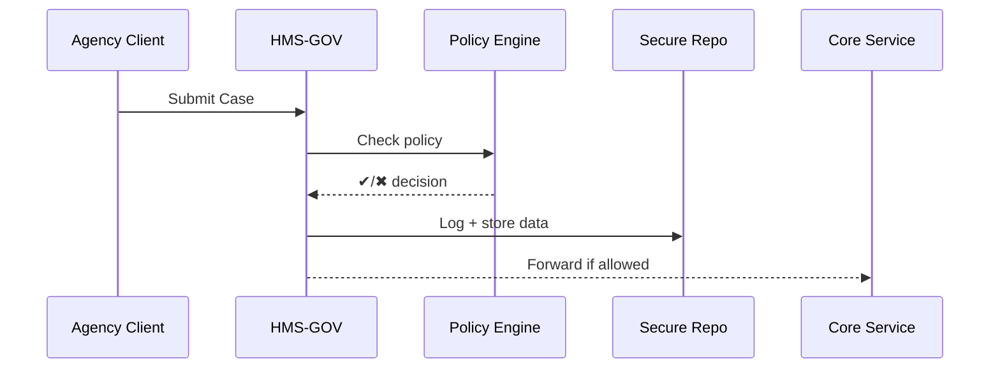

# Chapter 1: Governance Layer (HMS-GOV)

Welcome to HMS-CUR!  
Before we dive into machine-learning models, policy engines, or fancy dashboards, we need a **front door**—a place where outside agencies can knock, show their credentials, and talk to our platform without accidentally tripping over internal wires.  
That front door is the **Governance Layer (HMS-GOV).**

---

## 1. Why Do We Need HMS-GOV?

Imagine the **U.S. Census Bureau** wants to pull population data into CodifyHQ so a new benefits-allocation model can run nightly.  
At the same time, the **Peace Corps** hopes to log volunteer statistics, and a state **Child Support** office needs to verify payments.

Without a common entry point:

* each agency would build a different integration,
* legal rules (like data-sharing MOUs) might be missed,
* and debugging would feel like untangling a bowl of spaghetti.

HMS-GOV fixes that by offering:

1. Friendly, versioned **APIs** and simple **screens**.  
2. Automatic **policy enforcement** (no personal data leaves the building without sign-off).  
3. **Audit logs** for every call (helpful when Congress asks, “Who touched what?”).  

---

## 2. Key Concepts in Plain English

| Term | Beginner Explanation |
|------|----------------------|
| API Endpoint | A URL—like `https://gov.codifyhq.com/v1/census/population`—that an agency calls. |
| Screen | A point-and-click web form for staff who prefer browsers over code. |
| Policy Guard | A set of traffic lights that says *green* (pass), *yellow* (needs review), or *red* (block). |
| Audit Log | A tamper-proof diary of who did what and when. |
| Adapter | A mini-plug that converts an agency’s data shape to the one CodifyHQ understands. |

---

## 3. A Concrete Use Case

“**Submit a New Child-Support Case**”

1. A state worker fills a web form or posts JSON to HMS-GOV.  
2. HMS-GOV validates the data, checks policy, and writes an audit record.  
3. Approved data is passed to downstream services for processing.

Let’s see both flows.

### 3.1 API Flow (code)

```python
# client_submit_case.py
import requests

payload = {
    "case_id": "TX-2024-0001",
    "parent_name": "Alex Doe",
    "child_name":  "Jamie Doe",
    "monthly_amount_usd": 350
}

r = requests.post(
    "https://gov.codifyhq.com/v1/child-support/cases",
    json=payload,
    headers={"X-Agency": "TX-ChildSupport"}
)

print("Status:", r.status_code)
print("Result:", r.json())
```

Explanation  
1. We send JSON to a single URL.  
2. **HMS-GOV** answers—no need to know about internal microservices.

Possible output:

```text
Status: 202
Result: {
  "message": "Case accepted, awaiting policy approval",
  "tracking_id": "abc123"
}
```

### 3.2 Screen Flow (no code)

The same worker could open `gov.codifyhq.com/cases/new`, see a simple wizard, and press **Submit**. Under the hood, the screen calls the same endpoint.

---

## 4. What Happens Inside?

Below is a bird’s-eye view (no code yet):



Keep the names in mind—**CDF** stands for the Policy Engine we will meet in [Policy Engine (HMS-CDF)](02_policy_engine__hms_cdf__.md).

---

## 5. A Peek Under the Hood (Minimal Code)

Folder sketch:

```
hms-gov/
 ├─ router.py
 ├─ adapters/
 │   └─ child_support.py
 └─ guards/
     └─ privacy.py
```

### 5.1 Routing

```python
# hms-gov/router.py
from fastapi import FastAPI, Request, HTTPException
from adapters.child_support import map_payload
from guards.privacy import check_policy

app = FastAPI()

@app.post("/v1/child-support/cases")
async def new_case(req: Request):
    data = await req.json()
    
    # 1️⃣ translate outside format ➜ internal
    internal = map_payload(data)
    
    # 2️⃣ run policy guard
    decision = check_policy(internal, req.headers)
    if not decision["allow"]:
        raise HTTPException(status_code=403, detail=decision["reason"])
    
    # 3️⃣ write audit log         (pseudo)
    # audit_log.write(...)
    
    # 4️⃣ hand off to core service (pseudo)
    # core_service.enqueue(internal)
    
    return {
        "message": "Case accepted, awaiting policy approval",
        "tracking_id": decision["tracking_id"]
    }
```

Explanation  
1. **map_payload** converts whatever the agency sent into CodifyHQ’s canonical structure.  
2. **check_policy** calls the Policy Engine. If rules say “stop,” we raise a 403.  
3. Steps 3 & 4 are shown as comments to keep code < 20 lines.

### 5.2 Adapter Example

```python
# adapters/child_support.py
def map_payload(ext):
    """Convert external JSON to internal schema."""
    return {
        "caseId": ext["case_id"],
        "parent": ext["parent_name"],
        "child":  ext["child_name"],
        "amount": float(ext["monthly_amount_usd"])
    }
```

Simple and readable—new adapters are easy to write.

### 5.3 Policy Guard Stub

```python
# guards/privacy.py
import uuid

def check_policy(data, headers):
    # Placeholder logic; real version calls HMS-CDF
    agency = headers.get("X-Agency", "unknown")
    allowed = agency.startswith("TX-")
    return {
        "allow": allowed,
        "reason": "" if allowed else "Agency not whitelisted",
        "tracking_id": str(uuid.uuid4())
    }
```

Right now, we just allow Texas agencies; later chapters will make this smarter.

---

## 6. Hands-On Exercise

1. Clone the repo and run:

   ```bash
   uvicorn hms-gov.router:app --reload
   ```
2. Use the earlier Python snippet or `curl`:

   ```bash
   curl -X POST http://127.0.0.1:8000/v1/child-support/cases \
        -H "X-Agency: TX-ChildSupport" \
        -d '{"case_id":"TX-2024-0001","parent_name":"Alex","child_name":"Jamie","monthly_amount_usd":350}'
   ```

You should receive a 202 response with a tracking ID. Check the console for printed logs.

---

## 7. Where Does HMS-GOV Store Logs?

For beginners, think of an **immutable notebook**: every request and policy decision is written line-by-line. In production this notebook lives in the **Secure Data Repository** covered in [Secure Data Repository (HMS-DTA)](13_secure_data_repository__hms_dta__.md).

---

## 8. Common Questions

Q: “Do I need to know FastAPI?”  
A: Only if you want to extend endpoints. Otherwise, focus on JSON payloads.

Q: “How do screens appear?”  
A: They’re micro-frontends described later in [Interface Layer – Micro-Frontends (HMS-MFE)](08_interface_layer___micro_frontends__hms_mfe__.md).

Q: “Who writes policy rules?”  
A: Policy analysts, via [Policy Engine (HMS-CDF)](02_policy_engine__hms_cdf__.md). You don’t hard-code them here.

---

## 9. Summary & Next Steps

You now know:

* HMS-GOV is the **diplomatic front desk** of CodifyHQ.  
* It offers uniform APIs and screens, checks policy, and records every move.  
* Adapters and guards keep the code modular and beginner-friendly.

In the next chapter we’ll open the door behind those **Policy Guards** and learn how rules are created and enforced.

➡️ Continue to [Policy Engine (HMS-CDF)](02_policy_engine__hms_cdf__.md)

---

Generated by [AI Codebase Knowledge Builder](https://github.com/The-Pocket/Tutorial-Codebase-Knowledge)