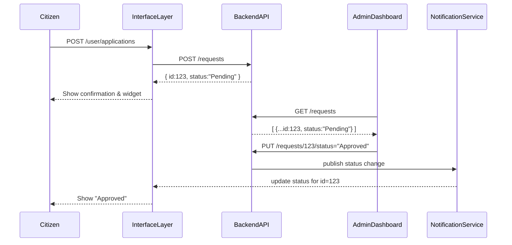

# Chapter 1: Interface Layer (User & Admin UIs)

Welcome to HMS-CUR! In this chapter we’ll explore the **Interface Layer**, the front lobby of our digital government building. This is where citizens submit requests and decision-makers review them—complete with real-time status updates.

## Why the Interface Layer?

Imagine walking into a federal office building. You see two service windows:
1. A **public inquiry** window for citizens (HMS-MFE).  
2. An **official business** window for administrators (HMS-GOV).

The Interface Layer bundles both windows—**User Portal** and **Admin Dashboard**—into one coherent digital lobby. It routes requests, shows real-time updates, and makes the citizen experience smooth and transparent.

### Use Case: Submitting a Citizen Service Request

Alice, a citizen, needs to apply for an energy lease permit at the Bureau of Ocean Energy Management. She:
1. Opens the **User Portal**.  
2. Fills out the “Permit Application” form.  
3. Submits her request.  
4. Sees a live status widget (“Pending → Reviewed → Approved”).  

Meanwhile, Bob, an agency official, logs into the **Admin Dashboard**, reviews Alice’s submission, changes its status, and Alice instantly sees the update.

## Key Concepts

1. **User Portal**  
   A React (or similar) app that citizens use to submit and track requests.  
2. **Admin Dashboard**  
   A separate app for decision-makers to review, approve, or reject.  
3. **Routing & Micro-Frontends**  
   We use simple URL routes to mount each portal—but under the hood we can swap in tiny “micro-frontends” for flexibility.  
4. **Real-Time Updates**  
   WebSockets or Server-Sent Events push status changes so citizens and admins always see the latest.

---

## How to Set Up the Interface Layer

Below is a minimal React example that routes `/user` to the User Portal and `/admin` to the Admin Dashboard.

```jsx
// src/interface/index.js
import React from 'react';
import ReactDOM from 'react-dom';
import { BrowserRouter, Route, Switch } from 'react-router-dom';
import UserPortal from './UserPortal';
import AdminDashboard from './AdminDashboard';

ReactDOM.render(
  <BrowserRouter>
    <Switch>
      <Route path="/user" component={UserPortal} />
      <Route path="/admin" component={AdminDashboard} />
    </Switch>
  </BrowserRouter>,
  document.getElementById('root')
);
```
*This mounts two entry points under one “lobby.”*

### User Portal Example

```jsx
// src/interface/UserPortal.js
import React, { useState } from 'react';

export default function UserPortal() {
  const [status, setStatus] = useState('No Request Yet');

  function submitApplication(formData) {
    fetch('/api/requests', {
      method: 'POST',
      headers: { 'Content-Type': 'application/json' },
      body: JSON.stringify(formData),
    })
      .then(res => res.json())
      .then(payload => setStatus(payload.status));
  }

  return (
    <div>
      <h1>Submit Permit</h1>
      {/* form elements omitted for brevity */}
      <button onClick={() => submitApplication({ /* form data */ })}>
        Send
      </button>
      <p>Current Status: {status}</p>
    </div>
  );
}
```
*Citizens click “Send,” and see a live status update.*

### Admin Dashboard Example

```jsx
// src/interface/AdminDashboard.js
import React, { useEffect, useState } from 'react';

export default function AdminDashboard() {
  const [requests, setRequests] = useState([]);

  useEffect(() => {
    fetch('/api/requests')
      .then(res => res.json())
      .then(data => setRequests(data));
  }, []);

  function changeStatus(id, newStatus) {
    fetch(`/api/requests/${id}/status`, {
      method: 'PUT',
      headers: { 'Content-Type': 'application/json' },
      body: JSON.stringify({ status: newStatus }),
    }).then(() => {/* refresh UI or emit event */});
  }

  return (
    <div>
      <h1>Review Applications</h1>
      {requests.map(r => (
        <div key={r.id}>
          #{r.id} – {r.status}
          <button onClick={() => changeStatus(r.id, 'Approved')}>
            Approve
          </button>
        </div>
      ))}
    </div>
  );
}
```
*Officials load all requests, then approve or reject.*

---

## Under the Hood: Sequence Walkthrough

Here’s what happens when Alice submits her permit:



1. **Submit**: Citizen UI sends request to API.  
2. **Store & Respond**: Backend saves and returns an ID.  
3. **Display**: UI shows a confirmation and status widget.  
4. **Review**: Admin UI fetches pending items.  
5. **Approve**: Admin UI updates status.  
6. **Notify**: A NotificationService pushes the update back to the citizen.

---

## Internal Implementation Files

- `src/interface/index.js`  
  Routes and mounts both portals.  
- `src/interface/UserPortal.js`  
  Handles form submission and status display.  
- `src/interface/AdminDashboard.js`  
  Lists requests and sends status updates.  

Behind the scenes you might wire up WebSockets or Server-Sent Events for real-time pushes, but the simple `fetch`/`useState` pattern illustrates the flow.

---

## Conclusion

You’ve learned how the **Interface Layer** acts as the front lobby for both citizens and administrators: mounting portals, routing traffic, and showing live status updates. Next, we’ll dive deeper into how to split the User Portal into independent micro-frontends for more flexibility.

Continue to [Micro-Frontend Architecture (HMS-MFE)](02_micro_frontend_architecture__hms_mfe__.md) for Chapter 2!

---

Generated by [AI Codebase Knowledge Builder](https://github.com/The-Pocket/Tutorial-Codebase-Knowledge)