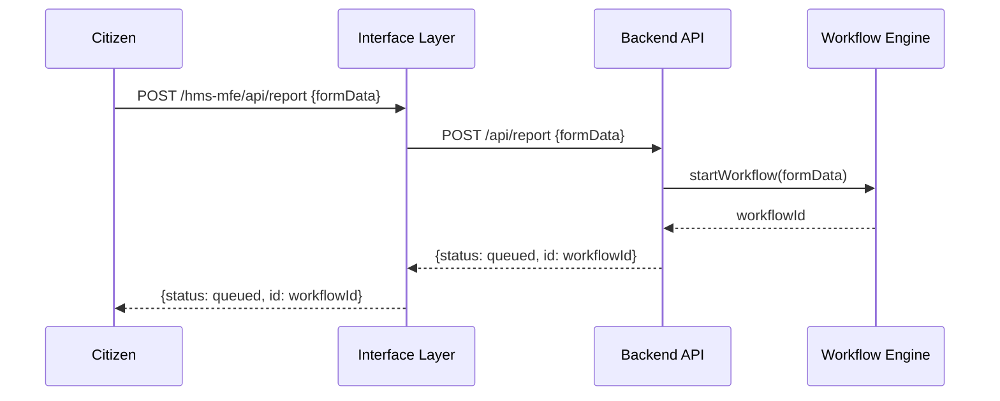
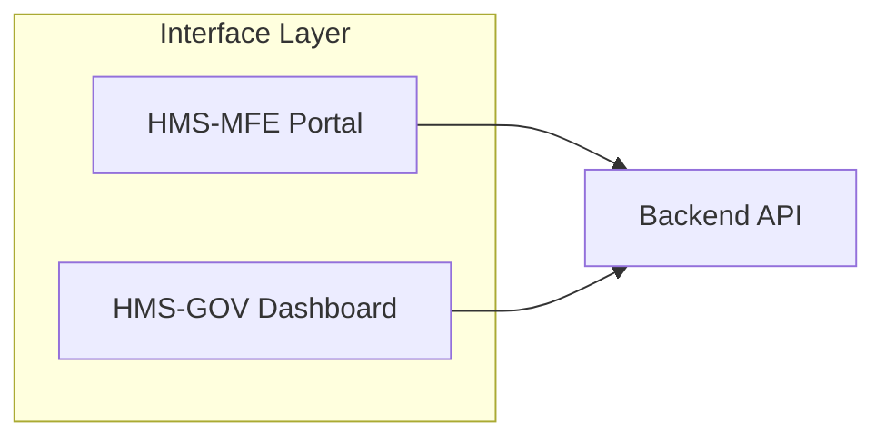

# Chapter 1: Interface Layer

Welcome to HMS-CUR! In this chapter, we’ll explore the **Interface Layer**—the user-facing portals and dashboards where citizens and administrators interact with the system.

---

## 1.1 Motivation: Solving the “Public Counter” Problem

Imagine you walk into a government building to submit an FDA adverse-event report:

- At the **front desk**, you hand over your form (citizen portal).
- In the **boardroom**, officials review high-level statistics (admin dashboard).

In HMS-CUR, the **Interface Layer** plays both roles. It routes citizen submissions into the system and surfaces metrics to administrators in a friendly UI. Without it, forms can’t be submitted, and dashboards can’t display data.

**Use case**  
A citizen files a drug safety complaint through **HMS-MFE**. Later, an administrator logs into **HMS-GOV** to see how many reports arrived today.

---

## 1.2 Key Concepts

1. **Portals**  
   - **HMS-MFE** – A citizen’s “public counter” for submitting forms or complaints.  
   - **HMS-GOV** – An administrator’s “boardroom” dashboard for metrics and approvals.

2. **Routing & Proxying**  
   - Static assets (HTML/CSS/JS) are served to the browser.  
   - API calls (`/api/*`) are forwarded to the **Backend API** layer.

3. **Configuration**  
   - Each portal is registered with a name, public URL, and optional auth.

---

## 1.3 Using the Interface Layer

Let’s see how to spin up both portals in a minimal Express.js app.

### 1.3.1 `src/interface_layer/index.js`

```js
const express = require('express');
const portalRouter = require('./portalRouter');

const app = express();
app.use(express.json());

// Citizen portal (public)
app.use('/hms-mfe', portalRouter({
  name: 'HMS-MFE',
  publicUrl: '/hms-mfe',
}));

// Admin portal (requires auth)
app.use('/hms-gov', portalRouter({
  name: 'HMS-GOV',
  publicUrl: '/hms-gov',
  authRequired: true,
}));

app.listen(3000, () => {
  console.log('Interface Layer running on port 3000');
});
```

> This code spins up two sub-apps:
> - `/hms-mfe` serves the citizen UI and proxies API calls  
> - `/hms-gov` serves the admin UI (with auth) and also proxies

---

## 1.4 Under the Hood

### 1.4.1 Step-by-Step Flow

1. **Citizen** clicks “Submit Report” on **HMS-MFE**.  
2. Browser sends `POST /hms-mfe/api/report`.  
3. **Interface Layer** proxies to **Backend API**.  
4. **Backend API** starts a workflow in the **Workflow Engine**.  
5. Responses bubble back to the citizen.

#### Sequence Diagram



### 1.4.2 Component Diagram



### 1.4.3 Core Router Code

File: `src/interface_layer/portalRouter.js`

```js
const express = require('express');

function portalRouter(config) {
  const router = express.Router();

  // Serve UI assets from ./ui/{PortalName}
  router.use(express.static(`./ui/${config.name}`));

  // Proxy any /api/* call to the Backend API
  router.all('/api/*', (req, res) => {
    // In real code: forward HTTP request to actual backend URL
    res.send(`Proxied to Backend API: ${req.path}`);
  });

  return router;
}

module.exports = portalRouter;
```

> This small module creates a mini-app for each portal:
> - Serves the UI directory  
> - Proxies API endpoints under `/api/*`

---

## 1.5 What We Learned

- The **Interface Layer** is your “public counter” and “executive briefing room.”  
- It hosts multiple portals (citizen vs. admin), serves static UIs, and proxies API calls.  
- Under the hood, Express.js routers keep things simple and modular.

Next up, we’ll dive into how the portals themselves are built. Join us in [Frontend Interface](02_frontend_interface_.md) to learn more!

---

Generated by [AI Codebase Knowledge Builder](https://github.com/The-Pocket/Tutorial-Codebase-Knowledge)