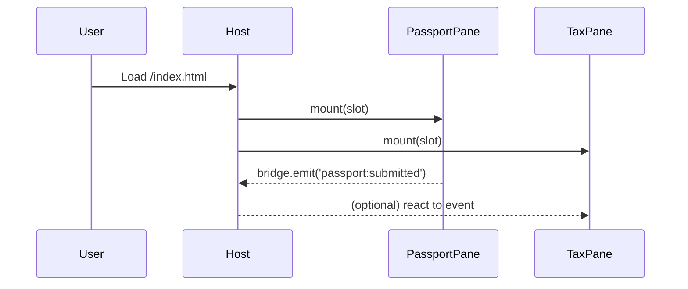

# Chapter 1: Micro-Frontend Interface (HMS-MFE)


> “One website, many independent windows — each window can close for cleaning without shutting the whole building.”

---

## 1. Why Do We Need HMS-MFE?

Imagine the federal **“MyGov”** portal where citizens can …

* renew a passport  
* pay last-minute taxes  
* submit an arts-funding application to the NEA  

Each task looks like just another page on a single site, yet every page is owned by a different agency team, ships on its own schedule, and may even use a different tech stack.  
HMS-MFE is the *public service counter* that makes this magic possible.

Without it, a bug in the passport form could take down the whole portal. With it, only the “passport window” closes while the “tax window” stays open.

---

## 2. The Core Ideas (with Office-Window Analogies)

| Concept | Office Analogy | What It Means in Code |
|---------|----------------|-----------------------|
| Host (Shell) | The building lobby | Bare-bones HTML that loads & arranges panes |
| Micro-Frontend (Pane) | One removable service window | Self-contained JS/CSS bundle |
| Slot | Empty wall space | `<div id="passport-slot"></div>` |
| Bridge | Inter-window speaking tube | Small API for messages (“tax paid”, “form saved”) |
| Deployment Toggle | “OPEN/CLOSED” sign | Config flag deciding which pane loads |

---

## 3. A 3-Minute Walk-Through

### 3.1 Set Up the Host

```html
<!-- public/index.html -->
<body>
  <header>MyGov Portal</header>

  <!-- Empty slots -->
  <div id="passport-slot"></div>
  <div id="tax-slot"></div>

  <script src="/host-loader.js"></script>
</body>
```

Explanation  
1. The file has zero business logic.  
2. `host-loader.js` will decide **what** to mount in each slot.

---

### 3.2 Register a Micro-Frontend

```js
// host-loader.js
import { mountPane } from 'hms-mfe';

mountPane({
  slot: 'passport-slot',
  url : 'https://agency-state.gov/passport/app.bundle.js'
});

mountPane({
  slot: 'tax-slot',
  url : 'https://treasury.gov/tax/pay.bundle.js'
});
```

Explanation  
`mountPane` downloads a bundle, executes it in isolation (think *sandboxed iframe* or *ES module*), and hands it the matching DOM node.

---

### 3.3 Passport Pane Skeleton (Agency-Owned)

```js
// passport/app.js  (owned by Dept. of State team)
import { bridge } from 'hms-mfe';

export function mount(el) {
  const btn = document.createElement('button');
  btn.textContent = 'Submit Passport Renewal';
  btn.onclick = () => bridge.emit('passport:submitted');
  el.appendChild(btn);
}

// expose to host
window.HMS_PANE = { mount };
```

Explanation  
1. The agency team writes **only** their window logic.  
2. When ready, they push a new bundle URL; the lobby never changes.

---

### 3.4 Try It Out

Open the browser:  

1. Host loads.  
2. Two panes mount, each showing its own UI.  
3. If the tax bundle is temporarily removed, the passport pane still works.

---

## 4. What Happens Under the Hood?

### 4.1 Step-by-Step (Plain English)

1. Browser requests `index.html`.  
2. `host-loader.js` runs and downloads each pane bundle.  
3. For each bundle:  
   a. Creates an *isolated execution context* (Shadow DOM or iframe).  
   b. Injects a tiny `bridge` API.  
   c. Calls the pane’s `mount(el)` with its slot element.  
4. Panes emit or listen to events through the bridge; the host routes or ignores them.

### 4.2 Minimal Sequence Diagram



---

## 5. Peeking at the Internals

### 5.1 `mountPane` (simplified)

```js
// node_modules/hms-mfe/index.js
export function mountPane({ slot, url }) {
  const el = document.getElementById(slot);
  import(/* @vite-ignore */ url).then(mod => {
    const pane = mod.HMS_PANE || window.HMS_PANE;
    pane.mount(el, createBridge());
  });
}

function createBridge() {
  const listeners = {};
  return {
    emit: (event, data) =>
      (listeners[event] || []).forEach(cb => cb(data)),
    on: (event, cb) =>
      (listeners[event] = (listeners[event] || []).concat(cb)),
  };
}
```

Explanation  
• Uses dynamic `import()` so the bundle can live on any domain.  
• Keeps bridge under 20 LOC; production adds security hardening.

---

## 6. Common Questions

1. **Can panes share global CSS?**  
   Yes, but you *shouldn’t*. Use Shadow DOM or CSS Modules to avoid clashes.

2. **What if one team uses React and another Svelte?**  
   Totally fine—each pane owns its own runtime bundle.

3. **How do panes navigate between pages?**  
   That belongs to the next topic: **Intent-Driven Navigation**!  

---

## 7. Summary & What’s Next

You now know that HMS-MFE is the lobby that…

* holds empty slots,
* mounts independently deployed window panes, and
* lets each agency team ship at its own pace without downtime.

Next we’ll learn how users move *between* these panes using high-level actions rather than raw URLs:  
[Intent-Driven Navigation](02_intent_driven_navigation_.md)

Welcome to the building—let’s keep exploring!

---

Generated by [AI Codebase Knowledge Builder](https://github.com/The-Pocket/Tutorial-Codebase-Knowledge)