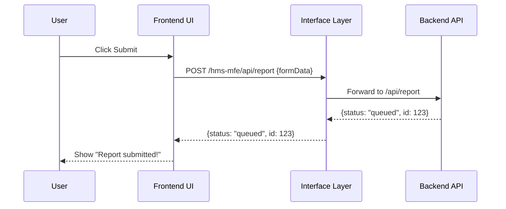

# Chapter 2: Frontend Interface

In [Chapter 1: Interface Layer](01_interface_layer_.md) we learned how to host portals on the server and proxy API calls. Now, we’ll see **how the portals themselves look and feel**—the visual components and micro-frontends that citizens and admins interact with. Think of this as the digital public-service kiosk, made of reusable widgets for a consistent, accessible experience.

---

## 2.1 Motivation: Why a Frontend Interface?

Imagine you’re a citizen filling out an FDA adverse-event report online:

- You see a clean form with clear instructions and labels.
- You click “Submit” and instantly get a confirmation message.
- All of it is styled the same way across different federal sites.

This is what the **Frontend Interface** solves:

- It provides **reusable widgets** (forms, tables, buttons).
- It wraps them in a **layout** (header, footer, navigation).
- It ensures **accessibility** (keyboard navigation, ARIA labels).
- It can load **micro-frontends** (HMS-MFE) independently, yet look consistent.

By the end of this chapter, you’ll have built a minimal citizen portal that submits a report form through the [Interface Layer](01_interface_layer_.md).

---

## 2.2 Key Concepts

1. **Widgets**  
   Small, reusable UI pieces (e.g., form fields, tables, date-pickers).

2. **Micro-Frontends (HMS-MFE)**  
   Independently built and deployed UI modules that compose into a portal.

3. **Layout & Theming**  
   A common wrapper (header, footer) and style rules applied to all widgets.

4. **Accessibility**  
   Keyboard focus, screen-reader labels, contrast checks built into each widget.

---

## 2.3 Building a Simple Citizen Portal

We’ll use React to demonstrate. Our portal has:

- A **Layout** component (header/footer)
- A **ReportForm** widget
- A bootstrap file to tie them together

### 2.3.1 Layout Component

File: `src/frontend_interface/Layout.js`

```js
import React from 'react';
import './Layout.css'; // basic styles

export function Layout({ children }) {
  return (
    <div className="portal">
      <header><h1>FDA Safety Portal</h1></header>
      <main>{children}</main>
      <footer>© 2024 U.S. Food and Drug Administration</footer>
    </div>
  );
}
```

This wraps everything in a consistent header/footer.

### 2.3.2 ReportForm Widget

File: `src/frontend_interface/ReportForm.js`

```js
import React, { useState } from 'react';

export function ReportForm() {
  const [data, setData] = useState({ name: '', description: '' });
  const submit = () => {
    fetch('/hms-mfe/api/report', {
      method: 'POST',
      headers: { 'Content-Type': 'application/json' },
      body: JSON.stringify(data)
    }).then(() => alert('Report submitted!'));
  };

  return (
    <form onSubmit={e => { e.preventDefault(); submit(); }}>
      <label>
        Your Name
        <input onChange={e => setData({ ...data, name: e.target.value })}/>
      </label>
      <label>
        Event Description
        <textarea onChange={e => setData({ ...data, description: e.target.value })}/>
      </label>
      <button type="submit">Submit Report</button>
    </form>
  );
}
```

This widget handles state, validation can be added, and calls the proxy endpoint you saw in [Interface Layer](01_interface_layer_.md).

### 2.3.3 Bootstrap File

File: `src/frontend_interface/index.js`

```js
import React from 'react';
import ReactDOM from 'react-dom';
import { Layout } from './Layout';
import { ReportForm } from './ReportForm';

ReactDOM.render(
  <Layout>
    <ReportForm />
  </Layout>,
  document.getElementById('root')
);
```

This ties layout and widget together into your portal’s “root” element.

---

## 2.4 Under the Hood

### 2.4.1 User Flow

Here’s what happens when a citizen clicks “Submit”:



### 2.4.2 How Widgets Are Loaded

In more advanced setups, widgets can be loaded dynamically:

File: `src/frontend_interface/widgetLoader.js`

```js
// Pseudocode: load widget modules by name
export async function loadWidget(name) {
  const module = await import(`./widgets/${name}.js`); 
  return module.default; // a React component
}
```

File: `src/frontend_interface/bootstrap.js`

```js
import React from 'react';
import ReactDOM from 'react-dom';
import { Layout } from './Layout';
import { loadWidget } from './widgetLoader';

async function init() {
  const { widgets } = await fetch('/hms-mfe/config.json').then(r=>r.json());
  const LoadedWidgets = await Promise.all(widgets.map(loadWidget));
  ReactDOM.render(
    <Layout>
      {LoadedWidgets.map((W, i) => <W key={i}/>)}
    </Layout>,
    document.getElementById('root')
  );
}
init();
```

> We fetch a simple JSON config listing widgets, dynamically import them, and render inside our `Layout`.

---

## 2.5 What We Learned

- **Frontend Interface** uses **widgets** and **micro-frontends** to build portals with consistent look & feel.  
- You saw a minimal React example: `Layout`, `ReportForm`, and a bootstrap.  
- Under the hood, clicks in the UI turn into API calls proxied by the [Interface Layer](01_interface_layer_.md).  
- You can extend this with dynamic widget loading, theming, and accessibility features.

Up next: learn how to guide users through the portal with smart, intent-driven flows in [Chapter 3: Intent-Driven Navigation](03_intent_driven_navigation_.md).

---

Generated by [AI Codebase Knowledge Builder](https://github.com/The-Pocket/Tutorial-Codebase-Knowledge)