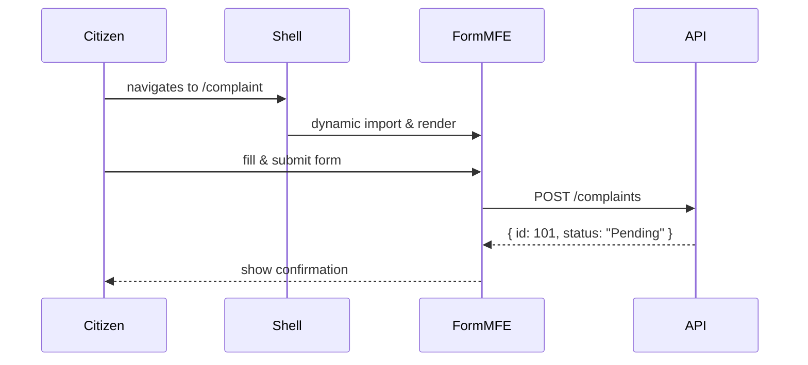

# Chapter 2: Micro-Frontend Architecture (HMS-MFE)

In [Chapter 1: Interface Layer (User & Admin UIs)](01_interface_layer__user___admin_uis__.md) we saw how a single React app can mount both citizen and admin portals under one “lobby.” Now, what if each feature inside that portal could be its own little app—built, tested, and deployed separately—while still looking like part of the same building? That’s exactly the power of **Micro-Frontend Architecture (HMS-MFE)**.

## Why Micro-Frontends?

Imagine a large federal building with individual service windows for different tasks (permits, complaints, FAQs). Each window is staffed and managed independently—so if the “Complaint Form” window needs an upgrade, you don’t have to close down the “Permit Application” window.

In HMS-MFE:

- Each **UI fragment** (micro-frontend) is an independent mini-app.
- You can develop, test, and deploy one fragment without touching the rest.
- The end user sees one seamless portal with a consistent header, footer, and navigation.

### Use Case: Federal Housing Complaint Portal

Alice wants to submit a mortgage insurance complaint to the Federal Housing Administration (FHA). The portal has:

1. A **Complaint Form** micro-frontend.  
2. A **Status Tracker** micro-frontend.  
3. A **Help & FAQ** micro-frontend.

Thanks to HMS-MFE, the FHA team can roll out a new “FAQ” window without touching the complaint form code.

## Key Concepts

1. **Shell (Container App)**  
   The host that loads and renders each micro-frontend.  
2. **Micro-Frontend (MFE)**  
   A self-contained UI fragment (e.g., ComplaintForm).  
3. **Dynamic Loading**  
   The shell fetches each MFE bundle at runtime.  
4. **Shared Dependencies**  
   React, styles, or utilities loaded once and reused.  
5. **Communication**  
   Simple events or props to pass data between shell and MFEs.

## Building Our Shell

Below is a minimal React shell that routes to two MFEs: `ComplaintForm` and `StatusTracker`.

```jsx
// src/mfe/Shell.js
import React from 'react';
import { BrowserRouter, Route, Switch } from 'react-router-dom';
import loadMFE from './mfeLoader';

export default function Shell() {
  const ComplaintForm = loadMFE('ComplaintForm');
  const StatusTracker = loadMFE('StatusTracker');

  return (
    <BrowserRouter>
      <Switch>
        <Route path="/complaint" component={ComplaintForm} />
        <Route path="/status" component={StatusTracker} />
      </Switch>
    </BrowserRouter>
  );
}
```
This shell:

1. Calls `loadMFE(name)` to fetch the remote bundle.  
2. Mounts each MFE on its own route.  

### What Happens When Alice Clicks “File Complaint”?



1. **Route Load**: The shell detects `/complaint` and loads the `ComplaintForm` bundle.  
2. **Render**: The MFE mounts itself.  
3. **Submit**: The MFE calls the backend API.  
4. **Response**: The form shows a “Pending” confirmation.  

## Implementing the Micro-Frontends

### 1. Dynamic Loader (`mfeLoader.js`)

```js
// src/mfe/mfeLoader.js
export default function loadMFE(name) {
  // In reality, URLs come from a manifest or config
  const url = `/mfe/${name}/remoteEntry.js`;
  return React.lazy(() => import(/* webpackIgnore: true */ url));
}
```
This simple loader uses `React.lazy` and dynamic import. In production you’d use Webpack Module Federation or a similar mechanism.

### 2. A Simple MFE Example

```jsx
// src/mfe/ComplaintForm/index.js
import React, { useState } from 'react';

export default function ComplaintForm() {
  const [status, setStatus] = useState('');

  function submit(data) {
    fetch('/api/complaints', {
      method: 'POST', headers: {'Content-Type':'application/json'},
      body: JSON.stringify(data),
    })
      .then(r => r.json())
      .then(res => setStatus(res.status));
  }

  return (
    <div>
      <h2>File a Complaint</h2>
      {/* imagine form fields here */}
      <button onClick={() => submit({ text: 'My issue...' })}>
        Submit
      </button>
      {status && <p>Your status: {status}</p>}
    </div>
  );
}
```
Even though it lives in its own repo or directory, it feels like part of the main shell.

## Internal Walkthrough

1. **Shell Startup**  
   - Reads MFE config (names & URLs).  
   - Renders common header/footer.  
2. **Route Match**  
   - On `/complaint`, calls `loadMFE('ComplaintForm')`.  
   - React Lazy triggers dynamic download.  
3. **MFE Initialization**  
   - The MFE bootstraps itself (registers routes, loads CSS).  
4. **User Interaction**  
   - Uses fetch or shared API client to talk to [Backend API Layer (HMS-API)](03_backend_api_layer__hms_api___hms_mkt__.md).  
5. **Independence**  
   - Deploying `ComplaintForm` v2 only requires uploading a new `remoteEntry.js`—the rest of the shell is untouched.

## Why This Helps

- Teams own individual MFEs—faster iteration.  
- Bugs in one feature don’t down the entire portal.  
- You can rewrite a feature in a new framework without rewriting everything.  

## Conclusion

In this chapter you learned how to break the portal into **independent UI fragments**—each loaded on demand and deployed separately. You saw a minimal shell, a dynamic loader, and a tiny MFE example for a federal-style complaint form. Next, we’ll dive into the APIs that back these micro-frontends in the [Backend API Layer (HMS-API / HMS-MKT)](03_backend_api_layer__hms_api___hms_mkt__.md).

---

Generated by [AI Codebase Knowledge Builder](https://github.com/The-Pocket/Tutorial-Codebase-Knowledge)