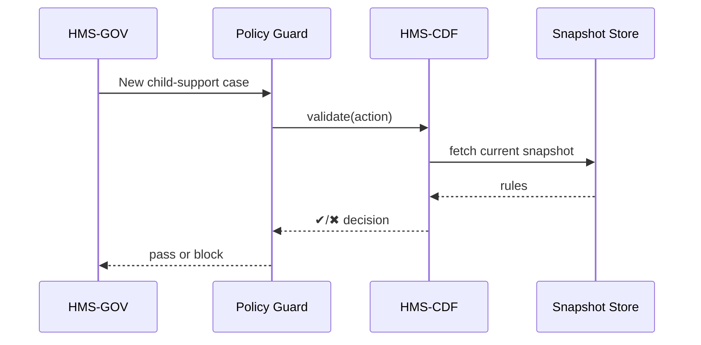

# Chapter 2: Policy Engine (HMS-CDF)


**Link back to Chapter 1:** See how HMS-CDF fits behind the front desk we built in [Governance Layer (HMS-GOV)](01_governance_layer__hms_gov__.md).

---

## 1. Why Do We Need a “Mini-Congress in Rust”?

Picture the Department of Energy (DOE) rolling out a **“Green Home Rebate”** program.  
Every 90 days Congress tweaks the rules—income limits change, new audit steps appear, deadlines shift.

If we hard-code those rules:

* developers must redeploy services for every tiny change,
* policy analysts can’t test “what-ifs” before launch,
* and agencies never share a single, authoritative rulebook.

**HMS-CDF** solves this by acting like a **legislative sandbox**:

1. Anyone with permission can **draft a bill** (a YAML or JSON file).  
2. Stakeholders **propose amendments**.  
3. A **vote engine** approves or rejects each change.  
4. When the enactment date hits, the new policy is **automatically live**—all downstream guards see it instantly.

Think of it as a tiny Congress that compiles instead of arguing.

---

## 2. Key Concepts (Plain English)

| Term            | Beginner Friendly Meaning |
|-----------------|---------------------------|
| Bill            | A complete rule set proposal (one file). |
| Amendment       | A patch to a bill (add / delete / edit lines). |
| Chamber         | A voting group (e.g., “Legal Team”, “Tech Team”). |
| Vote            | Yes / No on a bill or amendment. |
| Enactment Date  | When the bill becomes the law of the (code) land. |
| Policy Snapshot | The frozen set of rules active at any moment. |
| Guard           | A tiny program (like the “traffic light” in HMS-GOV) that asks, “Does the current snapshot allow this?” |

---

## 3. A 5-Minute Walk-Through

### Use Case: Changing the Rebate Income Cap

1. **Draft a Bill**

```yaml
# bills/green_rebate_v2.yaml
id: GR-2024-B1
title: Raise Income Cap to $90k
chambers: [DOE-Policy, DOE-Legal]
enactment: 2024-06-01
rules:
  income_cap_usd: 90000
```

Explanation  
• One YAML file = one bill.  
• Anyone can read it, diff it, and version-control it.

2. **Propose an Amendment**

```yaml
# amendments/GR-2024-A1.yaml
targets: GR-2024-B1
changes:
  income_cap_usd: 85000   # compromise number
```

3. **Cast Votes**

```bash
# 1-line CLI, pretend date is 2024-05-20
hms-cdf vote --bill GR-2024-B1 --chamber DOE-Policy --member "Alice" --yes
hms-cdf vote --bill GR-2024-A1 --chamber DOE-Legal  --member "Bob"   --yes
```

Output (truncated):

```
Vote recorded. Bill GR-2024-B1 now 1/2 YES.
Amendment GR-2024-A1 adopted (2/2 YES). Bill text updated.
```

4. **Automatic Enactment**

On 2024-06-01 at 00:00 UTC, HMS-CDF:

* seals the final text (`income_cap_usd: 85000`),
* bumps the **policy snapshot version**,
* notifies all guards.

No redeploys, no midnight hot-fixes.

---

## 4. Talking to CDF from HMS-GOV

Inside Chapter 1 we had a stubbed `check_policy`.  
Here’s a real (but still tiny) call:

```python
# guards/privacy.py (excerpt)
import requests
def check_policy(payload, headers):
    r = requests.post(
        "http://localhost:7000/cdf/validate",
        json={"snapshot": "latest", "action": "submit_case", "data": payload}
    )
    return r.json()      # {allow: true/false, reason: "..."}
```

Explanation  
1. We ask HMS-CDF to validate the action against the **latest snapshot**.  
2. The guard simply forwards the allow/deny answer to HMS-GOV.

---

## 5. What Happens Internally?



Only four moving parts—easy to reason about.

---

## 6. Inside HMS-CDF (Folder Peek)

```
hms-cdf/
 ├─ cli.rs            # tiny CLI for draft/vote/publish
 ├─ engine/
 │   ├─ loader.rs     # reads YAML/JSON into structs
 │   ├─ voter.rs      # counts ballots
 │   └─ timeline.rs   # handles enactment clocks
 └─ snapshots/
     └─ 2024-06-01T00-00-00.json
```

### 6.1 Loading a Bill (simplified Rust)

```rust
// engine/loader.rs
use serde::Deserialize;
#[derive(Deserialize)]
pub struct Bill {
    pub id: String,
    pub enactment: String,
    pub rules: serde_json::Value,
}
pub fn load(path: &str) -> Bill {
    let data = std::fs::read_to_string(path).unwrap();
    serde_yaml::from_str(&data).unwrap()
}
```

Explanation  
• < 15 lines!  
• `serde_yaml` or `serde_json` reads the file into a native struct.

### 6.2 Counting Votes

```rust
// engine/voter.rs
pub fn passed(yes: u32, total: u32) -> bool {
    yes * 2 > total   // simple majority
}
```

All complexity (multiple chambers, super-majority, etc.) can be plugged in later.

### 6.3 Publishing a Snapshot

```rust
// engine/timeline.rs
pub fn publish(bill: &Bill) {
    let file = format!("snapshots/{}.json", bill.enactment);
    std::fs::write(file, serde_json::to_string(&bill.rules).unwrap()).unwrap();
}
```

The active snapshot is the latest file whose timestamp ≤ now.

---

## 7. Hands-On: Your First Policy

1. Install the minimal CLI (pre-built binary):

```bash
cargo install hms-cdf-cli
```

2. Draft a bill (`bills/test.yaml`):

```yaml
id: TEST-1
title: Dice Roll Threshold
enactment: 2024-12-31
rules:
  max_roll: 4
```

3. Vote & enact:

```bash
hms-cdf draft bills/test.yaml
hms-cdf vote  --bill TEST-1 --chamber Dev --member You --yes
hms-cdf publish
```

4. Query the active rule:

```bash
curl http://localhost:7000/cdf/snapshot/latest | jq
```

Expected excerpt:

```json
{
  "max_roll": 4
}
```

Change the rule, add an amendment, re-publish—no code restarts needed.

---

## 8. Frequently Asked Questions

**Q: Do I have to know Rust?**  
No. Authors write YAML/JSON; the engine just happens to be implemented in Rust for speed and safety.

**Q: What if two bills conflict?**  
HMS-CDF detects overlapping keys during compile time and blocks publishing until resolved.

**Q: Where are votes stored?**  
In an append-only log inside the [Secure Data Repository (HMS-DTA)](13_secure_data_repository__hms_dta__.md).

---

## 9. Recap & What’s Next

You learned:

* HMS-CDF is our **policy parliament**, turning human-readable bills into machine-executable snapshots.  
* Bills, amendments, votes, and enactment timelines let rules evolve safely.  
* Guards (in HMS-GOV or elsewhere) query the **current snapshot** to allow or deny actions—no redeploys required.

Up next we’ll explore how lawyers and compliance officers verify that these policies align with real-world laws in [Compliance & Legal Reasoning (HMS-ESQ)](03_compliance___legal_reasoning__hms_esq__.md).

---

Generated by [AI Codebase Knowledge Builder](https://github.com/The-Pocket/Tutorial-Codebase-Knowledge)