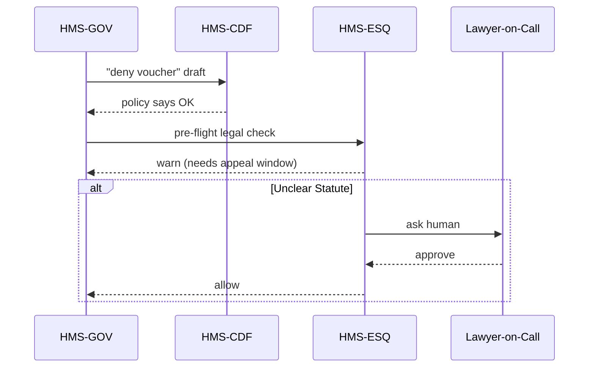

# Chapter 3: Compliance & Legal Reasoning (HMS-ESQ)

*Link back to the previous chapter:* Meet the policy parliament we built in [Policy Engine (HMS-CDF)](02_policy_engine__hms_cdf__.md).

---

## 1. Why Do We Need a Robot Lawyer?

### Real-World Use Case  
The **U.S. Southern Command (SOUTHCOM)** wants to deploy an AI chatbot that approves or denies travel vouchers for military families. A bill passed by Congress last summer says:

*“All travel-reimbursement denials **must** include an appeal window of **30 days**.”*

If our AI forgets that line and fires off denial letters without the appeal window, we are instantly out of compliance—and inviting lawsuits.

**HMS-ESQ** is the in-house counsel that double-checks every AI action before it is sent to the outside world.

---

## 2. Key Concepts in Plain English

| Term                       | Beginner Explanation |
|----------------------------|----------------------|
| Statute Library            | A folder of official laws, regs, and agency memos in machine-readable YAML. |
| Precedent Matcher          | Looks at past court cases to see if we’ve wandered into danger. |
| Conflict Highlighter       | The red pen—points out exactly which rule we’re breaking. |
| Legal Opinion              | A short JSON verdict: *allow*, *warn*, or *block*. |
| Human Escalation           | If ESQ is unsure, it asks a real lawyer for a thumbs-up. |

---

## 3. 60-Second Tour of the Workflow



---

## 4. Using HMS-ESQ to Safeguard Our Voucher Chatbot

### 4.1 What We Send In

```json
{
  "action":  "send_denial_letter",
  "payload": {
    "voucher_id": "SC-00123",
    "reason": "Late submission",
    "appeal_window_days": 20     // <- might violate law
  }
}
```

### 4.2 ESQ’s JSON Verdict

```json
{
  "allow": false,
  "severity": "high",
  "conflicts": [
    {
      "statute": "Pub.L. 117-338 §12",
      "clause":  "appeal_window_days >= 30",
      "current": 20
    }
  ],
  "message": "Appeal window must be at least 30 days."
}
```

If `allow` is `false`, HMS-GOV automatically blocks the outbound letter until the bug is fixed or a human lawyer signs off.

---

## 5. How Does ESQ Know the Law?

### 5.1 Tiny Statute File (YAML)

```yaml
# statutes/appeal_window.yaml
id: PubL_117_338_12
title: Military Travel Voucher Appeals
applies_to: send_denial_letter
rule: |
  payload.appeal_window_days >= 30
penalty: civil
effective: 2023-01-01
```

### 5.2 Micro Precedent Snippet

```yaml
# precedents/dc_cir_2021_foo.yaml
case: "Doe v. DoD (2021)"
holding: "Short appeal windows are arbitrary"
applies_to: send_denial_letter
weight: 0.8     # 0-1 scale of importance
```

Both are stored in Git so changes are auditable.

---

## 6. Minimal Code Walkthrough (Under 20 Lines Each)

`esq/validator.py`

```python
import yaml, json, pathlib

def load_rules():
    files = pathlib.Path("statutes").glob("*.yaml")
    return [yaml.safe_load(p.read_text()) for p in files]

def check(action, payload):
    for rule in load_rules():
        if rule["applies_to"] != action:
            continue
        clause = rule["rule"]
        # Unsafe in real life, but OK for demo
        if not eval(clause, {}, {"payload": payload}):
            return {
                "allow": False,
                "conflicts": [rule["id"]],
                "message": f"Violated {rule['title']}"
            }
    return {"allow": True}
```

Explanation  
1. Reads every YAML file in `statutes/`.  
2. Runs the clause with Python `eval`.  
3. Returns a tiny verdict dictionary.

`esq/api.py`

```python
from fastapi import FastAPI
from validator import check

app = FastAPI()

@app.post("/esq/validate")
async def validate(req: dict):
    verdict = check(req["action"], req["payload"])
    return verdict
```

Run locally:

```bash
uvicorn esq.api:app --reload
```

Then:

```bash
curl -X POST localhost:8000/esq/validate \
  -d '{"action":"send_denial_letter","payload":{"appeal_window_days":20}}' \
  -H "Content-Type: application/json"
```

You should get a JSON block with `allow: false`.

---

## 7. Under the Hood (No Code)

1. **Rule Loader** – grabs YAML statutes & precedents.  
2. **Interpreter** – converts human language like `payload.appeal_window_days >= 30` into code.  
3. **Scoring Engine** – if precedents exist, bumps severity.  
4. **Verdict Builder** – returns `allow`, `warn`, or `block`.  
5. **Escalation Hook** – unresolved `warn` flows to [Human-in-the-Loop (HITL) Oversight](07_human_in_the_loop__hitl__oversight_.md).

---

## 8. Folder Snapshot

```
hms-esq/
 ├─ api.py
 ├─ validator.py
 ├─ statutes/
 │   └─ appeal_window.yaml
 └─ precedents/
     └─ dc_cir_2021_foo.yaml
```

Each folder is plain text; lawyers can open the files in VS Code or even Notepad.

---

## 9. Hands-On Exercise

1. Clone or open the sample `hms-esq` folder.  
2. Change `appeal_window.yaml` from `>= 30` to `>= 45` and save.  
3. Re-run the `curl` command—ESQ now blocks anything below 45 days **without restarting the server**.

Congrats, you just amended the law in software!

---

## 10. Common Questions

**Q: Do lawyers really edit YAML?**  
Yes—because it’s plain text. We also provide a no-code editor in [Interface Layer – Micro-Frontends (HMS-MFE)](08_interface_layer___micro_frontends__hms_mfe__.md).

**Q: What if two statutes conflict?**  
ESQ flags both and pushes the clash to HITL for arbitration.

**Q: Is `eval` safe?**  
In production we use a sandboxed expression engine; `eval` here keeps the demo tiny.

---

## 11. Summary & What’s Next

You learned:

• HMS-ESQ is the **robot lawyer** that stops illegal AI actions.  
• Laws and precedents live in version-controlled YAML.  
• ESQ returns a simple JSON verdict used by HMS-GOV to allow, warn, or block.  

Next we’ll break things on purpose to make sure they fail gracefully in the [Simulation & Testing Sandbox (HMS-ESR)](04_simulation___testing_sandbox__hms_esr__.md).

---

Generated by [AI Codebase Knowledge Builder](https://github.com/The-Pocket/Tutorial-Codebase-Knowledge)