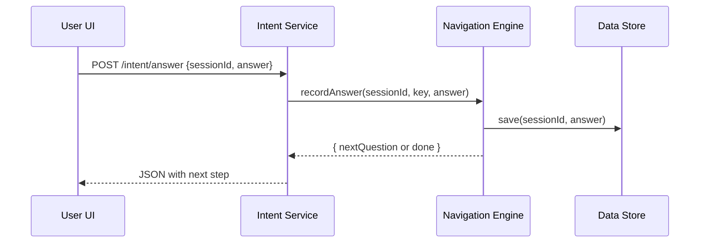

# Chapter 3: Intent-Driven Navigation

Welcome back! In [Chapter 2: Frontend Interface](02_frontend_interface_.md) we built pages and widgets. Now, we’ll make the portal **smartly guide** users—like a DMV digital concierge—based on **what they want to do**. This is **Intent-Driven Navigation**.

---

## 3.1 Motivation: From Menus to “Digital Concierge”

Imagine you visit a DMV website to:

- “Renew my driver’s license”
- “Report a lost license”
- “Update my address”

Instead of hunting through menus, a chatbot asks a couple of questions, then leads you **step-by-step**. That’s intent-driven navigation: the system detects **your goal**, asks the **relevant questions**, and shows the **right form** at the **right time**.

**Use case**  
A small business owner wants to “Apply for a Vendor Permit” from the city. The portal should:

1. Ask “What type of vendor permit?”  
2. Ask “Upload your ID”  
3. Show the submit button  
4. Create the permit application in the backend  

---

## 3.2 Key Concepts

1. **Intent Definition**  
   A JSON or code object describing a user goal, its questions, and next steps.

2. **Question Flow**  
   A list of prompts (e.g., “What’s your business name?”) and expected answers.

3. **State Management**  
   Saving user answers so you can resume or validate as you go.

4. **Navigation Engine**  
   A small service that reads an intent definition, asks questions in order, and decides “what’s next.”

---

## 3.3 Building an Intent

Let’s create a simple “Vendor Permit” intent.

### 3.3.1 Define the intent

File: `intents/vendor_permit.json`

```json
{
  "id": "vendor_permit",
  "title": "Vendor Permit Application",
  "questions": [
    { "key": "permitType", "text": "Which permit type?" },
    { "key": "businessName", "text": "Business name?" },
    { "key": "uploadID", "text": "Upload your ID document." }
  ]
}
```

This file lists the **questions** to ask in order.

### 3.3.2 Triggering the flow

In your frontend UI, you map a button to start this intent:

```js
// src/frontend_interface/startIntent.js
function startIntentFlow(intentId) {
  fetch(`/hms-mfe/api/intent/start/${intentId}`)
    .then(res => res.json())
    .then(session => showNextQuestion(session));
}

// Example: user clicks “Apply for Vendor Permit”
startIntentFlow('vendor_permit');
```

> When the user clicks, we call the Intent API, get a **session** back, and show the first question.

### 3.3.3 Asking the next question

```js
// src/frontend_interface/showNextQuestion.js
function showNextQuestion(session) {
  const q = session.nextQuestion;
  // Render q.text and an input box
}
function submitAnswer(session, answer) {
  fetch(`/hms-mfe/api/intent/answer`, {
    method: 'POST',
    body: JSON.stringify({ sessionId: session.id, answer })
  })
  .then(res => res.json())
  .then(showNextQuestion);
}
```

After each answer, we post back and render the next prompt—until questions run out, then we show “Review & Submit.”

---

## 3.4 Under the Hood

Here’s what happens when you answer a question:



1. **User UI** sends your answer to the **Intent Service**.  
2. **Intent Service** calls **Navigation Engine**.  
3. **Navigation Engine** stores your answer in the **Data Store**.  
4. It then picks the **next question** or signals **completion**.  
5. The UI receives JSON and renders accordingly.

### 3.4.1 Core Navigation Engine (simplified)

File: `src/intent_driven_navigation/navigationEngine.js`

```js
const intents = require('./intents'); // loads all JSON files
const store = {}; // in-memory store for sessions

function startIntent(id) {
  const def = intents[id];
  const session = { id: Date.now(), answers: {}, pointer: 0, def };
  store[session.id] = session;
  return nextQuestion(session.id);
}

function recordAnswer(sessionId, answer) {
  const s = store[sessionId];
  const key = s.def.questions[s.pointer].key;
  s.answers[key] = answer;
  s.pointer++;
  return nextQuestion(sessionId);
}

function nextQuestion(sessionId) {
  const s = store[sessionId];
  if (s.pointer < s.def.questions.length) {
    return { sessionId, nextQuestion: s.def.questions[s.pointer].text };
  }
  return { sessionId, done: true, responses: s.answers };
}
module.exports = { startIntent, recordAnswer };
```

> Here we load intent definitions, keep a simple in-memory **session store**, and move a pointer through the questions.

### 3.4.2 Intent API Endpoints

File: `src/intent_driven_navigation/api.js`

```js
const express = require('express');
const { startIntent, recordAnswer } = require('./navigationEngine');
const router = express.Router();

router.get('/intent/start/:id', (req, res) => {
  res.json(startIntent(req.params.id));
});

router.post('/intent/answer', express.json(), (req, res) => {
  const { sessionId, answer } = req.body;
  res.json(recordAnswer(sessionId, answer));
});

module.exports = router;
```

> We expose two endpoints: one to **start** the intent, one to **record answers** and fetch the next prompt.

---

## 3.5 What We Learned

- **Intent-Driven Navigation** turns a user goal (an intent) into a sequence of questions and steps.  
- We defined a simple JSON intent, wired up frontend calls, and built a mini **Navigation Engine**.  
- Under the hood, we keep session state, move through questions, and signal when we’re done.

Next, we’ll see how an AI agent can fill in missing details and assist users in [Chapter 4: AI Representative Agent](04_ai_representative_agent_.md).

---

Generated by [AI Codebase Knowledge Builder](https://github.com/The-Pocket/Tutorial-Codebase-Knowledge)