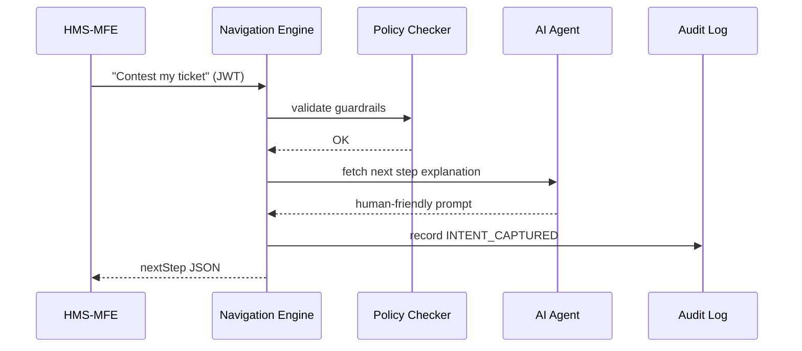

# Chapter 4: Intent-Driven Navigation Framework
*(part of the HMS-CUR tutorial series)*  

[⬅ Back to Chapter 3: Authorization & Identity Layer](03_authorization___identity_layer_.md)

---

## 0. Why Bother Asking “What Do You Want To Do?”

Picture Alex again.  
He opens the portal and sees **70+ menu links** ranging from “Pay Dog License” to “Request Road Closure.” He sighs.

Instead of forcing Alex to hunt, the *Intent-Driven Navigation Framework* (IDN) greets him like a concierge:

> “Hi Alex! What would you like to do?”  
> 1️⃣ Pay a fee 2️⃣ Contest a fine 3️⃣ File Chapter 13 bankruptcy

Alex types `2` → The system launches the *Contest-Parking-Fine* journey, automatically checking deadlines, pulling his citation, and reminding him of evidence requirements—no scavenger hunt, no missed milestone.

---

## 1. Two-Minute Hands-On Demo

### 1.1 Alex Talks To The Portal

```bash
$ curl -X POST /idn/intents \
       -H "Authorization: Bearer <alex_jwt>" \
       -d '{"text":"I want to contest my parking ticket"}'
```

Response (trimmed):

```json
{
  "journeyId": "contest-parking-fine",
  "nextStep": {
    "id": "upload-evidence",
    "prompt": "Please upload a photo of the parking sign."
  }
}
```

Alex uploads the photo → next prompt appears (`schedule-hearing`).  
Behind the curtain IDN guides him through every legal milestone **in order**, using rules stored in [Governance & Compliance Layer](08_governance___compliance_layer_.md).

*You just saw the whole magic.*

---

## 2. The Five Core Concepts (Using City-Hall Analogies)

| City-Hall Analogy | IDN Term | 1-Sentence Description |
|-------------------|----------|------------------------|
| “I need a birth certificate” | **Intent** | Free-text wish captured from user. |
| Clerk hands checklist | **Journey Blueprint** | Pre-built YAML script of required steps. |
| Each line on checklist | **Step** | Single user or system action (e.g., *Upload Evidence*). |
| Green stamps on checklist | **Milestone** | Legal/compliance gates the journey must hit. |
| Senior clerk approval | **Guardrail** | Code or policy rule that can halt a step. |

Put these five in your pocket; everything else is plumbing.

---

## 3. Building Your Own Journey (End-to-End in <40 Lines)

### 3.1 Declare the Journey Blueprint (15 Lines YAML)

```yaml
# journeys/contest-parking-fine.yml
id: contest-parking-fine
milestones:
  - citation_linked
  - evidence_received
  - hearing_scheduled
steps:
  - id: link-citation
    action: FETCH_CITATION
    guardrail: "deadline_not_passed"
  - id: upload-evidence
    action: UPLOAD
    requires: link-citation
  - id: schedule-hearing
    action: CALENDAR_PICK
    requires: upload-evidence
```

Explanation  
• `milestones` define success points auditors will later verify.  
• `requires` sets order; IDN will not offer *schedule-hearing* until evidence is in.

### 3.2 Register It (4 Lines)

```bash
$ curl -X POST /idn/journeys \
       -F file=@journeys/contest-parking-fine.yml
```

Framework validates YAML, stores it, and adds it to the concierge menu.

### 3.3 Kick It Off (Alex’s Side, 8 Lines)

```bash
# start
$ curl -X POST /idn/intents -d '{"text":"Contest my parking ticket"}'
# framework replies with journeyId & nextStep

# complete step
$ curl -X POST /idn/steps/upload-evidence \
       -F file=@sign_photo.jpg
```

Each call returns the *next* actionable step until all milestones are green.

---

## 4. What Happens Under The Hood?



Five players, one simple dance.

---

## 5. Peeking At The Code (Really Tiny!)

Directory excerpt:

```
idn/
 ├─ registry.py
 ├─ engine.py
 └─ guardrails.py
```

### 5.1 Loading Journey Blueprints (registry.py – 12 Lines)

```python
import yaml, glob

_journeys = {}
for path in glob.glob("journeys/*.yml"):
    with open(path) as f:
        j = yaml.safe_load(f)
        _journeys[j["id"]] = j

def get(journey_id):
    return _journeys[journey_id]
```

Reads YAML files at startup; no DB needed for starters.

### 5.2 Choosing The Next Step (engine.py – 18 Lines)

```python
from registry import get
from guardrails import check

def next_step(journey_id, completed_steps, context):
    j = get(journey_id)
    for step in j["steps"]:
        if step["id"] in completed_steps:
            continue
        if "requires" in step and step["requires"] not in completed_steps:
            continue
        if "guardrail" in step and not check(step["guardrail"], context):
            raise Exception("Guardrail failed")
        return step      # ← first eligible step
    return None          # journey complete
```

Beginners’ take-away: iterate → filter by `requires` → validate guardrail → return.

### 5.3 A Sample Guardrail (guardrails.py – 6 Lines)

```python
import datetime
def deadline_not_passed(ctx):
    due = ctx["citation_due"]       # e.g., 2024-10-01
    return datetime.date.today() <= due

RULES = {"deadline_not_passed": deadline_not_passed}

def check(name, ctx): return RULES[name](ctx)
```

Stops a journey if the legal deadline has expired.

---

## 6. Frequently Asked Questions

**Q: Do I need AI/NLP to detect intents?**  
A: No. Start with a select box. Drop in an AI model later; the rest of the framework stays the same.

**Q: Where are milestones stored?**  
A: In the same audit table used by [Governance & Compliance Layer](08_governance___compliance_layer_.md). One row per achieved milestone.

**Q: Can two journeys run in parallel?**  
A: Yes. Each intent receives a unique `instanceId`; IDN manages state separately.

---

## 7. Recap & What’s Next

You learned how the Intent-Driven Navigation Framework:

✓ Captures a free-text wish and maps it to a journey blueprint.  
✓ Guides users step-by-step, enforcing guardrails and compliance milestones.  
✓ Needs only a few YAML lines to create new journeys.  
✓ Plays nicely with identity (JWT) and policy checks you met in Chapter 3.

In the next chapter we’ll meet the brains that craft those friendly prompts and even auto-complete some steps: the [AI Representative Agent](05_ai_representative_agent_.md). 🎉

---

Generated by [AI Codebase Knowledge Builder](https://github.com/The-Pocket/Tutorial-Codebase-Knowledge)