# Chapter 5: AI Representative Agent (HMS-AGT / HMS-AGX)

*(Coming from the sandbox we played with in [Simulation & Testing Sandbox (HMS-ESR)](04_simulation___testing_sandbox__hms_esr__.md))*  

---

## 1. Why Do We Need an “AI Civil-Servant”?

Picture this:  
Maria, a veteran living in Arizona, just moved to a new apartment. She opens a browser and types:

> “Hi, I need my mailing address updated for disability benefits and I’m not sure which form to file.”

At 2 a.m. no human clerk is on duty, yet Maria still deserves help.  
Enter **HMS-AGT**—an always-awake digital representative that:

1. Understands Maria’s plain-English request.  
2. Checks policy (Can addresses be self-updated? Which form?) via the [Policy Engine (HMS-CDF)](02_policy_engine__hms_cdf__.md).  
3. Ensures nothing illegal happens (no privacy breach) via [Compliance & Legal Reasoning (HMS-ESQ)](03_compliance___legal_reasoning__hms_esq__.md).  
4. Fills out the proper Veterans Benefits Administration PDF, signs it with the correct credential, and submits it.  
5. Logs every step for audit.

All while our human staff sleep soundly.

---

## 2. Key Concepts (Plain-English Glossary)

| Term | Beginner-Friendly Meaning |
|------|---------------------------|
| Agent Manifest | A small YAML file that tells HMS what the agent can do (tools, data scopes, identity). |
| Tool | A single API the agent can call, e.g., “submit_form” or “lookup_policy”. |
| Skill Pack | A bundle of related tools—think “Forms Toolkit” or “Payments Toolkit”. |
| Memory | Short, private notes the agent keeps while a conversation is open (expires after X hours). |
| Guardrail | A built-in question—*“Does this action violate policy or law?”*—asked before any tool call. |
| Lifespan | When memory expires the agent forgets and starts fresh, preventing data creep. |

---

## 3. Building Our First Agent in 15 Lines

Below is a toy but runnable **agent manifest** (`agents/vba_address_bot.yaml`):

```yaml
id: vba_address_bot
display_name: VBA Address Assistant
lifespan_minutes: 30
skills:
  - forms_toolkit          # submits PDFs
  - policy_lookup          # asks HMS-CDF
  - legal_check            # asks HMS-ESQ
defaults:
  agency: Veterans Benefits Administration
  allowed_forms: [21-0781, 21-686c]
```

Explanation  
• YAML keeps things human-readable.  
• `skills` are auto-loaded from the Marketplace (see [Marketplace of Capabilities (HMS-MKT)](09_marketplace_of_capabilities__hms_mkt__.md)).  
• The agent forgets everything after 30 min—handy for privacy.

---

### 3.1 Tiny Driver Python (18 lines)

```python
# hms-agt/run_agent.py
import yaml, requests, openai, os, json

AGENT = yaml.safe_load(open("agents/vba_address_bot.yaml"))

def chat(user_msg):
    history = [{"role":"system", "content":f"You are {AGENT['display_name']}."},
               {"role":"user", "content":user_msg}]
    
    # Ask the LLM what tool to call
    response = openai.ChatCompletion.create(
        model="gpt-4o-mini",
        messages=history,
        functions=[{"name":"submit_form","parameters":{}}],
        function_call="auto"
    )
    
    if response.choices[0].finish_reason=="function_call":
        # Guardrails before action
        ok = legal_ok(user_msg) and policy_ok(user_msg)
        return "✅ Form submitted!" if ok else "🚫 Request blocked."
    return response.choices[0].message.content
```

What happens?  
1. We load the manifest.  
2. We ask an LLM to decide whether to call `submit_form`.  
3. Before executing, we **double-check** with legal & policy guards.

*(The helper functions below are just stubs for clarity.)*

```python
def policy_ok(text):
    r = requests.post("http://localhost:7000/cdf/validate",
                      json={"snapshot":"latest",
                            "action":"address_change",
                            "data":{"text":text}})
    return r.json()["allow"]

def legal_ok(text):
    r = requests.post("http://localhost:8000/esq/validate",
                      json={"action":"address_change",
                            "payload":{"text":text}})
    return r.json()["allow"]
```

---

## 4. Walking Through Maria’s Request

```mermaid
sequenceDiagram
    participant CIT as Maria
    participant MFE as Web Chat (HMS-MFE)
    participant AGT as HMS-AGT
    participant CDF as HMS-CDF
    participant ESQ as HMS-ESQ

    CIT->>MFE: "I moved, please update my address."
    MFE->>AGT: send message
    AGT->>CDF: check policy
    CDF-->>AGT: ✔ allowed
    AGT->>ESQ: legal check
    ESQ-->>AGT: ✔ allowed
    AGT-->>MFE: "Form 21-686c submitted. Here is a receipt."
```



Only five actors—easy to grasp!

---

## 5. Under the Hood (No-Magic Tour)

1. **Manifest Loader** – reads the YAML to know skills, lifespan, and credentials.  
2. **Conversation Manager** – stores short-term memory in Redis; auto-deletes after `lifespan_minutes`.  
3. **LLM Router** – chooses an LLM (e.g., GPT-4o) and injects the current tool list.  
4. **Guardrail Layer** – every tool call flows through  
   • `policy_ok()` (talks to [HMS-CDF](02_policy_engine__hms_cdf__.md)) and  
   • `legal_ok()` (talks to [HMS-ESQ](03_compliance___legal_reasoning__hms_esq__.md)).  
5. **Tool Executor** – performs the action (submit the PDF) and writes an audit record in the [Secure Data Repository (HMS-DTA)](13_secure_data_repository__hms_dta__.md).

---

## 6. Internal File Peek

```
hms-agt/
 ├─ run_agent.py
 ├─ guardrails.py
 ├─ tools/
 │   └─ forms_toolkit.py
 └─ agents/
     └─ vba_address_bot.yaml
```

### 6.1 `guardrails.py` (≤ 20 lines)

```python
import requests

def check(action, payload):
    # Ask Policy Engine
    p = requests.post("http://localhost:7000/cdf/validate",
                      json={"snapshot":"latest",
                            "action":action,
                            "data":payload}).json()
    # Ask Robot Lawyer
    l = requests.post("http://localhost:8000/esq/validate",
                      json={"action":action,
                            "payload":payload}).json()
    return p["allow"] and l["allow"], p, l
```

Returns a single boolean plus the detailed verdicts—simple!

### 6.2 `tools/forms_toolkit.py` (16 lines)

```python
import pdfkit, uuid, datetime, json, pathlib

def submit_form(form_id, fields, agent_id):
    fn = f"/tmp/{form_id}_{uuid.uuid4()}.pdf"
    pdfkit.from_string(render_html(form_id, fields), fn)

    # pretend to POST to VBA endpoint
    # requests.post("https://vba.gov/forms/upload", files=...)

    log = {
        "time": datetime.datetime.utcnow().isoformat(),
        "form": form_id,
        "file": fn,
        "agent": agent_id
    }
    pathlib.Path("audit").mkdir(exist_ok=True)
    open(f"audit/{uuid.uuid4()}.json","w").write(json.dumps(log))
    return {"status":"submitted", "file":fn}
```

Explanation  
• Converts HTML to PDF, submits it (stubbed), and records an audit log.  
• Under 20 lines—everybody wins.

---

## 7. Hands-On Mini Lab

1. Clone the sample folder:

```bash
git clone https://github.com/example/hms-agt-demo
cd hms-agt-demo
pip install openai fastapi pdfkit pyyaml requests uvicorn
```

2. Start policy & legal services in dev mode (see earlier chapters).

3. Run the agent:

```bash
python run_agent.py
```

4. When prompted, type:

```
I just moved to 123 Cactus Rd, Phoenix AZ.
```

Expected reply:

```
✅ Form submitted! Your confirmation number is XYZ123.
```

5. Check the `audit/` folder—there’s a JSON file describing the submission. Congrats, you built and used your first AI civil-servant!

---

## 8. Frequently Asked Questions

**Q: Is the LLM allowed to see personal data?**  
Only the minimum. The manifest’s `skills` list is cross-checked against data scopes defined in [Governance Layer (HMS-GOV)](01_governance_layer__hms_gov__.md).

**Q: What happens if legal or policy checks fail?**  
The agent sends a polite refusal and escalates to a human clerk through [Human-in-the-Loop (HITL) Oversight](07_human_in_the_loop__hitl__oversight_.md).

**Q: How do I add a new skill?**  
Publish it to the marketplace (Chapter 9) and reference it in the agent’s YAML.

**Q: AGT vs. AGX?**  
AGT is the default single-agency runtime.  
AGX is the hardened, cross-agency edition with stricter isolation—same API, stronger walls.

---

## 9. Wrap-Up & Next Steps

You now know how to:

* Define an **Agent Manifest** that lists skills, lifespan, and permissions.  
* Use a tiny Python driver to turn plain English into concrete government actions.  
* Rely on existing guardrails (policy + legal) so your AI doesn’t break the rules.  
* Audit every step for future oversight.

In short, HMS-AGT/HMS-AGX brings a tireless digital civil-servant to every desk—no coffee required.

Next we’ll look at how agents keep their context small but rich by using the [Model Context Protocol (HMS-MCP)](06_model_context_protocol__hms_mcp__.md).

---

Generated by [AI Codebase Knowledge Builder](https://github.com/The-Pocket/Tutorial-Codebase-Knowledge)