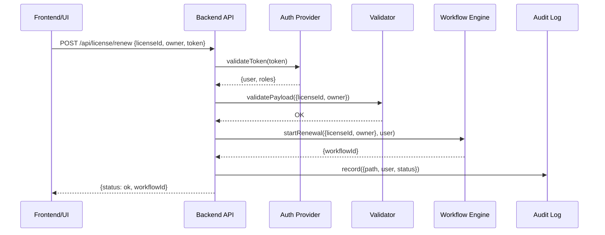

# Chapter 5: Backend API

Welcome back! In [Chapter 4: AI Representative Agent](04_ai_representative_agent_.md) we saw how an AI assistant can draft policy changes. Now it’s time to expose a **secure, audited gateway**—the **Backend API**—through which frontends, AI agents, and external systems read and modify processes.

---

## 5.1 Motivation: A Secure Inter-Agency Mailroom

Imagine a government building where every letter must pass through a secure mailroom:

- **Identity check**: Who sent it?  
- **Content inspection**: Is the request well formed?  
- **Audit log**: Who touched it and when?  

The **Backend API** is our digital mailroom. Every time the citizen portal, an AI agent, or another agency calls `/api/*`, the Backend API:

1. Verifies who you are (authentication/authorization).  
2. Validates your input.  
3. Sends the request on to the right process (e.g., Workflow Engine).  
4. Records an audit entry for compliance.

**Use case**  
A citizen submits a driver’s license renewal through the portal. Behind the scenes:

1. Frontend calls `POST /api/license/renew`.  
2. Backend API checks the user token.  
3. It validates `licenseId` and `owner` fields.  
4. It starts the renewal workflow.  
5. It logs the entire transaction.

---

## 5.2 Key Concepts

1. **Endpoints**  
   Define routes like `POST /api/license/renew` or `GET /api/report/status/:id`.

2. **Authentication & Authorization**  
   Confirm the caller’s identity (e.g., JWT, API keys) and check permissions.

3. **Input Validation**  
   Ensure every request payload follows the expected schema.

4. **Audit Logging**  
   Record request details (who, what, when, status) for compliance and debugging.

5. **Uniform Error Handling**  
   Return consistent error messages (400 for bad request, 401 for unauthorized, 500 for server error).

---

## 5.3 Using the Backend API

Let’s build a minimal Express.js server that handles license renewals, with auth, validation, and audit.

### 5.3.1 Bootstrapping the Server

```js
// src/backend_api/index.js
const express = require('express');
const auth     = require('./middleware/auth');
const validate = require('./middleware/validate');
const audit    = require('./middleware/audit');

const app = express();
app.use(express.json());
app.use(auth);   // 1. Who are you?
app.use(audit);  // 2. Log every request
```

This sets up JSON parsing, authentication, and audit-logging for all routes.

### 5.3.2 Defining an Endpoint

```js
// Renew a driver’s license
app.post(
  '/api/license/renew',
  validate.renewLicense,          // 3. Check payload shape
  (req, res) => {
    // Here you'd call your Workflow Engine or database
    res.json({ status: 'ok', workflowId: 'wf-1234' });
  }
);
```

- `validate.renewLicense` rejects malformed requests.  
- The handler returns a JSON response with a workflow ID.

### 5.3.3 Starting the Server

```js
app.listen(4000, () => 
  console.log('🔒 Backend API listening on port 4000')
);
```

---

## 5.4 Under the Hood

Here’s the step-by-step flow when a frontend calls the renew endpoint:



1. **Auth**: the API checks the token.  
2. **Validation**: the payload is inspected.  
3. **Processing**: the renewal workflow is started.  
4. **Audit**: every detail is logged.  
5. **Response**: the workflow ID is returned to the caller.

### 5.4.1 Authentication Middleware

```js
// src/backend_api/middleware/auth.js
module.exports = (req, res, next) => {
  const tok = req.headers.authorization;
  // Dummy check: in real life, verify a JWT or API key
  if (tok === 'Bearer secret') {
    req.user = { name: 'Alice', roles: ['citizen'] };
    next();
  } else {
    res.status(401).json({ error: 'Unauthorized' });
  }
};
```

### 5.4.2 Validation Middleware

```js
// src/backend_api/middleware/validate.js
exports.renewLicense = (req, res, next) => {
  const { licenseId, owner } = req.body;
  if (!licenseId || typeof owner !== 'string') {
    return res.status(400).json({ error: 'Invalid input' });
  }
  next();
};
```

### 5.4.3 Audit Logging Middleware

```js
// src/backend_api/middleware/audit.js
module.exports = (req, res, next) => {
  const start = Date.now();
  res.on('finish', () => {
    console.log({
      path: req.path,
      user: req.user?.name,
      status: res.statusCode,
      durationMs: Date.now() - start
    });
    // In production: send this to a secure audit store
  });
  next();
};
```

---

## 5.5 What We Learned

- The **Backend API** is our secure, audited gateway—like a high-security mailroom—for all process calls.  
- We enforce **authentication**, **input validation**, and **audit logs** on every request.  
- A minimal Express.js example shows how to define routes, plug in middleware, and return uniform responses.

Next up: learn how to actually execute those workflows inside the system in [Chapter 6: Workflow Engine](06_workflow_engine_.md).

---

Generated by [AI Codebase Knowledge Builder](https://github.com/The-Pocket/Tutorial-Codebase-Knowledge)