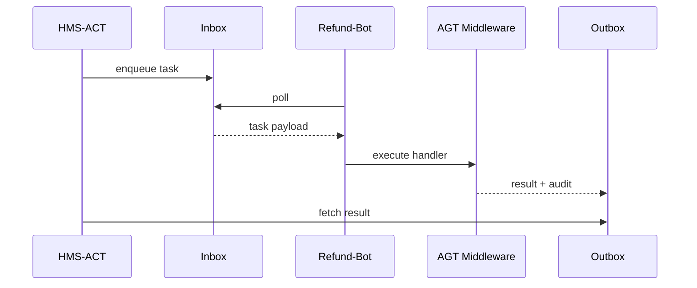

# Chapter 5: Core Agent Framework (HMS-AGT)

*(Giving every digital civil-servant the same badge, voice, and daily logbook)*  

[← Back to Chapter&nbsp;4: Agent Orchestration & Workflow (HMS-ACT)](04_agent_orchestration___workflow__hms_act__.md)

---

## 1. Why Do We Need HMS-AGT?  

Imagine the Legal Services Corporation (LSC) rolling out a “Legal Aid Chat-Bot” that helps veterans appeal denied benefits.  
Three weeks later, the Natural Resources Conservation Service (NRCS) wants a “Conservation Grant Helper,” and the FCC dreams up a “Radio-License Checker.”

If every agency hard-codes its own:

* identity format  
* authentication handshake  
* conversation style  
* audit log  

…we get 20 slightly-different snowflakes ⛄—impossible to govern or maintain.

**HMS-AGT** is the **employee onboarding kit**: one uniform, one badge swipe, one logbook.  
Build an agent once; plug it into any workflow from [HMS-ACT](04_agent_orchestration___workflow__hms_act__.md) with zero re-wiring.

---

## 2. High-Level Use Case — “Refund-Bot in 10 Minutes”

Goal: create a **Refund-Bot** that

1. Receives a citizen refund request from HMS-ACT,  
2. Calls Treasury’s Calculator API,  
3. Returns the amount **and** writes a complete audit record.  

We will finish it in four tiny snippets—no custom auth, no custom logging: HMS-AGT provides both out of the box.

---

## 3. Key Concepts (Employee-Handbook Analogies)

| HMS-AGT Piece | First-Day-on-the-Job Analogy | What It Gives Your Code |
|---------------|-----------------------------|-------------------------|
| Agent Manifest | HR personnel file | Name, version, permissions. |
| Badge (Token) | Plastic door badge | Signed JWT used to call other services. |
| Inbox | Desk in-tray | Queue where tasks arrive. |
| Outbox | Completed forms tray | Where results + logs automatically go. |
| Middleware | Mandatory orientation videos | Pre-built steps (auth check, redact PII, etc.). |

Keep these five nouns in mind; the rest feels natural after that.

---

## 4. Creating Your First Agent  

### 4.1 Scaffold the Manifest  

```jsonc
// refund-bot/agent.json
{
  "name": "refund-bot",
  "version": "1.0.0",
  "permissions": ["treasury.calc.read"],
  "description": "Calculates postage refunds for USPS claims."
}
```

Explanation  
A plain JSON file tells HMS-AGT who you are and what you’re allowed to touch.

---

### 4.2 Write the Business Logic  

```js
// refund-bot/index.js
import { agent }   from 'hms-agt';
import { fetch }   from 'node-fetch';   // normal HTTP

agent.handle(async task => {
  // 1. Grab citizen input
  const { weight, insured } = task.input;

  // 2. Call Treasury API
  const res   = await fetch(
    'https://treasury.gov/api/refund', {
      method : 'POST',
      headers: agent.auth.headers(), // adds badge token
      body   : JSON.stringify({ weight, insured })
    });
  const { refund } = await res.json();

  // 3. Return output (auto-logged)
  return { refund };
});
```

Explanation  
• `agent.handle` is the single callback HMS-AGT will invoke whenever a task hits the inbox.  
• `agent.auth.headers()` injects the signed badge token—no OAuth boilerplate.  
• Returning a plain JSON object sends a result **and** writes an audit entry automatically.

*(Under 20 lines—mission accomplished!)*

---

### 4.3 Start the Agent Locally  

```bash
$ npx hms-agt run refund-bot
✓ Manifest loaded, permissions verified
✓ Connected to inbox queue (refund-bot)
Waiting for tasks...
```

Explanation  
`hms-agt run` boots a tiny side-car that:

1. Registers **refund-bot** with central discovery,  
2. Opens the inbox queue,  
3. Streams logs to the Security & Compliance Engine.

---

### 4.4 Wire It into a Workflow (1 line)  

```js
// somewhere in HMS-ACT workflow definition
{ id:'calc-refund', agent:'refund-bot' }
```

That’s it—the orchestrator from Chapter 4 can now assign tasks to our new agent exactly like a shift supervisor handing over paperwork.

---

## 5. What Happens Behind the Scenes?  

### 5.1 Step-by-Step (Plain English)

1. Workflow engine enqueues a task labeled `refund-bot`.  
2. HMS-AGT side-car grabs the next message from the agent’s **Inbox**.  
3. Middleware stack adds context: badge token, correlation ID, empty audit entry.  
4. Your `agent.handle` code runs.  
5. `return { refund }` passes through middleware again, which:  
   a. Encrypts PII fields if needed.  
   b. Writes a **single line** to the immutable audit log.  
6. Result is pushed to the **Outbox**; HMS-ACT picks it up and moves to the next workflow step.

### 5.2 5-Node Sequence Diagram  



---

## 6. Inside HMS-AGT — A Gentle Peek  

### 6.1 Core Runtime (simplified, 18 lines)

```js
// hms-agt/runtime.js
export function start(handler){
  const inbox  = connectQueue(self.name);
  const outbox = connectQueue(`${self.name}-out`);

  inbox.on('message', async msg => {
    const ctx   = enrich(msg);            // +token +log stub
    let output, error;

    try   { output = await handler(ctx); }
    catch (e){ error = e.toString(); }

    await outbox.send({ id:msg.id, output, error, log:ctx.log });
  });
}
```

Explanation  
• `enrich(msg)` tacks on auth headers & an empty log object.  
• Whether the handler returns data **or** throws, a single envelope is always posted to `outbox`—making failures visible to supervisors.

### 6.2 Minimal Middleware Example  

```js
// middleware/pii-redact.js
export function enrich(msg){
  const clean = JSON.parse(JSON.stringify(msg.input));
  delete clean.ssn;                    // naïve redaction
  msg.log.before = clean;
  return msg;
}
```

Explanation  
Middleware are tiny pure functions; chain as many as you like—HMS-AGT loads them automatically from `refund-bot/middleware/*.js`.

---

## 7. Frequently Asked Questions  

1. **Can agents be written in Python or Go?**  
   Yes—HMS-AGT exposes a gRPC spec; official JS, Python, and Go clients exist.

2. **How are permissions enforced?**  
   The badge token lists scopes from the manifest. Upstream APIs validate that scope before honoring a request.

3. **What if I need conversational memory?**  
   Include the built-in `conversation` middleware:  
   ```bash
   $ npm i @hms-agt/mw-conversation
   ```  
   It stores chat turns in [HMS-DTA](06_central_data_repository__hms_dta__.md).

4. **How big can logs grow?**  
   Up to 4 KB per task by default; larger blobs are auto-offloaded to blob storage with a pointer.

5. **Do I have to run the side-car in production?**  
   No. Drop the Docker image `hms/agt-runner` into Kubernetes and mount your code—identical behavior.

---

## 8. Summary & What’s Next  

In this chapter you:

* Learned why a **uniform agent framework** stops snowflake chaos.  
* Built **Refund-Bot** with only two tiny files and zero boilerplate for auth or logging.  
* Peeked into the runtime and middleware that keep things secure and auditable.

Next, we’ll see where all that audit data and conversation history actually live—in the **Central Data Repository (HMS-DTA)**:  
[Chapter&nbsp;6: Central Data Repository (HMS-DTA)](06_central_data_repository__hms_dta__.md)

Welcome to the team, Agent!

---

Generated by [AI Codebase Knowledge Builder](https://github.com/The-Pocket/Tutorial-Codebase-Knowledge)