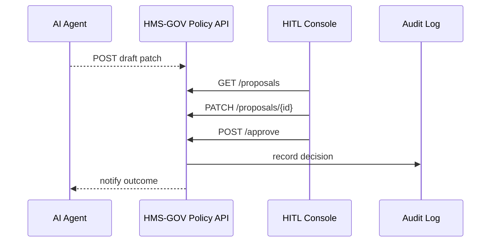

# Chapter 6: Human-in-the-Loop (HITL) Decision Maker
*(part of the HMS-CUR tutorial series)*  

[⬅ Back to Chapter 5: AI Representative Agent](05_ai_representative_agent_.md)

---

## 0. Why Do We Still Need Humans?

Last chapter the **AI Representative Agent (AIRA)** drafted a policy patch (“auto-escalate permits after 24 h”).  
Great—but Congress, auditors, and citizens do **not** want software alone to change public rules.

Enter the **Human-in-the-Loop (HITL) Decision Maker**—think of an **air-traffic controller for policy**.  
Before any AI-generated “flight plan” goes live, a real official must wave it through, reroute it, or slam the brakes.

Concrete use-case we’ll build:

> Clara the City Clerk reviews AIRA’s 24 h-deadline patch, tweaks the time-limit to **48 h**, approves it, and the new rule instantly governs every garden-permit request.

You’ll learn how to:

1. Pull the draft from the inbox.  
2. Edit parameters safely from the **HMS-GOV** console or API.  
3. Approve (or reject) with a digitally-signed audit record.  

All in less than 40 lines of code.

---

## 1. Key Concepts (Control-Tower Analogies)

| Control-Tower Analogy | HITL Term        | Beginner Explanation |
|-----------------------|------------------|----------------------|
| Incoming flight list  | **Proposal Inbox** | Queue of AI-generated drafts waiting for review. |
| Green / yellow / red wand | **Decision Controls** | Buttons: *Approve*, *Edit*, *Reject*. |
| Pilot sign-off        | **Digital Signature** | Clerk’s JWT + timestamp recorded forever. |
| Black-box recorder    | **Audit Trail**  | Immutable log viewable by inspectors. |
| Emergency “go-around” | **Rollback Switch** | One click to revert a bad rule. |

Keep these five ideas in your pocket; everything else is plumbing.

---

## 2. Trying HITL in 5 Minutes

Below we mimic Clara reviewing the 24 h patch.

### 2.1 List Pending Proposals (Inbox)

```bash
curl -H "Authorization: Bearer <clara_jwt>" \
     https://gov.example.com/hitl/proposals
```

Sample output:

```json
[
  {
    "id": "P-23",
    "summary": "Permits pending >24h violate SLA",
    "patch": { "add_rule": "auto-escalate-after: 24h" },
    "confidence": 0.82,
    "state": "pending"
  }
]
```

*Explanation* – Clerk sees every draft that needs a decision.

### 2.2 Preview & Edit the Patch

```bash
curl -X PATCH \
  -H "Authorization: Bearer <clara_jwt>" \
  -H "Content-Type: application/json" \
  -d '{ "patch": { "add_rule": "auto-escalate-after: 48h" } }' \
  https://gov.example.com/hitl/proposals/P-23
```

*Explanation* – Clara changes “24 h” → “48 h”. Only *diff* is stored; original remains in history.

### 2.3 Approve & Publish

```bash
curl -X POST \
  -H "Authorization: Bearer <clara_jwt>" \
  https://gov.example.com/hitl/proposals/P-23/approve
```

Expected response:

```json
{ "status": "approved", "effective": "2024-03-20T00:00Z" }
```

*What just happened?*  
• Rule is copied from `drafts/` to `active/` in the Policy Registry.  
• Audit Trail logs Clara’s decision with a cryptographic checksum.  
• New 48 h deadline is enforced immediately for every permit.

### 2.4 See the Audit Entry

```bash
curl -H "Authorization: Bearer <auditor_jwt>" \
     https://gov.example.com/audit?proposal=P-23
```

```json
{
  "proposalId": "P-23",
  "decision": "approved",
  "signedBy": "clara@city.gov",
  "patchHash": "9af1c…",
  "timestamp": "2024-03-19T14:02Z"
}
```

---

## 3. What Happens Under the Hood?

### 3.1 Step-by-Step Flow



1. **AIRA** submits a draft.  
2. **HITL Console** fetches & edits it.  
3. Approval triggers an audit entry and promotes the patch to *active* rules.  

### 3.2 Folder Map (Mini)

```
hms-gov/
 ├─ hitl/
 │   ├─ routes.py
 │   ├─ service.py
 │   └─ ui/
 └─ policies/
     ├─ drafts/
     └─ active/
```

---

## 4. Inside the Code (All Snippets ≤ 20 Lines)

### 4.1 Storage Helper (`service.py`)

```python
# hitl/service.py
import json, os, hashlib, time

BASE = "policies"

def _path(id, phase):            # phase = 'drafts' or 'active'
    return f"{BASE}/{phase}/{id}.json"

def load_draft(pid):
    with open(_path(pid, "drafts")) as f:
        return json.load(f)

def save_draft(pid, data):
    with open(_path(pid, "drafts"), "w") as f:
        json.dump(data, f, indent=2)

def promote(pid):
    os.replace(_path(pid, "drafts"), _path(pid, "active"))
```

*Explanation* – Reads, writes, and promotes JSON files—simple and transparent.

### 4.2 API Routes (`routes.py`)

```python
# hitl/routes.py
from flask import Blueprint, request, jsonify
from .service import load_draft, save_draft, promote
from audit import log                       # re-uses Chapter 1 logger
bp = Blueprint("hitl", __name__)

@bp.get("/hitl/proposals")
def list_props():
    # list file names in /drafts
    return jsonify([...])

@bp.patch("/hitl/proposals/<pid>")
def edit(pid):
    p = load_draft(pid)
    p["patch"] = request.json["patch"]
    save_draft(pid, p)
    return "", 204

@bp.post("/hitl/proposals/<pid>/approve")
def approve(pid):
    promote(pid)
    log({"event":"PROPOSAL_APPROVED","id":pid,"by":request.user})
    return jsonify(status="approved")
```

*Explanation* – Three ultra-small endpoints: list, edit, approve.

### 4.3 Digital Signature (decorator)

```python
# auth_helpers.py
import jwt, time, hashlib

def sign_and_log(event):
    def deco(fn):
        def inner(*a, **k):
            res = fn(*a, **k)
            tok = request.headers["Authorization"].split()[1]
            user = jwt.decode(tok, SECRET, ["HS256"])["sub"]
            checksum = hashlib.sha256(request.get_data()).hexdigest()
            audit.log({**event,"by":user,"hash":checksum,"ts":time.time()})
            return res
        return inner
    return deco
```

Attach `@sign_and_log({...})` to any sensitive route—done!

---

## 5. Common Pitfalls & FAQ

**Q: What if two clerks edit the same draft?**  
A: Last-write-wins is blocked—`ETag` headers enforce optimistic locking, returning `409 Conflict` on stale updates.

**Q: Can I preview the impact before approving?**  
A: Yes. A “Simulate” button in the UI runs the patch against 30 days of historical events and shows predicted KPIs.

**Q: How do I roll back a bad rule?**  
A: `POST /hitl/proposals/P-23/rollback` moves the JSON from `active/` back to `drafts/` and emits an “ROLLBACK” audit entry.

**Q: Does HITL slow things down?**  
A: Minimal. Small patches often require <10 seconds of human review. For emergencies, a “Fast-Track” flag can auto-approve under predefined conditions (e.g., critical security fix) but still logs the human later.

---

## 6. Recap

In this chapter you:

✓ Saw why **humans remain the final authority** in a legally-bound system.  
✓ Explored the **Proposal Inbox → Edit → Approve** workflow.  
✓ Touched tiny, <20-line code samples powering storage, API, and audit.  
✓ Learned to leverage JWTs for digital signatures and instant accountability.

Your new 48 hour rule is live—gardeners rejoice! 🌱  
Next we’ll dive into **how those active rules actually change real-world processes** inside HMS-CUR: [Policy / Process Module](07_policy___process_module_.md)

---

---

Generated by [AI Codebase Knowledge Builder](https://github.com/The-Pocket/Tutorial-Codebase-Knowledge)