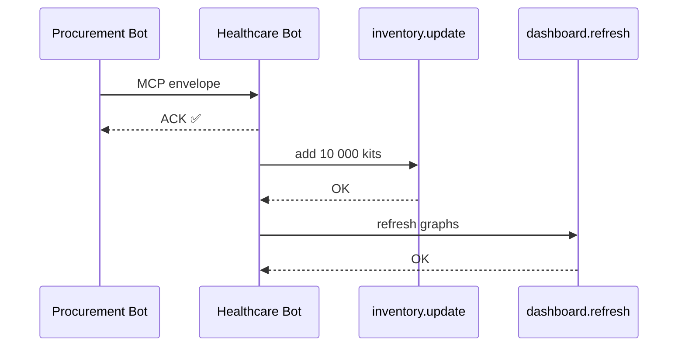

# Chapter 6: Model Context Protocol (HMS-MCP)

*(Coming from our brand-new AI civil-servant in [AI Representative Agent (HMS-AGT / HMS-AGX)](05_ai_representative_agent__hms_agt___hms_agx__.md))*  

---

## 1. Why Do Agents Need a “Universal Translator”?

Imagine this late-night scene inside a federal data center:

1. A **Procurement Bot** just found a supplier that can ship 10 000 low-cost COVID-19 test kits.  
2. A **Healthcare Bot** (run by HHS) must log those kits, schedule distribution, and update public dashboards.  
3. A **Finance Bot** needs the purchase order so it can move money through Treasury.  

All three bots speak to the same backend, but they were built by different teams, in different languages, with different field names:

| Bot | Field for “quantity” | Field for “unit price” |
|-----|----------------------|------------------------|
| Procurement | `qty` | `price_usd` |
| Healthcare  | `amount` | `cost` |
| Finance     | `units` | `unit_cost` |

Without a shared protocol, we drown in one-off adapters.  
**Model Context Protocol (HMS-MCP)** fixes this by giving every agent a simple envelope—like a diplomatic pouch—that clearly states:

* What task am I doing?  
* Which data do I need?  
* Which tool-chain do I expect downstream?  

> Think of MCP as the *“PDF form”* that every AI agent must fill in before handing work to any other agent.

---

## 2. Central Use-Case Walk-Through

We will build a *mini flow*:

1. The Procurement Bot discovers a supplier.  
2. It hands an **MCP message** to the Healthcare Bot.  
3. The Healthcare Bot logs the delivery schedule.  

We’ll see how a tiny, 12-line JSON document keeps everyone in sync.

---

## 3. Key Concepts (Glossary)

| MCP Term | Beginner-Friendly Meaning |
|----------|---------------------------|
| Context Envelope | The outer JSON object—like the envelope that holds the letter. |
| Task Card | A short sentence + metadata describing *what needs to be done*. |
| Data Contract | Explicit field definitions (name, type, units) so nobody misreads numbers. |
| Tool Chain | Ordered list of tools the next agent should invoke. |
| Handshake | Quick ACK/❌ reply saying “I understand this envelope” or “I don’t.” |

---

## 4. The 12-Line MCP Envelope

Below is a complete, valid MCP message—well under 20 lines.

```json
{
  "mcp_version": "1.0",
  "task": "log_covid_test_kits",
  "source_agent": "procurement_bot",
  "target_agent": "healthcare_bot",
  "data": {
    "quantity_units": "kits",
    "quantity": 10000,
    "unit_price_usd": 1.25
  },
  "tool_chain": ["inventory.update", "dashboard.refresh"]
}
```

Explanation for beginners:

1. `mcp_version` – so we can evolve the format later.  
2. `task` – one camel-case verb phrase.  
3. `source_agent` / `target_agent` – plain IDs.  
4. `data` – self-describing fields; *units* live right next to the number!  
5. `tool_chain` – tells the Healthcare Bot exactly which internal tools to call next.

---

## 5. Sending & Receiving MCP in <20 Lines of Python

### 5.1 Sender (Procurement Bot)

```python
# send_mcp.py (17 lines)
import json, requests

envelope = {
    "mcp_version": "1.0",
    "task": "log_covid_test_kits",
    "source_agent": "procurement_bot",
    "target_agent": "healthcare_bot",
    "data": {"quantity_units": "kits", "quantity": 10000, "unit_price_usd": 1.25},
    "tool_chain": ["inventory.update", "dashboard.refresh"]
}

r = requests.post("http://localhost:9000/mcp", json=envelope)
print("Handshake:", r.json())        # ➜ {"ack": true}
```

Beginner notes: we just `POST` the JSON; no fancy SDK needed.

### 5.2 Receiver (Healthcare Bot)

```python
# receive_mcp.py (18 lines)
from fastapi import FastAPI, HTTPException
import inventory, dashboard                 # pretend tool modules

app = FastAPI()

@app.post("/mcp")
async def handle(env: dict):
    if env.get("mcp_version") != "1.0":
        raise HTTPException(400, "Unknown MCP version")

    if env["task"] == "log_covid_test_kits":
        data = env["data"]
        inventory.update(data)              # tool 1
        dashboard.refresh()                 # tool 2
        return {"ack": True}
    return {"ack": False, "reason": "Task unknown"}
```

Explanation:

1. We validate `mcp_version`.  
2. We branch on `task`.  
3. We call each tool in `tool_chain`—just two function calls here.

---

## 6. What Happens Under the Hood?



Only four participants—easy to follow for beginners.

---

## 7. Implementation Notes for Curious Readers

### 7.1 Folder Peek

```
hms-mcp/
 ├─ schemas/
 │   └─ mcp_v1.json
 ├─ sender.py
 └─ receiver.py
```

### 7.2 JSON-Schema (excerpt, 15 lines)

```json
{
  "$id": "mcp_v1",
  "type": "object",
  "required": ["mcp_version", "task", "data"],
  "properties": {
    "mcp_version": {"enum": ["1.0"]},
    "task":        {"type": "string"},
    "data":        {"type": "object"},
    "tool_chain":  {
       "type": "array",
       "items": {"type": "string"}
    }
  }
}
```

Beginners can copy-paste this into any JSON-schema validator to auto-check envelopes.

### 7.3 Minimal Validator (19 Lines)

```python
# hms-mcp/validate.py
import jsonschema, json, pathlib

schema = json.load(open("schemas/mcp_v1.json"))

def is_valid(envelope: dict) -> bool:
    try:
        jsonschema.validate(envelope, schema)
        return True
    except jsonschema.ValidationError as err:
        print("❌ MCP invalid:", err.message)
        return False
```

*Why only 19 lines?* Because `jsonschema` does the heavy lifting.

---

## 8. Integrating MCP with Earlier Chapters

• **Agents** in [HMS-AGT / HMS-AGX](05_ai_representative_agent__hms_agt___hms_agx__.md) now call `validate.is_valid()` before sending any envelope.  
• **Policy checks** (HMS-CDF) can inspect the `task` and `data` fields to see whether the action is allowed.  
• **Legal checks** (HMS-ESQ) can confirm the contract (e.g., unit price within GSA limits).  
• Failed handshakes automatically escalate to [Human-in-the-Loop (HITL) Oversight](07_human_in_the_loop__hitl__oversight_.md).

---

## 9. Hands-On Exercise

1. Run the Healthcare Bot receiver:

```bash
uvicorn receive_mcp:app --reload
```

2. In a second terminal, send the envelope:

```bash
python send_mcp.py
```

3. Change `unit_price_usd` to `5000` and rerun. You’ll see the receiver still ACKs, but later HMS-ESQ (if wired in) will block the purchase—try hooking it up!

---

## 10. Common Questions

**Q: Is MCP only for JSON?**  
Version 1.0 is JSON for simplicity; future versions may support Protocol Buffers or YAML.

**Q: What if the receiving agent doesn’t understand a tool in `tool_chain`?**  
It returns `{"ack": false, "reason": "tool_unknown"}`. The sender can then fall back or call HITL.

**Q: Do humans ever write MCP envelopes manually?**  
Rarely. Most envelopes are auto-generated by agents, but developers can craft them in a text editor for testing.

---

## 11. Summary & Next Steps

You learned:

* Why cross-agency AI tools need a **universal translator**.  
* The anatomy of a 12-line **MCP envelope**.  
* How to send, receive, validate, and act on MCP messages in <20 lines of code.  
* How MCP ties into policy, legal, and human oversight layers.

Next we’ll see how real humans watch over these bots in [Human-in-the-Loop (HITL) Oversight](07_human_in_the_loop__hitl__oversight_.md).

---

Generated by [AI Codebase Knowledge Builder](https://github.com/The-Pocket/Tutorial-Codebase-Knowledge)