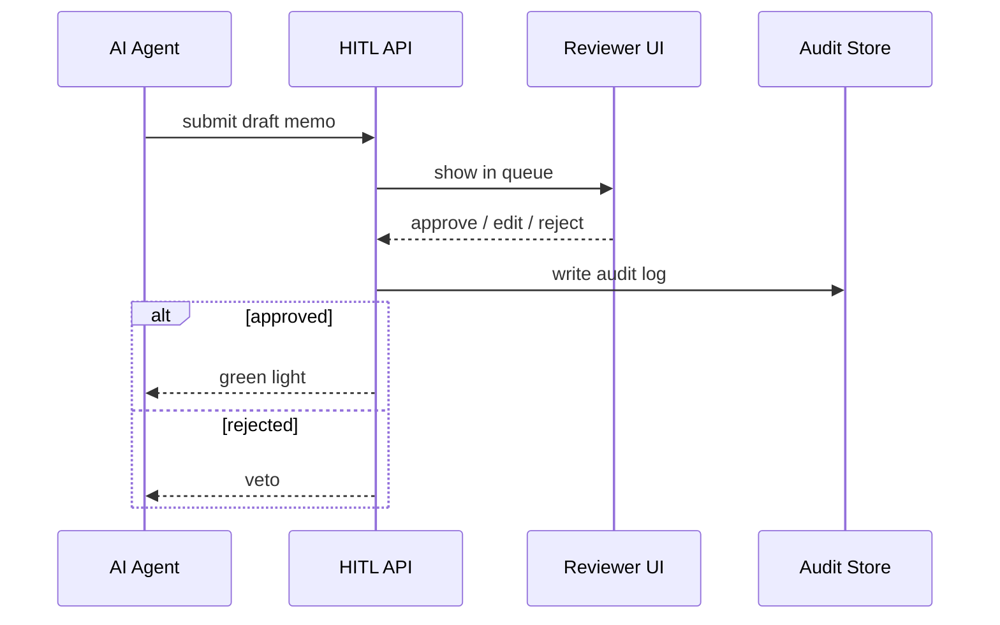

# Chapter 7: Human-in-the-Loop (HITL) Oversight

*(Picking up right after our universal translator in [Model Context Protocol (HMS-MCP)](06_model_context_protocol__hms_mcp__.md).)*  

---

## 1. Why Do We Still Need a Human?

Picture a late-night scene at the **House Office of Inspector General (OIG)**:

1. An **AI Agent** finishes a 30-page audit memo about travel-voucher fraud.  
2. The memo passes **policy** checks ([HMS-CDF](02_policy_engine__hms_cdf__.md)).  
3. It clears **legal** checks ([HMS-ESQ](03_compliance___legal_reasoning__hms_esq__.md)).  

Should the AI e-mail Congress on its own?  
Probably not.  
A real inspector wants to skim, tweak wording, maybe strike a sensitive paragraph.

**Human-in-the-Loop (HITL) Oversight** is the final checkpoint—much like a deputy secretary initialing a memo before it becomes policy.

---

## 2. Central Use-Case: “Approve an AI-Drafted Audit Memo”

We will:

1. Queue the AI’s draft for review.  
2. Let an authorized official approve, edit, or reject it.  
3. Log every click for auditors.  

The whole flow can run on a laptop using <40 lines of Python + one tiny HTML page.

---

## 3. Key Concepts (Plain English)

| Term | Beginner-Friendly Meaning |
|------|---------------------------|
| Review Queue | A to-do list of AI proposals waiting for humans. |
| Approval Screen | A simple webpage that shows the proposal and three buttons: *Approve*, *Edit*, *Reject*. |
| Role-Based Permission | Only users with a specific badge (e.g., “Inspector”) can press *Approve*. |
| Audit Trail | An un-editable diary: who did what, when, and why. |
| Escalation | If nobody acts in X hours, bump it to a higher official or page them by text. |

---

## 4. Walking Through the Flow



Only four participants—easy to digest.

---

## 5. Quick-Start: Spin Up a Mini HITL Server

### 5.1 Requirements

```bash
pip install fastapi uvicorn jinja2 pydantic
```

### 5.2 Folder Snapshot

```
hms-hitl/
 ├─ server.py
 ├─ templates/
 │   └─ review.html
 └─ audit/
```

### 5.3 `server.py` – 19 Lines

```python
from fastapi import FastAPI, Form
from fastapi.responses import HTMLResponse
from jinja2 import Template
import json, uuid, pathlib, datetime

app = FastAPI()
queue = []                       # memory queue ⏳

@app.post("/submit")
async def submit(item: dict):
    item["id"] = str(uuid.uuid4())
    queue.append(item)
    return {"queued": True, "id": item["id"]}

@app.get("/review", response_class=HTMLResponse)
async def review():
    tpl = Template(open("templates/review.html").read())
    return tpl.render(items=queue)

@app.post("/action")
async def action(id: str = Form(...), decision: str = Form(...)):
    item = next(x for x in queue if x["id"] == id)
    log = {"time": datetime.datetime.utcnow().isoformat(),
           "id": id, "decision": decision, "user": "alice@oig.gov"}
    pathlib.Path("audit").mkdir(exist_ok=True)
    open(f"audit/{id}.json","w").write(json.dumps(log))
    queue.remove(item)
    return {"status": decision}
```

**What’s happening?**

1. `/submit` – AI agents push proposals here.  
2. `/review` – Humans open this URL to see the list.  
3. `/action` – Form posts *approve*, *edit*, or *reject*; a JSON log is written.  

No databases, no auth yet—perfect for a demo.

### 5.4 `templates/review.html` – 17 Lines

```html
<!doctype html>
<html>
<body>
<h1>Review Queue</h1>

  <h3>Draft {{ it.id }}</h3>
  <pre>{{ it.content }}</pre>
  <form action="/action" method="post">
    <input type="hidden" name="id" value="{{ it.id }}">
    <button name="decision" value="approve">Approve</button>
    <button name="decision" value="reject">Reject</button>
  </form>
  <hr>

  <p>No items pending 🎉</p>

</body>
</html>
```

Open `http://127.0.0.1:8000/review` and you have a bare-bones approval screen.

---

## 6. Driving It from an AI Agent

```python
# agent_submit.py – 15 lines
import requests, textwrap

draft = {
  "title": "Travel Voucher Fraud – FY24",
  "content": textwrap.dedent("""
      Finding: 12% of vouchers lacked receipts.
      Recommendation: Implement auto-validation.
  """)
}
r = requests.post("http://127.0.0.1:8000/submit", json=draft)
print("Queued as", r.json()["id"])
```

Run this, refresh the browser, and see the memo waiting for your approval.

---

## 7. Adding Role-Based Permissions (Tiny Stub)

Real apps authenticate the reviewer. Drop-in snippet using HTTP header:

```python
# inside action() before writing log
if "alice@oig.gov" not in ["alice@oig.gov","bob@oig.gov"]:
    raise HTTPException(403, "Not allowed")
```

Swap the hard-coded list with LDAP or OAuth later—concept stays the same.

---

## 8. Under the Hood – Step-by-Step

1. **Agent submits** JSON ➜ `/submit`.  
2. Item stored in **in-memory queue** (or Redis in prod).  
3. **Reviewer UI** polls `/review`; renders Jinja template.  
4. Reviewer clicks **Approve / Reject** ➜ POST `/action`.  
5. Server writes an **audit JSON file** under `audit/`.  
6. Server returns decision to the agent (HTTP 200 with `status`).  
7. **Escalation timer** (not shown) could e-mail a supervisor if queue >24 h.

---

## 9. How HITL Connects to Other Layers

| Layer | Interaction |
|-------|-------------|
| [HMS-AGT](05_ai_representative_agent__hms_agt___hms_agx__.md) | Calls `/submit` then waits for decision. |
| [HMS-CDF](02_policy_engine__hms_cdf__.md) | Can flag actions as “needs_human” → agent routes here. |
| [HMS-ESQ](03_compliance___legal_reasoning__hms_esq__.md) | Adds legal notes into the draft for the reviewer. |
| [HMS-DTA](13_secure_data_repository__hms_dta__.md) | Stores finalized audit logs. |
| [HMS-MFE](08_interface_layer___micro_frontends__hms_mfe__.md) | Will replace this raw HTML with a polished micro-frontend. |

---

## 10. Hands-On Challenge

1. Start the server:

```bash
uvicorn server:app --reload
```

2. Run `agent_submit.py` three times (queue fills).  
3. Approve one memo, reject another.  
4. Open the `audit/` folder—each action is a JSON line like:

```json
{"time":"2024-05-29T02:31:45.551Z",
 "id":"75e3...",
 "decision":"approve",
 "user":"alice@oig.gov"}
```

5. Change `decision` buttons to *Edit*; send back a revised memo—extend as homework!

---

## 11. FAQ

**Q: What if edits are needed?**  
Add a textarea in the form, post the edited text, and save it to the audit record.  

**Q: Can multiple reviewers collaborate?**  
Yes—store the queue in a shared DB and show a *“claimed by”* badge.  

**Q: How do we prevent tampering with audit logs?**  
Write logs to the [Secure Data Repository (HMS-DTA)](13_secure_data_repository__hms_dta__.md) which is append-only.

---

## 12. Recap & Next Steps

You have learned:

* Why even perfect AI still gets a human signature.  
* The four moving parts of HITL: **Queue → Screen → Action → Audit**.  
* How to spin up a prototype with <40 lines of code.  
* How HITL plugs into every layer we built so far.

Next we’ll swap our bare HTML for reusable, production-grade web components in  
[Interface Layer – Micro-Frontends (HMS-MFE)](08_interface_layer___micro_frontends__hms_mfe__.md).

---

Generated by [AI Codebase Knowledge Builder](https://github.com/The-Pocket/Tutorial-Codebase-Knowledge)