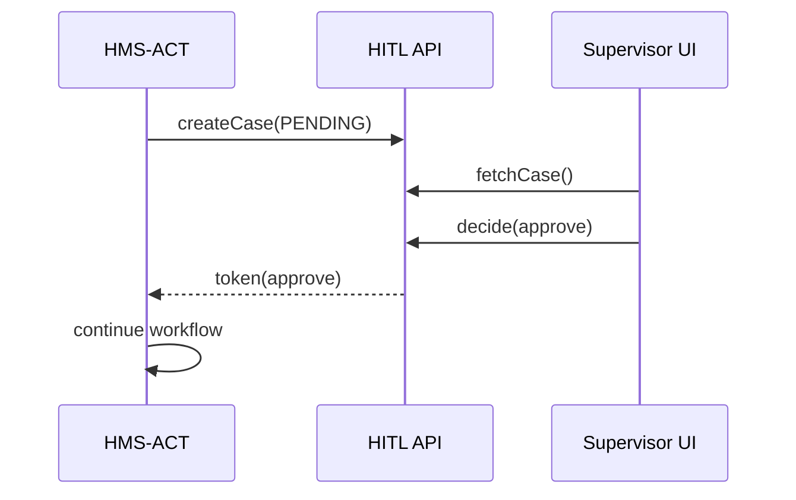

# Chapter 7: Human-in-the-Loop Oversight (HITL)

[← Back to Chapter 6: Central Data Repository (HMS-DTA)](06_central_data_repository__hms_dta__.md)

---

## 1. Motivation — “The Red Phone on the Desk”

Imagine a **Postal Refund** workflow (we built it in [HMS-ACT](04_agent_orchestration___workflow__hms_act__.md)).  
Most claims are under \$100 and fly through in seconds, but a few cross a legal threshold:

* Any refund **>\$100** must be signed by a supervisor.  
* If the claim involves an overseas parcel, **Customs** must also approve.  

A *purely automated* system would either  
1. break the law by paying too early, or  
2. block **all** claims, annoying citizens.

**Human-in-the-Loop Oversight (HITL)** is the *red phone* that pauses just those critical cases, gets a quick thumbs-up (or tweak) from a real human, and then lets automation resume.

---

## 2. Key Concepts (Airport-Control-Tower Analogies)

| HITL Term | Control-Tower Analogy | Plain English |
|-----------|----------------------|---------------|
| Pause Point | “Hold short of runway.” | A spot in the workflow where machines must wait. |
| Reviewer | Air-traffic controller | Person allowed to clear or deny the pause. |
| Escalation | “Tower → Supervisor” | Forward the case if 1st reviewer stalls or rejects. |
| Decision Token | Green/red light | Small JSON object the human returns (approve, tweak, veto). |
| Audit Trail | Flight log | Immutable record of what was shown and decided. |

Keep these five nouns in mind; everything else is just glue.

---

## 3. Hands-On Tour — Adding HITL to the Postal Claim

We will:

1. Mark a **pause point** in the existing workflow.  
2. Pop up a *review panel* for supervisors.  
3. Continue automatically once approved.

### 3.1 Mark the Pause Point (one extra task)

```js
// wf-postal-claim.js  (≤19 lines)
import { registerWorkflow } from 'hms-act';

registerWorkflow('postal-claim', [
  { id:'verify-address', agent:'address-bot' },
  { id:'calc-refund',    agent:'refund-bot'  },

  // NEW: pause if refund>100
  { id:'manual-review',  hitl:{
      if : data => data.refund > 100,     // condition
      role: 'postal-supervisor'           // who may review
    }
  },

  { id:'send-check',     agent:'mailer-bot' }
]);
```

Explanation  
• We add **`hitl`** instead of an `agent`.  
• The function `if` decides when to pause.  
• `role` names the group that can clear it.

---

### 3.2 Minimal Review Pane (micro-frontend)

```js
// review-pane.js  (≤18 lines)
import { fetchCase, decide } from 'hms-hitl';

export async function mount(el){
  const c = await fetchCase();          // gets next pending case
  if(!c) return el.textContent = 'No cases!';

  el.innerHTML = `
     <h3>Refund: $${c.data.refund}</h3>
     <button id=ok>Approve</button>
     <button id=no>Deny</button>`;

  document.getElementById('ok').onclick =
        () => decide(c.id, { approve:true });
  document.getElementById('no').onclick =
        () => decide(c.id, { approve:false, note:'Need docs' });
}
```

Explanation  
• `fetchCase()` streams the next waiting pause for *you*.  
• `decide()` posts a **Decision Token**; workflow resumes (or aborts) instantly.

---

### 3.3 What the Workflow Sees

No extra code!  
Once a decision arrives:

* **approve =true** → HMS-ACT jumps to `send-check`.  
* **approve =false** → workflow ends with state **REJECTED**.

---

## 4. What Happens Under the Hood?

### 4.1 Step-by-Step (Plain English)

1. `calc-refund` finishes with `refund:125`.  
2. HMS-ACT notices the next template has a `hitl.if` rule that evaluates to **true**.  
3. A **HITL Case** is written to HMS-DTA with status **PENDING**.  
4. Reviewers’ dashboard (review pane) polls `/hitl/cases?role=postal-supervisor` and fetches the case.  
5. Reviewer presses **Approve** → a Decision Token `{approve:true}` is saved.  
6. HMS-ACT sees the token, marks the pause point **DONE**, and continues.  
7. The entire case (inputs, screenshots, decision) is locked in the audit trail forever.

### 4.2 Tiny Sequence Diagram



---

## 5. Inside HITL – Code-Light Peek

### 5.1 Creating a Case (10 lines)

```js
// hitl/create.js
export async function createCase(task){
  await dta.put({                       // reuse HMS-DTA
    collection : 'hitl-cases',
    recordId   : task.runId + '/' + task.id,
    data       : { input:task.data, status:'PENDING' },
    lock       : ['role:' + task.hitl.role]
  });
}
```

Explanation  
• The case lives in the **Central Data Repository**; only the correct role may open it.

### 5.2 Streaming Cases to Reviewers (9 lines)

```js
// hitl/fetch.js
export async function fetchCase(role){
  const res = await dta.query({
    collection:'hitl-cases',
    where:{ 'data.status':'PENDING', lock:`role:${role}` },
    limit:1
  });
  return res[0];
}
```

Explanation  
A simple query returns one un-assigned PENDING case that the current reviewer is allowed to see.

### 5.3 Storing the Decision (9 lines)

```js
// hitl/decide.js
export async function decide(id, token){
  const rec = await dta.get('hitl-cases', id);
  rec.data.status = 'DECIDED';
  rec.data.token  = token;           // approve / deny / tweaks
  await dta.put(rec);                // new version
  notifyWorkflow(id, token);         // small helper
}
```

Explanation  
• Decision and status update in the same record → immutable trail.  
• `notifyWorkflow` wakes HMS-ACT so it can move on instantly.

---

## 6. Frequently Asked Questions

1. **Can reviewers edit the AI output, not just approve/deny?**  
   Yes—`token` can include a `patch` object (e.g., corrected refund amount). HMS-ACT merges it into the workflow data.

2. **What if no supervisor responds?**  
   Each pause point supports a `timeout` (default 24 h). Expiry can auto-escalate to a higher role or fail the workflow.

3. **Is every task forced through HITL?**  
   No. Only tasks that meet the `hitl.if` rule pause. Low-risk cases sail through.

4. **How are reviewers authenticated?**  
   They log in via the same SSO that powers the **Micro-Frontend Interface**. Their JWT lists roles (`role:postal-supervisor`).

5. **Can a reviewer see the raw AI prompt & response?**  
   If stored in HMS-DTA, yes—locks permit. This is vital for compliance with [AI Governance Values Enforcement](11_ai_governance_values_enforcement_.md).

---

## 7. Summary & What’s Next

You just learned how **Human-in-the-Loop Oversight**:

* Pauses high-stakes workflow steps at **pause points**.  
* Shows a clean **review panel** to authorized humans.  
* Resumes (or cancels) automation based on a compact **Decision Token**.  
* Writes an untouchable **audit trail** in HMS-DTA.

Next we will dive into how rich prompt/response *context* is packed and transported between models and agents using the **Model Context Protocol (HMS-MCP)**:  
[Chapter 8: Model Context Protocol (HMS-MCP)](08_model_context_protocol__hms_mcp__.md)

---

---

Generated by [AI Codebase Knowledge Builder](https://github.com/The-Pocket/Tutorial-Codebase-Knowledge)