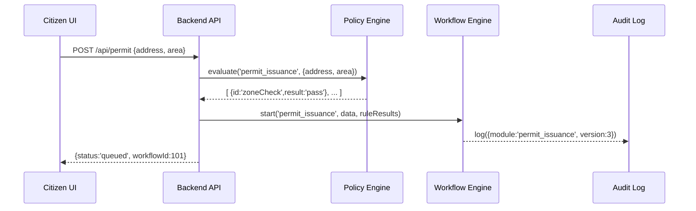

# Chapter 7: Policy/Process Module

In [Chapter 6: Workflow Engine](06_workflow_engine_.md) we saw how tasks get sequenced. Now let’s look at the **Policy/Process Module**—the place where all your business rules and workflows live. Think of it as the city’s “legal code” for one service: each version (or “chapter”) defines exactly how things work.

---

## 7.1 Motivation: A Single Source of Truth for Business Rules

Imagine a city’s building-permit office. Every time someone applies, the system needs to know:

- Which forms to show
- What inspections are required
- How fees are calculated
- Who must approve

If these rules are scattered across code, they become impossible to maintain. The **Policy/Process Module** solves this by bundling:

1. Business rules (e.g., “Zone A requires two inspections”)  
2. Workflow definitions (e.g., “intake → review → inspection → approval”)  

into one discrete unit. When your AI Agent proposes an optimization—say, “allow fast-track for pre-approved contractors”—it edits this module, publishes a new chapter, and the system picks up those changes automatically.

---

## 7.2 Key Concepts

1. **Module**  
   A folder or record that holds all rules and workflows for one program (e.g., permit_issuance).

2. **Chapter**  
   A version of the module, with an effective date and version number—like an amendment.

3. **Rule**  
   A single business condition, expressed in code or JSON (e.g., `if applicant.age < 18 deny`).

4. **Workflow**  
   A named sequence of steps triggered by the module (e.g., intake → inspection → approval).

5. **Versioning**  
   Every edit creates a new chapter. The system always uses the latest effective chapter.

---

## 7.3 Defining a Policy Module

Here’s a minimal example for a “permit_issuance” module. Save this as `policy_modules/permit_issuance/module.json`:

```json
{
  "moduleId": "permit_issuance",
  "version": 3,
  "effectiveDate": "2024-07-01",
  "rules": [
    { "id": "zoneCheck", "if": "address.zone == 'A'", "require": ["electricalInspection"] },
    { "id": "feeCalc", "formula": "baseFee + (area * 0.5)" }
  ],
  "workflow": ["intake", "review", "inspection", "approval"]
}
```

This file:

- Declares a **version** (3) and **effectiveDate**
- Lists **rules** and a **workflow** array

When the AI Agent proposes a change, it updates this JSON (bumping version to 4) and publishes it.  

---

## 7.4 Loading and Applying a Module

### 7.4.1 Loading Current Chapter

```js
// src/policy_process_module/PolicyStore.js
const fs = require('fs');
function loadModule(id) {
  const raw = fs.readFileSync(`policy_modules/${id}/module.json`);
  return JSON.parse(raw);
}
module.exports = { loadModule };
```

This simple loader reads the latest `module.json` for a given program.

### 7.4.2 Applying Rules at Runtime

```js
// src/policy_process_module/PolicyEngine.js
const { loadModule } = require('./PolicyStore');
class PolicyEngine {
  evaluate(moduleId, context) {
    const mod = loadModule(moduleId);
    return mod.rules.map(r => ({
      id: r.id,
      result: evalRule(r, context) // imagine a safe evaluator
    }));
  }
}
module.exports = new PolicyEngine();
```

Here, `evaluate` returns which rules passed or failed for a given application `context` (like form data).

---

## 7.5 Under the Hood

When a citizen submits a permit request, here’s what happens:



1. **Backend API** asks **Policy Engine** to check rules.  
2. The engine loads the current **chapter** JSON.  
3. After rule results, the API starts a workflow in the **Workflow Engine**.  
4. An **audit log** records which module and version ran.

---

## 7.6 Internal Implementation Details

### 7.6.1 Module Repository

Your modules live in folders:

```
policy_modules/
└── permit_issuance/
    └── module.json
└── complaint_handling/
    └── module.json
```

When AI or an admin publishes an update, they commit a new `module.json` with incremented `version`.

### 7.6.2 Safe Rule Evaluation

A real system uses a sandbox or DSL, not `eval`. For example:

```js
function evalRule(rule, ctx) {
  // Very simplistic: support "address.zone == 'A'"
  const expr = rule.if.replace('==', '===');
  return Function('"use strict"; return ' + expr).call(ctx);
}
```

In production you’d use a library or your own parser.

---

## 7.7 What We Learned

- A **Policy/Process Module** bundles business rules and workflow definitions into a versioned “chapter.”  
- We saw how to define a module in JSON, load it at runtime, and apply its rules via the **Policy Engine**.  
- Every submission goes through rule checking, then kicks off a workflow—ensuring one consistent source of truth.  
- When the AI Agent suggests optimizations, it edits this module (new chapter) and the system immediately picks up the changes.

Up next, we’ll connect to outside systems—databases, payment gateways, GIS services—in [Chapter 8: External System Integration](08_external_system_integration_.md).

---

Generated by [AI Codebase Knowledge Builder](https://github.com/The-Pocket/Tutorial-Codebase-Knowledge)