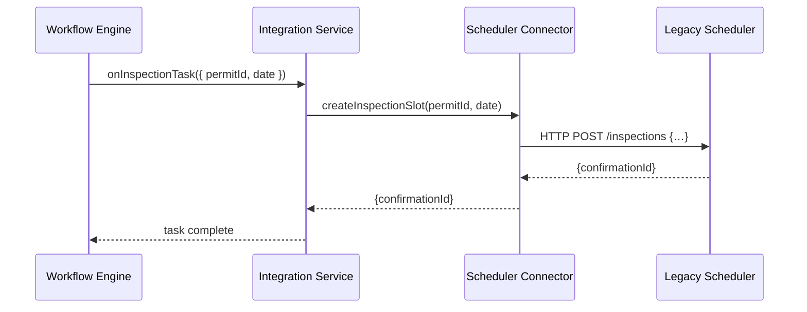

# Chapter 8: External System Integration

In [Chapter 7: Policy/Process Module](07_policy_process_module_.md) we defined how business rules and workflows live in versioned modules. Now it’s time to **connect HMS-CUR** to the outside world—scheduling apps, document management systems, or legacy agency databases—using **External System Integration**.

---

## 8.1 Motivation: Building Secure Data Pipelines

Imagine a **River Basin Commission** that still uses a 20-year-old desktop app to schedule field inspections. Citizens apply for water-use permits in HMS-CUR, but the inspection calendar lives in that legacy system. Without integration, inspectors never see new requests in real time, and data drifts out of sync.

**External System Integration** solves this by creating **secure pipelines**:

- Connector to the **Scheduling System**—so new inspections show up immediately.
- Connector to the **Document Management System**—so reports filed in HMS-CUR are archived in the agency’s vault.
- Connector to **Legacy Databases**—so citizen records stay consistent across platforms.

With these pipes in place, HMS-CUR and existing systems share data in real time, ensuring nothing falls through the cracks.

---

## 8.2 Key Concepts

1. **Connector**  
   A small module that knows how to talk to one external system (e.g., REST API, SOAP, JDBC).

2. **Sync Mechanism**  
   The rules and schedule for pushing or pulling data (e.g., push on event, poll every minute).

3. **Mapping & Transformation**  
   Translating HMS-CUR data structures into the external system’s format and vice versa.

4. **Security & Authentication**  
   Storing credentials, using TLS, and enforcing least-privilege access.

5. **Error Handling & Monitoring**  
   Detecting failed calls, retrying when safe, and alerting ops teams.

---

## 8.3 Using External System Integration

Below is a minimal example showing how to **schedule an inspection** in a legacy system whenever a permit workflow reaches the “inspection” step.

### 8.3.1 Define a Connector

File: `connectors/schedulerConnector.js`
```js
// A simple REST connector to the legacy scheduler
const fetch = require('node-fetch');
const BASE = 'https://legacy-scheduler.example.gov';

async function createInspectionSlot(permitId, date) {
  const res = await fetch(`${BASE}/inspections`, {
    method: 'POST',
    headers: { 'Content-Type': 'application/json', 'API-Key': process.env.SCHED_KEY },
    body: JSON.stringify({ permitId, date })
  });
  return res.json(); // { confirmationId: 'abc123' }
}

module.exports = { createInspectionSlot };
```
This connector wraps the external API, handling URL, headers, and JSON.

### 8.3.2 Hook into the Workflow

File: `src/external_system_integration/IntegrationService.js`
```js
const { createInspectionSlot } = require('../../connectors/schedulerConnector');

// Called from the Workflow Engine on “inspection” task activation
async function onInspectionTask(task) {
  const { permitId, requestedDate } = task.data;
  const result = await createInspectionSlot(permitId, requestedDate);
  console.log('Scheduled in legacy system:', result.confirmationId);
}

module.exports = { onInspectionTask };
```
When the “inspection” step runs, we call our connector to push data out.

---

## 8.4 Under the Hood

Here’s what happens when an inspection task fires:



1. **Workflow Engine** invokes `onInspectionTask`.  
2. **Integration Service** delegates to the **Scheduler Connector**.  
3. Connector calls the **Legacy Scheduler** via HTTP.  
4. The legacy system returns an ID, which we log or store.  
5. The task completes and the workflow moves on.

---

## 8.5 Internal Implementation Details

### 8.5.1 Connector Interface

All connectors implement the same minimal pattern:

```js
// connectors/interface.js
class Connector {
  constructor(config) { this.config = config; }
  async call(endpoint, payload) { /* HTTP/SOAP/DB logic */ }
}

module.exports = Connector;
```

Concrete connectors extend this:

```js
// connectors/documentConnector.js
const Connector = require('./interface');
class DocumentConnector extends Connector {
  async uploadReport(doc) {
    return this.call('/upload', { doc });
  }
}
module.exports = DocumentConnector;
```

A shared base makes it easy to add new systems.

### 8.5.2 Configuration

File: `config/connectors.json`
```json
{
  "scheduler": {
    "type": "rest",
    "baseUrl": "https://legacy-scheduler.example.gov",
    "apiKey": "${SCHED_KEY}"
  },
  "docs": {
    "type": "soap",
    "wsdl": "https://doc-mgmt.example.gov/service?wsdl"
  }
}
```
A loader reads this file at startup and instantiates each connector with proper credentials.

---

## 8.6 What We Learned

- **External System Integration** uses **connectors** to bridge HMS-CUR with existing agency systems.  
- We saw how to write a small REST connector, invoke it from the **Workflow Engine**, and keep data in sync.  
- Under the hood, a shared connector interface and simple config make it easy to add new pipelines securely.

Next up, we’ll ensure every action is traceable and compliant in our [Chapter 9: Audit & Compliance Framework](09_audit___compliance_framework_.md).

---

Generated by [AI Codebase Knowledge Builder](https://github.com/The-Pocket/Tutorial-Codebase-Knowledge)