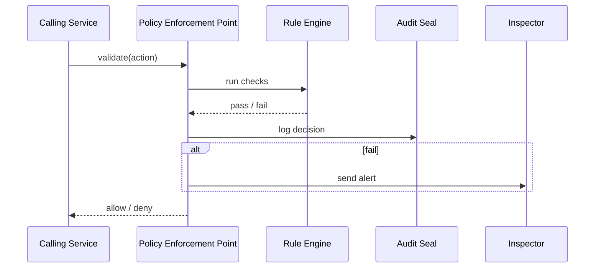

# Chapter 8: Governance & Compliance Layer
*(part of the HMS-CUR tutorial series)*  

[⬅ Back to Chapter 7: Policy / Process Module](07_policy___process_module_.md)

---

## 0. Why Add Yet **Another** Layer?

Picture this:  
The **AI Representative Agent** (from [Chapter 5](05_ai_representative_agent_.md)) suggests emailing every citizen a *full* copy of their health-benefit PDF so they can “easily download it later.”  
Harmless?  Maybe.  
But the PDF contains birth dates and Social-Security numbers—sending it unencrypted would violate:

* The Presidential Executive Order on **Privacy & Data Protection**  
* The **FOIA** (Freedom of Information Act) rule that says redact PII before release  
* Your own agency’s **24-hour breach reporting** policy

The **Governance & Compliance Layer (GCL)** is the immune system that catches this *before* the email is sent, blocks the action, and pings an inspector.

Goal of this chapter:  
You will build a tiny but working “policy immune system” that can:

1. Receive any proposed action (e.g., “email PDF to Alex”).  
2. Check it against privacy, ethics, transparency, and safety rules.  
3. Return **allow / deny** plus an audit-ready reason.  
4. Alert an inspector when something is blocked.

All code blocks are ≤ 20 lines, absolutely beginner-safe.

---

## 1. Key Concepts (Clinic Analogy)

| Clinic Analogy              | GCL Term                 | 1-Sentence Explanation                              |
|-----------------------------|--------------------------|-----------------------------------------------------|
| Nurse takes vitals          | **Policy Enforcement Point (PEP)** | First stop; inspects every request.                 |
| Doctor’s checklist          | **Rule Engine**          | Codified executive orders & agency policies.        |
| “Do Not Discharge” alarm    | **Stop-Gate**            | Hard block that halts deployment if a rule fails.   |
| Medical record entry        | **Audit Seal**           | Immutable log entry with reason + hash.            |
| Call to specialist          | **Inspector Notifier**   | Emails/SMS the compliance officer on serious hits.  |

Keep these five boxes in mind—everything else is plumbing.

---

## 2. 5-Minute Hands-On: “Can I Send This Email?”

### 2.1 The JSON We Want To Send

```jsonc
{
  "action": "send_email",
  "to": "alex@example.com",
  "body": "Here is your full health PDF",
  "attachments": ["health_benefits.pdf"],
  "contains_PII": true,
  "requested_by": "AI-Agent-7"
}
```

### 2.2 Ask GCL for Permission

```bash
curl -X POST http://localhost:4200/gcl/validate \
     -H "Content-Type: application/json" \
     -d @email_request.json
```

Response:

```json
{
  "allowed": false,
  "rule_broken": "privacy.no_unencrypted_pii",
  "message": "Attachment contains PII but no encryption.",
  "inspector_notified": true
}
```

The email is **blocked** and an inspector just got a ping.  
No sensitive PDF leaks—mission accomplished!

---

## 3. How to Use the GCL in Your Code

Below is a 15-line wrapper that any service (AI agents, micro-services, even front-end apps) can call:

```python
# gcl_client.py  (15 lines)
import requests, json

def guard(action: dict) -> bool:
    res = requests.post("http://localhost:4200/gcl/validate", json=action).json()
    if not res["allowed"]:
        raise PermissionError(f"GCL Blocked: {res['message']}")
    return True

# ------------------ Usage ------------------
from gcl_client import guard

action = {
  "action": "send_email",
  "to": "alex@example.com",
  "attachments": ["health_benefits.pdf"],
  "contains_PII": True,
  "requested_by": "AI-Agent-7"
}

guard(action)          # Raises error -> stops execution
```

Explanation:  
1. Build a plain Python `dict` describing the intent.  
2. `guard()` posts it to GCL.  
3. If GCL says ❌, we throw `PermissionError` and stop the workflow.

That’s it—any module is now compliance-aware.

---

## 4. What Happens Behind the Curtain?



Only 5 participants—simple and transparent.

---

## 5. Peeking at the Implementation Files

Project tree (only GCL parts):

```
gcl/
 ├─ app.py           # tiny Flask API
 ├─ rules.py         # actual policy checks
 ├─ notifier.py      # inspector alerts
 └─ audit.py         # immutable log
```

### 5.1 API Endpoint (`app.py` – 18 lines)

```python
from flask import Flask, request, jsonify
import rules, notifier, audit

app = Flask(__name__)

@app.post("/gcl/validate")
def validate():
    act = request.json
    ok, rule, msg = rules.check(act)

    audit.write(act, ok, rule, msg)      # always log
    if not ok:
        notifier.alert(act, rule, msg)   # ping inspector

    return jsonify({
        "allowed": ok,
        "rule_broken": rule,
        "message": msg,
        "inspector_notified": not ok
    })

if __name__ == "__main__":
    app.run(port=4200)
```

Explanation:  
• Accept JSON, call `rules.check`, log the verdict, maybe alert an inspector, return a short JSON response.

### 5.2 Rule Engine (`rules.py` – 20 lines)

```python
# Very small rule set for demo
RULES = [
    {
      "id": "privacy.no_unencrypted_pii",
      "when": lambda a: a.get("contains_PII") and a["action"] == "send_email",
      "message": "Attachment contains PII but no encryption."
    },
    {
      "id": "foia.deadline",
      "when": lambda a: a.get("action") == "release_document" and a["age_days"] > 20,
      "message": "FOIA response exceeds 20-day limit."
    }
]

def check(action: dict):
    for r in RULES:
        if r["when"](action):
            return False, r["id"], r["message"]
    return True, None, "ok"
```

Explanation:  
* Iterate rules; first match blocks the action.  
* Each rule is a tiny `lambda`—easy to extend or auto-generate by the AI Representative Agent.

### 5.3 Notifier (`notifier.py` – 10 lines)

```python
import smtplib, os

def alert(action, rule, msg):
    body = f"Blocked action:\nRule: {rule}\nReason: {msg}\n\n{action}"
    with smtplib.SMTP("localhost") as s:
        s.sendmail("gcl@agency.gov", "inspector@agency.gov", body)
```

Explanation: just a simple email; could be Slack, SMS, etc.

### 5.4 Audit Seal (`audit.py` – 12 lines)

```python
import json, time, hashlib, pathlib
LOG = pathlib.Path("logs/gcl_audit.log")
LOG.parent.mkdir(exist_ok=True)

def write(action, ok, rule, msg):
    payload = {
        "ts": time.time(),
        "allowed": ok,
        "rule": rule,
        "msg": msg,
        "hash": hashlib.sha256(json.dumps(action).encode()).hexdigest()
    }
    LOG.open("a").write(json.dumps(payload) + "\n")
```

Explanation:  
• Every request gets a SHA-256 hash + timestamp—unchangeable evidence for auditors.

---

## 6. Integrating with Other HMS Layers

* **AI Representative Agent** – call `gcl/validate` before executing any suggestion.  
* **Policy / Process Module** – stores the *text* of each rule; GCL only enforces.  
* **Human-in-the-Loop Decision Maker** – can *temporarily* override a block by signing a waiver; the override itself is logged here.  
* **Metrics & Monitoring Dashboard** (coming in [Chapter 14](14_metrics___monitoring_dashboard_.md)) – visualizes “Blocks per Week” to spot policy friction.

---

## 7. Common Questions

**Q: What if a service forgets to call GCL?**  
A: The [Backend API Gateway](09_backend_api_gateway__hms_api___hms_svc__.md) also embeds the PEP, so every external request is *double-checked*.

**Q: Can GCL auto-fix a request?**  
A: Yes. Instead of flat ❌, a rule can return a *remediation* (e.g., “encrypt the PDF first”). The caller may re-submit after applying the fix.

**Q: How do I add a new rule?**  
1. Create a JSON/YAML entry in the Policy / Process Module.  
2. `rules.py` can auto-load it on startup—no code change needed.

**Q: Does this slow the system?**  
A: Each validation takes ≈ 1–2 ms. You can cache “known good” actions with SHA-256 keys if needed.

---

## 8. Recap & Next Steps

You just built the HMS “immune system” that:

✓ Checks every action against transparency, privacy, ethics, and safety rules.  
✓ Blocks non-compliant actions *before* they hit production.  
✓ Notifies inspectors and writes tamper-proof audit logs in ≤ 20 lines of code.  
✓ Integrates seamlessly with AI agents, humans, and the API Gateway.

Next we’ll see how requests that *pass* the immune system flow through the secure entry point of the platform: [Backend API Gateway (HMS-API / HMS-SVC)](09_backend_api_gateway__hms_api___hms_svc__.md) 🚪

---

Generated by [AI Codebase Knowledge Builder](https://github.com/The-Pocket/Tutorial-Codebase-Knowledge)