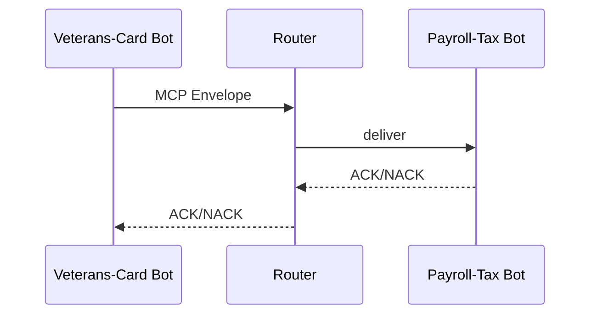

# Chapter 8: Model Context Protocol (HMS-MCP)

[← Back to Chapter 7: Human-in-the-Loop Oversight (HITL)](07_human_in_the_loop_oversight__hitl__.md)

---

## 1  Why Do We Need Yet *Another* Protocol?

Picture a citizen, **Jackson**, who types into the national **MyGov** chat:

> “I lost my VA I-D card and also need to update my tax withholding.”

Two *completely different* agents must now cooperate:

1. **Veterans-Card Bot** (runs under the Department of Veterans Affairs).  
2. **Payroll-Tax Bot** (runs under the Treasury).

If each bot invents its own JSON shape (“`cardId`” vs. “`id_card`”, dates in ISO vs. U.S. format, SSN partly masked vs. plain) they will **misunderstand** each other or, worse, leak data.

**Model Context Protocol (HMS-MCP)** is the *NATO phonetic alphabet* for our bots:

* one envelope format,  
* one set of required headers,  
* one way to signal security level, data types, and next actions.

With MCP in place, any agent—health-care, finance, or zoning—can pick up a context packet and know **exactly** how to parse, trust, and act on it.

---

## 2  Key Concepts (Hand-Signal Analogies)

| MCP Term | Battlefield Hand-Signal | Plain English |
|----------|------------------------|---------------|
| Envelope | Outstretched palm      | “Here comes a packet.” |
| `meta`   | Thumbs-up/down         | Who sent it, when, risk level. |
| `intent` | Pointing ahead         | What the sender *wants* next. |
| `data`   | Holding a document     | The actual business payload. |
| `tags`   | Colored armband        | Extra labels: PII, HIPAA, CLASSIFIED. |
| Ack/Nack | Salute / crossed arms  | “Got it” / “Reject – can’t comply.” |

Memorize these six pieces; every MCP message is just a tidy box of them.

---

## 3  A 3-Minute Hands-On Tour

Goal: have **Veterans-Card Bot** ask **Payroll-Tax Bot** to update withholding *only* after the card replacement request is accepted.

*(All code under 20 lines, promise!)*

### 3.1 Create the MCP Envelope in Veterans-Card Bot

```js
// vets-card-bot.js  (inside agent.handle)
import { send } from 'hms-mcp';

send({
  meta   : { from:'vets-card-bot', to:'payroll-bot', ts:Date.now() },
  intent : 'update-withholding',
  data   : { ssn:'***-**-6789', newAllowance:3 },
  tags   : ['PII', 'IRS'],
});
```

Explanation  
`send()` simply writes the envelope to the *shared* bus (implemented by [HMS-ACT](04_agent_orchestration___workflow__hms_act__.md)).  
Every field is predictable—no ad-hoc keys.

---

### 3.2 Receive & Acknowledge in Payroll-Tax Bot

```js
// payroll-bot.js  (inside agent.handle)
import { receive, ack } from 'hms-mcp';

const env = await receive('update-withholding');
if(env.tags.includes('PII') && !hasPIIRole())
     return ack(env, { ok:false, reason:'Forbidden' });

updateIRS(env.data);           // ← your business logic
ack(env, { ok:true });
```

Explanation  
1. `receive()` blocks until an envelope with the desired `intent` arrives.  
2. Bot inspects `tags` to enforce policy.  
3. `ack()` is the handshake back to sender—success or failure is explicit.

---

### 3.3 What the User Sees

Nothing! The exchange is invisible but guarantees that:

* Veterans-Card Bot never passes un-masked SSNs.  
* Payroll-Tax Bot refuses work if permissions are missing.  
* Jackson’s chat proceeds smoothly:  
  * “Your VA card is on the way.”  
  * “Withholding updated to 3 allowances.”

---

## 4  What Happens Under the Hood?

### 4.1 Step-by-Step (Plain English)

1. **Vet Bot** calls `send()` → envelope enters **MCP Queue**.  
2. **MCP Router** (small service inside HMS-ACT) looks at `to:'payroll-bot'`.  
3. Router delivers envelope to Payroll-Tax Bot’s inbox.  
4. Payroll Bot processes, then calls `ack()` which returns to the Router.  
5. Router forwards ACK back to Vet Bot; if `ok:false` the workflow can branch to a human review (see [HITL](07_human_in_the_loop_oversight__hitl__.md)).

### 4.2 Minimal Sequence Diagram



---

## 5  Inside MCP — A Gentle Peek

### 5.1 Envelope Schema (8 lines)

```jsonc
{
  "meta"  : { "from":"string", "to":"string", "ts":"number"   },
  "intent": "string",
  "data"  : { /* free-form JSON */ },
  "tags"  : ["PII", "HIPAA?", "..."],
  "sig"   : "HMAC-SHA256 envelope hash"   // auto-added
}
```

Explanation  
• `sig` is appended by the runtime so receivers can verify nothing changed in transit.

### 5.2 Tiny Runtime (19 lines)

```js
// hms-mcp/index.js  – boiled down
const bus = connectQueue('mcp');

export function send(env){
  env.sig = hmac(env);           // integrity
  bus.push(env);
}

export function receive(intent){
  return new Promise(res=>{
    bus.on('msg', m => m.intent===intent && res(m));
  });
}

export function ack(orig, result){
  bus.push({ meta:{ from:'sys', to:orig.meta.from }, 
             intent:'ack', data:{ id:hmac(orig), ...result } });
}

function hmac(obj){ /* one-liner SHA256 over JSON */ }
```

Explanation  
*Under 20 lines* you get send, receive, and ack logic—all other niceties (retry, encryption) are just wrappers around this core.

---

## 6  FAQ – **“Can MCP also…?”**

1. **Handle streaming (e.g., live transcript)?**  
   Yes—set `intent:'stream-start'`, send chunks with `intent:'stream-chunk'`, finish with `'stream-end'`.

2. **Embed binary files?**  
   Put them in [HMS-DTA](06_central_data_repository__hms_dta__.md) and pass a `data.uri` pointer instead.

3. **Route to multiple receivers?**  
   Use `to:'broadcast:finance'` and the Router fans out to every agent with that role.

4. **Work outside HMS-CUR (external SaaS)?**  
   Yes—Chapter 9 shows how the **External Integration Layer** maps MCP envelopes to REST, SOAP, or webhooks.

5. **Version the protocol?**  
   Envelope header `meta.ver` defaults to **1**. New optional fields must stay backward-compatible.

---

## 7  Where MCP Fits Among Other Layers

* **Micro-Frontends** ([HMS-MFE](01_micro_frontend_interface__hms_mfe__.md)) send high-level intents; MCP carries the *typed* payloads.  
* **Workflows** ([HMS-ACT](04_agent_orchestration___workflow__hms_act__.md)) queue tasks but embed the *same* MCP envelope for clarity.  
* **Security Engine** ([Chapter 10](10_security___compliance_engine__hms_esq___hms_ops__.md)) parses `tags` to enforce export-control rules.  
* **HITL** ([Chapter 7](07_human_in_the_loop_oversight__hitl__.md)) can display the exact envelope a human must approve.

Think of MCP as the **blood type compatibility chart** that lets any organ (agent) plug into any body (workflow).

---

## 8  Summary & What’s Next

You just learned that **Model Context Protocol**:

* Wraps every inter-agent message in a predictable **Envelope**.  
* Adds `meta`, `intent`, `data`, and `tags` so bots never misinterpret or mishandle sensitive info.  
* Works hand-in-hand with earlier layers—routing via HMS-ACT, storing via HMS-DTA, and pausing via HITL.  
* Needs only a few lines of code to adopt.

Ready to talk to *external* partners—like a state DMV SOAP service or a private bank’s webhook?  
That’s exactly what we’ll tackle in  
[Chapter 9: External Integration Layer (HMS-A2A)](09_external_integration_layer__hms_a2a__.md).

See you outside the firewall!

---

Generated by [AI Codebase Knowledge Builder](https://github.com/The-Pocket/Tutorial-Codebase-Knowledge)