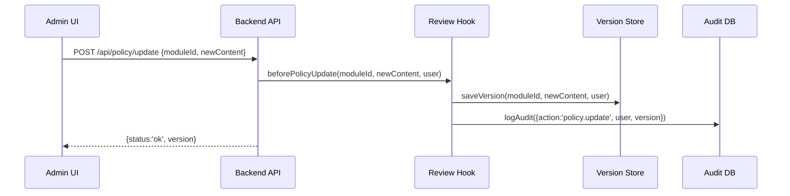

# Chapter 9: Audit & Compliance Framework

Continuing from [Chapter 8: External System Integration](08_external_system_integration_.md), we’ve connected HMS-CUR to legacy systems. Now we’ll build the “Inspector General’s office” of our platform—the **Audit & Compliance Framework** that logs, versions, and reviews every change so AI or human edits are fully traceable.

---

## 9.1 Motivation: Why Audit & Compliance?

Imagine the Office for Civil Rights publishes a new complaint-handling policy. Staff or an AI agent updates the policy text. Later, Congress asks: “Who made that change? When? What exactly changed?” Without a robust audit trail, you can’t prove compliance or investigate anomalies.  

With an **Audit & Compliance Framework** you can:  
1. Log every request or policy edit.  
2. Version-stamp each change, storing diffs.  
3. Enforce review hooks for sign-off.  
4. Generate reports for oversight or congressional inquiries.

**Use case**  
A policy analyst uses an AI agent to tweak language on “response times.” The change goes through a review hook, is versioned, logged with user info, and flagged if an SLA rule was violated. Later, auditors retrieve the full history.

---

## 9.2 Key Concepts

1. **Audit Log**  
   A chronological record of system events (who, what, when, status).

2. **Versioning**  
   Assigning incremental version numbers and storing each snapshot or diff.

3. **Review Hooks**  
   Interceptors that run before/after changes to require human approval or flag anomalies.

4. **Traceability**  
   The ability to trace each change back to its origin—user or AI, with timestamps and diff data.

5. **Compliance Reports**  
   Automated summaries of recent changes, pending reviews, SLA breaches, etc.

---

## 9.3 Using Audit & Compliance

Below is a minimal Express.js setup that logs every API call and version-stores policy edits.

### 9.3.1 Audit Middleware

```js
// src/audit_compliance/auditMiddleware.js
const auditService = require('./auditService');

function auditMiddleware(req, res, next) {
  const start = Date.now();
  res.on('finish', () => {
    auditService.log({
      timestamp: new Date(),
      user: req.user?.name || 'anonymous',
      path: req.path,
      status: res.statusCode,
      durationMs: Date.now() - start
    });
  });
  next();
}

module.exports = auditMiddleware;
```
This middleware logs each request when the response finishes.

### 9.3.2 Review Hook on Policy Update

```js
// src/audit_compliance/reviewHooks.js
const versionStore = require('./versionStore');

async function beforePolicyUpdate(moduleId, newContent, user) {
  // Save new version and capture diff
  const version = await versionStore.saveVersion(moduleId, newContent, user);
  return version; // handler can block or flag if needed
}

module.exports = { beforePolicyUpdate };
```
Call `beforePolicyUpdate` when someone updates a policy. It versions the content and records who made the change.

---

## 9.4 Under the Hood

Here’s how a policy update flows through the framework:



1. **Admin UI** sends an update.  
2. **Backend API** invokes the **review hook**.  
3. The hook calls **Version Store** to snapshot the change.  
4. It logs an **audit entry**.  
5. The API returns the new version number.

---

## 9.5 Internal Implementation

### 9.5.1 Audit Service

```js
// src/audit_compliance/auditService.js
const db = require('./auditDb'); // imagine a simple table

async function log(entry) {
  // entry: {timestamp, user, path, status, durationMs}
  await db.insert('audit_logs', entry);
}

module.exports = { log };
```
A simple service that writes audit entries to a database.

### 9.5.2 Version Store

```js
// src/audit_compliance/versionStore.js
const fs = require('fs');
const path = require('path');

async function saveVersion(moduleId, content, user) {
  const dir = `policy_modules/${moduleId}/history`;
  if (!fs.existsSync(dir)) fs.mkdirSync(dir, { recursive: true });
  const version = Date.now();
  const file = path.join(dir, `${version}.json`);
  fs.writeFileSync(file, JSON.stringify({ content, user, date: new Date() }));
  return version;
}

module.exports = { saveVersion };
```
This module snapshots each policy change in a timestamp-named file under a `history` folder.

---

## 9.6 What We Learned

- We built an **audit middleware** to log every API request.  
- We added a **review hook** that versions policy edits before applying them.  
- Internally, an **Audit Service** writes logs to a database, and a **Version Store** snapshots policy JSON with user info.  
- Now every change is fully traceable, reportable, and compliant with oversight requirements.

Up next: we’ll measure system health and user activity in [Chapter 10: Metrics & Monitoring](10_metrics___monitoring_.md).

---

Generated by [AI Codebase Knowledge Builder](https://github.com/The-Pocket/Tutorial-Codebase-Knowledge)