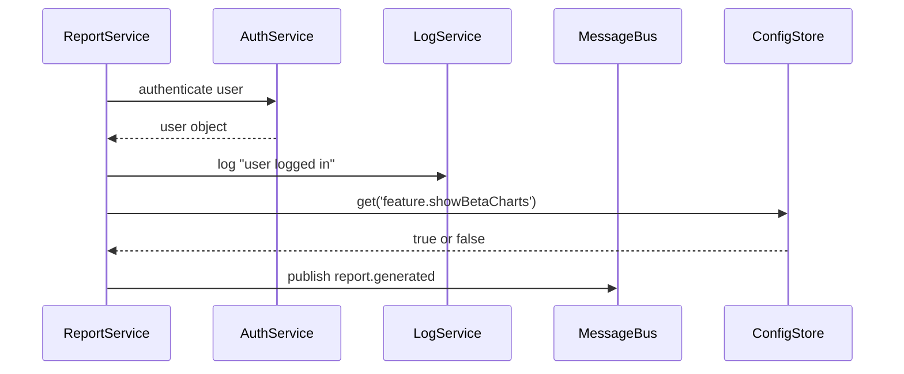

# Chapter 9: Core Infrastructure (HMS-SYS)

In [External System Synchronization](08_external_system_synchronization_.md) we saw how to push events out to partner systems. Before any module—UIs, microservices, AI agents, or sync connectors—can work together reliably, they all need the same basic “utilities”: user login, audit logs, an internal message bus, and shared configuration. That’s the job of **Core Infrastructure (HMS-SYS)**.

## Why Core Infrastructure?

Think of HMS-SYS like a city’s central utility plant. It delivers:

- **Authentication** (secure water)  
- **Logging** (reliable power)  
- **Messaging** (fast communications)  
- **Configuration Management** (traffic signals & control)

…to every “neighborhood” (module) in our system. When a citizen logs in or an AI Agent writes an audit record, HMS-SYS ensures it’s handled securely, consistently, and in a place everyone can read.

### Central Use Case: Secure Login and Audit

Alice is a government official who opens her Admin Dashboard. Under the hood:

1. The Dashboard calls `HMS-SYS` for **authentication**.  
2. HMS-SYS verifies her credentials and returns a user token.  
3. The Dashboard logs “Alice logged in” via HMS-SYS’s **logging** service.  
4. A monitoring service picks up that log via HMS-SYS’s **messaging** bus.  
5. The Dashboard reads a feature flag (`showBetaFeatures`) from HMS-SYS’s **config** service.

Below we’ll explore each piece so you can plug HMS-SYS into any module.

---

## Key Concepts

1. **Authentication**  
   Verify users or services and issue tokens.

2. **Logging**  
   Write structured audit records to a central store.

3. **Messaging**  
   Publish/subscribe events on an internal bus for loose coupling.

4. **Configuration Management**  
   Store and fetch runtime settings (endpoints, feature flags).

---

## Using HMS-SYS in Your Code

Here’s a minimal example showing all four services in a tiny “Report Service”:

```js
// src/reportService.js

import { auth, logger, bus, config } from 'hms-sys';

async function start() {
  // 1. Require login
  const user = await auth.requireLogin();
  // 2. Log the login
  logger.info(`${user.name} logged in to ReportService`);

  // 3. Read a feature flag
  const beta = config.get('feature.showBetaCharts');
  if (beta) console.log('🔥 Showing beta charts');

  // 4. Publish an event when a report is generated
  bus.publish('report.generated', { userId: user.id, time: Date.now() });
}

start();
```

Explanation:

1. `auth.requireLogin()` opens a login prompt or checks a token.  
2. `logger.info(...)` writes an audit record you’ll see in the central log store.  
3. `config.get(...)` fetches a setting from the config database (or memory).  
4. `bus.publish(...)` pushes an event so other modules (AI agents, orchestration) can react.

---

## What Happens Under the Hood?



1. **AuthService** checks credentials and returns user data.  
2. **LogService** appends a structured record.  
3. **ConfigStore** looks up the key.  
4. **MessageBus** broadcasts the event to subscribers.

---

## Under the Hood: Core Implementation

Below are simplified snippets from the HMS-SYS package.

### 1. Authentication (`src/sys/auth.js`)

```js
// src/sys/auth.js
import jwt from 'jsonwebtoken';

export async function requireLogin() {
  // In a real UI, redirect to OIDC login
  const token = localStorage.getItem('HMS_TOKEN');
  return jwt.verify(token, process.env.JWT_SECRET);
}
```
This code:
- Reads a JWT from local storage  
- Verifies it using a secret  
- Returns the decoded user (id, name, roles)

### 2. Logging (`src/sys/logger.js`)

```js
// src/sys/logger.js
export function info(message, meta = {}) {
  const record = { level: 'info', message, time: new Date(), ...meta };
  // In reality, send to ElasticSearch, Splunk, or a database
  console.log(JSON.stringify(record));
}
```
Every service can call `logger.info(...)` to produce a consistent audit record.

### 3. Messaging (`src/sys/bus.js`)

```js
// src/sys/bus.js
import { EventEmitter } from 'events';
const bus = new EventEmitter();
export function publish(event, data) { bus.emit(event, data); }
export function subscribe(event, handler) { bus.on(event, handler); }
```
Modules subscribe to domain events without tight coupling.

### 4. Configuration (`src/sys/config.js`)

```js
// src/sys/config.js
const settings = {
  'feature.showBetaCharts': true,
  'api.timeoutMs': 5000,
  // ...more keys
};
export function get(key) { return settings[key]; }
```
Load from a file, database, or environment—every module calls `config.get(...)` the same way.

---

## Conclusion

You’ve learned how **Core Infrastructure (HMS-SYS)** delivers authentication, logging, messaging, and configuration management to every part of HMS-CUR—like a city’s utility plant powering every neighborhood. With HMS-SYS in place, modules can trust a common security model, write consistent audit logs, talk via events, and share runtime settings. Next up, we’ll explore policies, audits, and compliance in the [Governance Layer (Transparency & Compliance)](10_governance_layer__transparency___compliance__.md).

---

Generated by [AI Codebase Knowledge Builder](https://github.com/The-Pocket/Tutorial-Codebase-Knowledge)