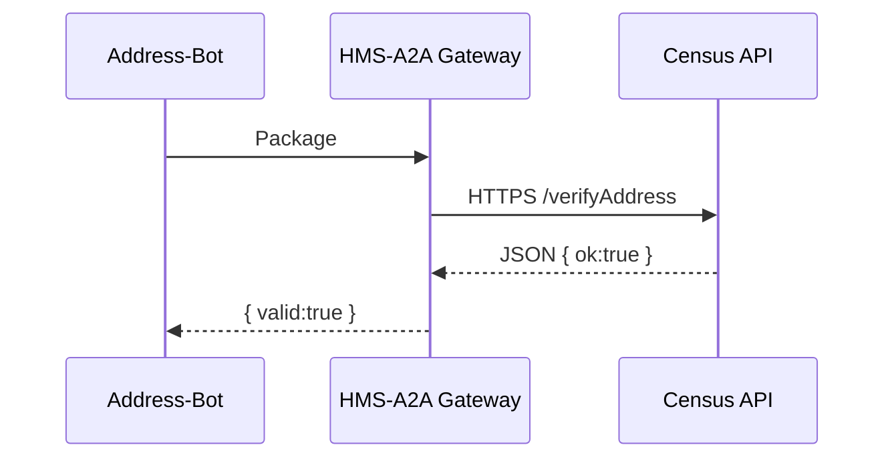

# Chapter 9: External Integration Layer (HMS-A2A)
*(The diplomatic corps that lets any federal bot speak “foreign” APIs without spilling secrets)*  

[← Back to Chapter&nbsp;8: Model Context Protocol (HMS-MCP)](08_model_context_protocol__hms_mcp__.md)

---

## 1. Why Do We Need HMS-A2A?

Imagine the **Military Postal Service Agency (MPSA)** wants to double-check a soldier’s new overseas address.  
The only authoritative source is the **Census Bureau**.  
Today that means:

1. MPSA writes a custom SOAP client ⭐  
2. Census exposes a REST JSON endpoint ⭐  
3. Both agencies argue about security headers ⭐

…and nothing ships for months.

**HMS-A2A** solves this by acting like a **trusted diplomatic pouch**:

* MPSA drops a **package** (data + token + intention).  
* A2A Gateway adds the right stamps, languages, and visas.  
* Census receives a format it already trusts—no embassy drama.

Result: one *uniform* way to reach **any** external system—federal, state, local, or private vendor—while shielding internal secrets.

---

## 2. Key Concepts (Passport-Office Analogies)

| HMS-A2A Term | Passport Analogy | Plain English |
|--------------|-----------------|---------------|
| Connector | Embassy | Code bundle that knows a partner’s API style (REST, SOAP, SFTP…). |
| Package | Sealed diplomatic pouch | Data + security token + intent from inside HMS-CUR. |
| Adapter | Embassy clerk | Translates package into partner-specific request and back. |
| Trust Profile | Visa rules | Whitelist of IPs, tokens, rate limits approved by the partner. |
| Relay | Courier van | Encrypted, logged channel that actually moves bytes. |

Remember these 5 nouns—everything else is detail.

---

## 3. Running Example – “Verify Soldier Address”

Goal: MPSA’s **Address-Bot** (built in [HMS-AGT](05_core_agent_framework__hms_agt__.md)) must call the Census **/verifyAddress** endpoint, get “VALID / INVALID,” and continue the workflow.

We’ll do it in **3 snippets** (all <20 lines).

### 3.1 Register the Connector (once per partner)

```js
// setup-census-connector.js
import { registerConnector } from 'hms-a2a';

registerConnector('census-verify', {
  baseURL : 'https://api.census.gov/addr',
  auth    : { type:'apiKey', header:'X-API-Key' },
  mapOut  : r => ({ valid:r.ok })   // Adapter
});
```

Explanation  
* `registerConnector(id, config)` stores how to talk to the partner.  
* `mapOut` converts the partner’s JSON into our own tiny object.

---

### 3.2 Send a Package from Address-Bot

```js
// address-bot.js  (inside agent.handle)
import { sendPackage } from 'hms-a2a';

const reply = await sendPackage('census-verify', {
  intent : 'check-address',
  data   : { line:'123 Main', city:'Apo', zip:'09096' },
  tags   : ['PII']
});
if(!reply.valid) throw 'Bad address!';
```

Explanation  
* One line ships our **Package** through the gateway.  
* Tags travel with it (see [HMS-MCP](08_model_context_protocol__hms_mcp__.md)); the connector masks PII if contract demands.

---

### 3.3 Inspect the Result inside the Workflow

```js
/* Workflow already waits for Address-Bot’s result.
   If reply.valid === true it proceeds; else it branches to HITL. */
```

No extra code—HMS-A2A made the remote call feel like any local function.

---

## 4. What Happens Behind the Curtain?

### 4.1 Step-by-Step (Plain English)

1. Address-Bot calls `sendPackage(connectorId, payload)`.  
2. HMS-A2A:

   a. Looks up the **Trust Profile** for `census-verify`.  
   b. Wraps `payload` in a **Package**: `{meta, intent, data, tags, sig}`.  
   c. Passes it to the **Adapter** which builds an HTTPS request.  
   d. Sends request via **Relay** (mTLS + audit log).  

3. Census API returns raw JSON.  
4. Adapter runs `mapOut` → `{ valid:true }`.  
5. Gateway signs the response, logs it with the [Security & Compliance Engine](10_security___compliance_engine__hms_esq___hms_ops__.md), and hands it back to the bot.

### 4.2 Mini Sequence Diagram



---

## 5. Under-the-Hood Code Peek

*(real code stripped to essentials, each <15 lines)*

### 5.1 `sendPackage` Core

```js
// hms-a2a/index.js (excerpt)
export async function sendPackage(id, payload){
  const c = connectors[id];
  const pkg = sign({ ...payload, ts:Date.now() });
  const res = await sendHTTPS(c, pkg);
  return c.mapOut(res);
}
```

Explanation  
* `sign()` adds an HMAC so partner knows it’s authentic.  
* `sendHTTPS` handles auth headers (apiKey, OAuth, etc.).

### 5.2 Tiny HTTPS Sender

```js
async function sendHTTPS(c, pkg){
  return fetch(c.baseURL, {
    method :'POST',
    headers:{ [c.auth.header]: getKey(c) },
    body   : JSON.stringify(pkg)
  }).then(r=>r.json());
}
```

Explanation  
Nine lines turn any MCP Package into a partner request—differences live in the connector config, not your code.

---

## 6. Frequently Asked Questions

1. **Can the partner push events back?**  
   Yes—register a `webhook` style connector; A2A verifies the signature and converts it into an MCP envelope.

2. **SOAP? SFTP? Email?**  
   Connectors can use any transport; only the Adapter needs to know. Your bot still calls `sendPackage()`.

3. **Rate limits & retries?**  
   Trust Profile sets `maxReqPerMin` and `retry:3`. The Relay enforces both automatically.

4. **What about sensitive classifications?**  
   If `tags` include `CLASSIFIED`, A2A consults the [Security Engine](10_security___compliance_engine__hms_esq___hms_ops__.md) before sending.

5. **Do I need one connector per endpoint?**  
   Usually one per partner API baseURL—Adapters can branch on `intent` to hit specific paths.

---

## 7. Where HMS-A2A Fits in the Big Picture

* **Agents** (Chapter 5) call external systems through A2A—never directly.  
* **MCP Envelopes** (Chapter 8) become **Packages** with extra transport info.  
* **Security & Compliance Engine** (next chapter) audits every package automatically.  

Think of A2A as the **foreign-affairs bureau** that handles passports and visas so your local clerks can focus on their actual jobs.

---

## 8. Summary & Next Steps

In this chapter you:

* Learned the 5 core ideas: Connector, Package, Adapter, Trust Profile, Relay.  
* Created a connector for the Census API in **7 lines**.  
* Sent a secure, logged request from Address-Bot with **one function call**.  
* Peeked at the 20-line internal that makes it all tick.

Next we’ll dive into the safeguards that watch every message—**inside or outside**—in  
[Chapter 10: Security & Compliance Engine (HMS-ESQ + HMS-OPS)](10_security___compliance_engine__hms_esq___hms_ops__.md).

Safe travels across agency borders!

---

Generated by [AI Codebase Knowledge Builder](https://github.com/The-Pocket/Tutorial-Codebase-Knowledge)