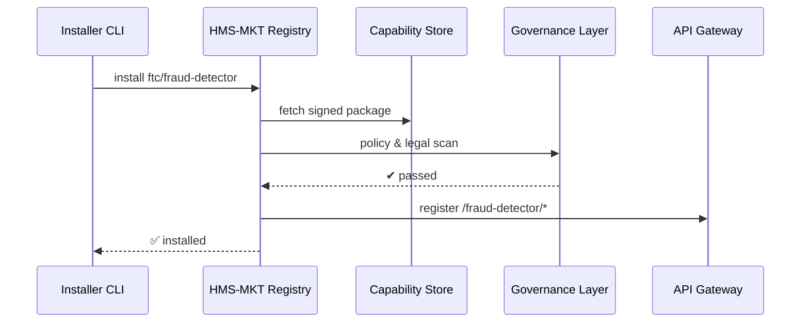

# Chapter 9: Marketplace of Capabilities (HMS-MKT)

*(Just finished building Lego-style UIs in [Interface Layer – Micro-Frontends (HMS-MFE)](08_interface_layer___micro_frontends__hms_mfe__.md). Now let’s learn how those pieces—and hundreds of backend ones—show up in the first place.)*  

---

## 1  Why Do We Need a “Government App Store”?

Central use-case:  
The **Federal Trade Commission (FTC)** wants to spot suspicious unemployment-benefit claims.  
Instead of filing weeks of paperwork to hire a vendor, an FTC engineer should be able to:

1. Open an internal **Marketplace** page.  
2. Search “fraud detector.”  
3. Click **Install**.  
4. Wire the model into an existing claims pipeline before lunch.  

At the same time the **National Park Service** might browse for a **GIS heat-map plug-in**; the **PBGC** (Pension Benefit Guaranty Corporation) could grab an **e-signature validator**.  

HMS-MKT is that one-stop shop—an **App Store for micro-services, AI skills, and UI widgets**—already cleared for policy, security, and procurement.  

---

## 2  Key Concepts (Plain English)

| Term | Beginner-friendly meaning |
|------|---------------------------|
| Capability Card | A 1-page YAML/JSON manifest that tells the marketplace what the asset does, who owns it, and how to install it. |
| Provider | The agency or team that publishes the capability (e.g., “Southwestern Power Administration Algorithms Group”). |
| Installer | A tiny CLI or API that pulls the asset, checks signatures, and registers it with the platform. |
| Version Ring | Stable → Beta → Experimental channels so agencies can pick their risk level. |
| Dependency | A required backend or data scope (e.g., “needs secure access to citizen PII”). |
| Review Gate | Automated scans + human sign-off that happen *once* before anything hits the shelf. |

---

## 3  A 5-Minute Walk-Through: Installing a Fraud-Detection Model

### 3.1  Find and Install

```bash
# 1️⃣ Search
hms-mkt search fraud-detector
# → ftc/fraud-detector  v2.3  "Unemployment claim anomaly model"

# 2️⃣ Install (to Beta ring)
hms-mkt install ftc/fraud-detector --ring beta
```

**What happens?**  
The CLI downloads a signed container, checks it against policy, registers an API route under the [Backend API Gateway](10_backend_api_gateway_.md), and prints a success message.

### 3.2  Use It Inside a Pipeline (Python, 11 lines)

```python
import requests, json
claim = json.load(open("sample_claim.json"))

r = requests.post(
    "http://api.gov.local/fraud-detector/v2/score",
    json=claim
)
print("Risk score:", r.json()["score"])
```

Output (example):

```
Risk score: 0.91   # anything >0.8 triggers manual review
```

No procurement forms or docker wiring required—the marketplace handled it.

---

## 4  Under the Hood (Step-by-Step)



Five actors—easy to follow.

---

## 5  Capability Card Anatomy (12 Lines)

`fraud-detector.card.yaml`

```yaml
id: ftc/fraud-detector
version: 2.3.1
description: Unemployment-claim anomaly model
api: /fraud-detector/v2/score
inputs: { claim_json: object }
outputs: { score: float (0-1) }
dependencies:
  - hms-dta:read_secure_claims
license: FedRAMP-Ready
```

Explanation  
1. `id` + `version` → unique in the store  
2. `api` → the route that the Backend API Gateway will expose  
3. `dependencies` → permissions automatically requested from [Governance Layer (HMS-GOV)](01_governance_layer__hms_gov__.md)

---

### 5.1  Publishing a Card (CLI, 8 Lines)

```bash
hms-mkt publish fraud-detector.card.yaml \
    --package fraud-detector.tar.gz \
    --ring beta
```

The marketplace:

* signs the package,  
* runs security scans,  
* stores it in S3-like storage,  
* and adds the entry to the catalog.

---

## 6  Minimal Internal Code Peeks

Folder layout:

```
hms-mkt/
 ├─ cli.py
 ├─ registry.py
 ├─ install/
 │   └─ installer.py
 └─ cards/
     └─ fraud-detector.card.yaml
```

### 6.1  CLI “install” Command (<=17 Lines)

```python
# cli.py
import registry, install, sys
cmd, pkg = sys.argv[1], sys.argv[2]

if cmd == "install":
    card = registry.fetch_card(pkg)
    if not registry.policy_ok(card):
        sys.exit("❌  Blocked by policy")
    install.pull_package(card["id"], card["version"])
    install.register_route(card["api"])
    print("✅  Installed", card["id"], card["version"])
```

Walk-through  
1. Fetches the **Card**  
2. Runs policy check (talks to [Policy Engine (HMS-CDF)](02_policy_engine__hms_cdf__.md))  
3. Pulls container + registers route—done!

### 6.2  Policy Check Stub (10 Lines)

```python
# registry.py (excerpt)
import requests
def policy_ok(card):
    r = requests.post("http://localhost:7000/cdf/validate",
        json={"snapshot":"latest","action":"install_capability","data":card})
    return r.json()["allow"]
```

Tiny: delegates the heavy lifting to the Policy Engine.

---

## 7  How Does HMS-MKT Keep Things Safe?

1. **Static Scan**—checks code for malware.  
2. **License Guard**—verifies FedRAMP/NIST tags.  
3. **Legal Scan**—calls [Compliance & Legal Reasoning (HMS-ESQ)](03_compliance___legal_reasoning__hms_esq__.md).  
4. **Simulation Pass**—auto-runs a small dataset in the [Simulation & Testing Sandbox (HMS-ESR)](04_simulation___testing_sandbox__hms_esr__.md).  
5. **Human Sign-off**—optional queue in [HITL Oversight](07_human_in_the_loop__hitl__oversight_.md).  

All this happens **once per version**, so agencies can install with a single click ever after.

---

## 8  Hands-On Mini Lab

1. Clone demo repo:

```bash
git clone https://github.com/example/hms-mkt-demo
cd hms-mkt-demo
pip install -r requirements.txt
```

2. Start local registry (dummy FastAPI):

```bash
uvicorn registry:app --reload
```

3. Publish the sample capability:

```bash
hms-mkt publish cards/fraud-detector.card.yaml --package sample_pkg.tgz
```

4. From another terminal, search & install:

```bash
hms-mkt search fraud
hms-mkt install ftc/fraud-detector
```

5. Call the new API via the gateway stub:

```bash
curl -X POST localhost:9001/fraud-detector/v2/score -d @claim.json
```

You just shipped an AI model without a single procurement form!

---

## 9  FAQ

**Q : Can any agency publish?**  
Only providers whitelisted by HMS-GOV. Others submit through a review gate.

**Q : How are updates handled?**  
`hms-mkt upgrade <id>` pulls the next minor/major version after repeat scans.

**Q : What if two capabilities claim the same route?**  
The installer aborts unless you pass `--force`, and even then policy must allow overrides.

**Q : Can MFEs live here too?**  
Yes—UI bundles are just another capability type with `ui: true` in the card.

---

## 10  What You Learned

* HMS-MKT is the **App Store** for federal micro-services, AI models, and UI widgets.  
* A **Capability Card** (≤ 1 page YAML) describes each asset.  
* One CLI command **installs** a capability—policy, legal, and security checks already done.  
* The system plugs into earlier layers:  
  • policy ([HMS-CDF](02_policy_engine__hms_cdf__.md))  
  • legal ([HMS-ESQ](03_compliance___legal_reasoning__hms_esq__.md))  
  • human oversight ([HITL](07_human_in_the_loop__hitl__oversight_.md))  
  • runtime routing via the upcoming [Backend API Gateway](10_backend_api_gateway_.md).

Ready to see where all these new routes actually land?  
➡️ Continue to [Backend API Gateway](10_backend_api_gateway_.md)

---

Generated by [AI Codebase Knowledge Builder](https://github.com/The-Pocket/Tutorial-Codebase-Knowledge)