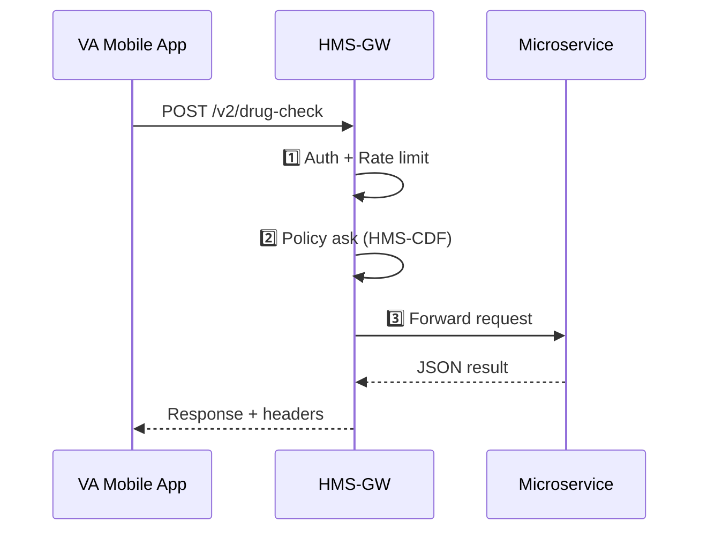

# Chapter 10: Backend API Gateway  

*(Just grabbed some shiny new skills from the [Marketplace of Capabilities (HMS-MKT)](09_marketplace_of_capabilities__hms_mkt__.md)?  
Now we need one front-door where every phone line—old, new, and future—plugs in safely.)*  

---

## 1  Why Do We Need an “API Switchboard”?

Central use-case  
The **Veterans Affairs (VA)** mobile app (v1.4) lets veterans refill prescriptions.  
Overnight, the **Marketplace** publishes a brand-new *Drug-Interaction Checker* microservice (v2).  

We must guarantee that:  
1. Old apps **still work** (no 3 a.m. outage).  
2. New traffic to `/drug-check` is forwarded to the new microservice.  
3. Every request is **authenticated, rate-limited, logged, and policy-checked**—before touching private medical data.

That single checkpoint is the **Backend API Gateway (HMS-GW)**.

---

## 2  Key Concepts in Plain English

| Term | Beginner Explanation |
|------|----------------------|
| Route Table | A phone book: “/rx → pharmacy-svc”, “/drug-check → checker-svc”. |
| Adapter Plug | Tiny code that rewrites headers or payloads so each microservice gets the shape it expects. |
| Auth Filter | “Show me your ID” step—checks JWT, API key, or signed cookie. |
| Version Bucket | Folder of routes for `/v1/*`, `/v2/*` … older buckets never break. |
| Rate Limiter | Speed bump: “Max 30 calls/min per user.” |
| Fallback Rule | If `/v2/drug-check` crashes, silently fall back to `/v1` until ops wakes up. |

---

## 3  Quick Start—Exposing Two Services in 18 Lines

`gateway.py`

```python
from fastapi import FastAPI, Request, HTTPException
import httpx, os

ROUTES = {
    "/v1/rx":  "http://pharmacy-svc:8001",
    "/v2/rx":  "http://pharmacy-svc:8002",
    "/v2/drug-check": "http://checker-svc:9000"
}

app = FastAPI()

@app.api_route("/{ver}/{path:path}", methods=["GET","POST"])
async def proxy(ver: str, path: str, req: Request):
    dest = f"/{ver}/{path}"
    if f"/{ver}/{path.split('/')[0]}" not in ROUTES:
        raise HTTPException(404, "No such route")

    # 1️⃣ Auth filter (stub)
    if "Authorization" not in req.headers:
        raise HTTPException(401, "Auth required")

    # 2️⃣ Forward the call
    url = ROUTES[f"/{ver}/{path.split('/')[0]}"] + "/" + "/".join(path.split('/')[1:])
    async with httpx.AsyncClient() as c:
        resp = await c.request(req.method, url, json=await req.json(), headers=req.headers)
    return resp.json()
```

What this tiny file does  
1. Looks up the destination in `ROUTES`.  
2. Requires an `Authorization` header.  
3. Forwards the request and streams back the JSON.  

Run locally:

```bash
uvicorn gateway:app --reload
```

Try it:

```bash
curl -H "Authorization: Bearer demo" \
     -d '{"rx":"Lisinopril"}' \
     http://127.0.0.1:8000/v1/rx
```

Result: JSON from `pharmacy-svc`.

---

## 4  What Happens Under the Hood?



Five clear steps, one guard at a time.

---

## 5  How Routes Arrive from the Marketplace

When the new *Drug-Interaction Checker* is published, its Capability Card (see previous chapter) contains:

```yaml
api: /drug-check
version: v2
```

The **installer** does two things:

1. Copies the container to `checker-svc`.  
2. Appends a line in `gateway/routes.yaml`:

```yaml
/v2/drug-check: http://checker-svc:9000
```

Hot-reload script in the gateway picks up the change—zero downtime, no manual edit.

---

## 6  Inside the Gateway—Folder Peek

```
hms-gw/
 ├─ gateway.py
 ├─ routes.yaml
 ├─ plugins/
 │   └─ rate_limiter.py
 └─ adapters/
     └─ pharmacy_json_fix.py
```

### 6.1  Rate-Limiter Plug (15 lines)

```python
# plugins/rate_limiter.py
import time, collections
WINDOW = 60          # seconds
MAX    = 30          # calls per user
hits = collections.defaultdict(list)

def too_many(user):
    now = time.time()
    hits[user] = [t for t in hits[user] if now - t < WINDOW]
    hits[user].append(now)
    return len(hits[user]) > MAX
```

In `gateway.py`, call:

```python
from plugins.rate_limiter import too_many
if too_many(req.headers.get("Authorization", "anon")):
    raise HTTPException(429, "Slow down")
```

### 6.2  YAML Route Loader (10 lines)

```python
import yaml, watchdog.events, watchdog.observers

def load_routes():
    return yaml.safe_load(open("routes.yaml"))

ROUTES = load_routes()

class HotReload(watchdog.events.FileSystemEventHandler):
    def on_modified(self, event):
        global ROUTES
        if "routes.yaml" in event.src_path:
            ROUTES = load_routes()

watchdog.observers.Observer().schedule(HotReload(), ".", True).start()
```

The file changes → routes refresh automatically.

---

## 7  Connecting to Other HMS Layers

| Layer | Gateway Touch-Point |
|-------|--------------------|
| [Governance Layer (HMS-GOV)](01_governance_layer__hms_gov__.md) | Gateway is the **internal** front door; GOV is the **external** one. |
| [Policy Engine (HMS-CDF)](02_policy_engine__hms_cdf__.md) | Each request includes `x-policy-snapshot` so the engine can allow/deny. |
| [Monitoring & Observability (HMS-OPS)](14_monitoring___observability__hms_ops__.md) | Gateway emits metrics: latency, 4xx/5xx counts, rate-limit hits. |
| [Management Layer (HMS-SVC / HMS-OPS / HMS-OMS)](11_management_layer__hms_svc___hms_ops___hms_oms__.md) | Ops dashboards and blue-green deploys act **through** the gateway. |
| [Marketplace (HMS-MKT)](09_marketplace_of_capabilities__hms_mkt__.md) | Installers append new routes to `routes.yaml`. |

---

## 8  Hands-On Challenge

1. Add rate limiting: copy the plug-in above, import it into `gateway.py`.  
2. Simulate abuse:

```bash
for i in {1..35}; do 
  curl -s -o /dev/null -w "%{http_code}\n" \
       -H "Authorization: Bearer demo" \
       http://127.0.0.1:8000/v2/drug-check
done
```

You should see a few `200` followed by `429`—limit enforced!

3. Change `routes.yaml` to point `/v2/rx` back to `/v1` while the service is down; observe zero errors in the client.

---

## 9  FAQ

**Q: Do I need FastAPI?**  
Any language works; we used FastAPI for its tiny syntax.  
Reverse proxies like **NGINX** or **Envoy** can replace the Python stub in prod.

**Q: How is TLS handled?**  
A lightweight sidecar (e.g., `envoy-tls`) terminates HTTPS and forwards plain HTTP to `gateway.py`.

**Q: How does versioning avoid breaking old apps?**  
Buckets (`/v1/*`, `/v2/*`, …) remain forever. Retire only when analytics show 0 hits for 90 days and policy allows.

---

## 10  What You Learned

* HMS-GW is the **phone switchboard** inside our platform.  
* Routes, auth, rate limits, and policy hooks live in one place.  
* Marketplace installs auto-extend the switchboard—no re-deploys.  
* A 18-line Python file is enough to grasp the core idea.

Next stop: learn how ops teams **scale, restart, or blue-green deploy** those microservices behind the gateway in  
[Management Layer (HMS-SVC / HMS-OPS / HMS-OMS)](11_management_layer__hms_svc___hms_ops___hms_oms__.md)

---

Generated by [AI Codebase Knowledge Builder](https://github.com/The-Pocket/Tutorial-Codebase-Knowledge)