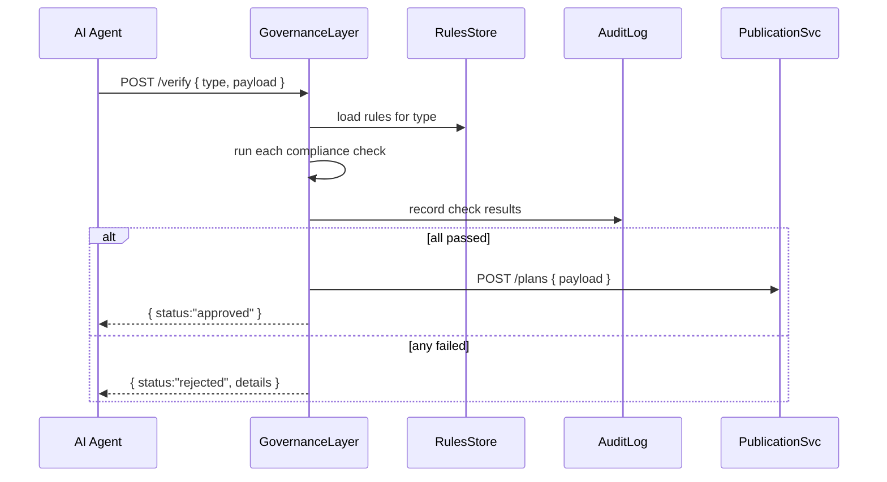

# Chapter 10: Governance Layer (Transparency & Compliance)

In [Chapter 9: Core Infrastructure (HMS-SYS)](09_core_infrastructure__hms_sys__.md) we added authentication, logging, messaging, and config for every module. Now we’ll introduce the **Governance Layer**, which acts like a city council writing and enforcing the laws for our system—making every transaction and AI decision transparent, auditable, and regulation-compliant.

## Why Do We Need a Governance Layer?

Imagine an AI agent drafts a benefits distribution plan for a federal housing program. Before that plan goes live, we must ensure it:

- Respects privacy rules (no personal data leaks)  
- Meets ethics standards (no biased allocations)  
- Follows federal regulations (document retention, review chains)  

The Governance Layer is our “rules of the road” checker. It intercepts proposals, runs compliance checks, logs every step, and only lets valid plans proceed to publication.

### Central Use Case: Approving an AI-Proposed Benefit Plan

1. **AI Agent** emits a `benefitProposal` event with proposed allocations.  
2. **Governance Layer** loads relevant federal privacy and ethics rules.  
3. It **validates** the proposal against each rule.  
4. It writes a **transparency log** of the check.  
5. If all checks pass, it forwards the plan to the **Publication Service**; otherwise it rejects and notifies stakeholders.

## Key Concepts

1. **Policy Rules**  
   A set of JSON-defined checks (e.g., “no more than 20% of funds to one ZIP code”).  

2. **Compliance Checks**  
   The process of running a proposal through each rule and collecting pass/fail results.  

3. **Transparency Logging**  
   Writing structured records of who ran what check, when, and with what outcome.  

4. **Audit Trail**  
   An immutable store of all governance events for post-mortem review by auditors.  

5. **Publication Control**  
   Gatekeeping mechanism that only releases approved decisions to the wider system.

## Using the Governance Layer

Here’s how a client—say, the Management Layer or an AI Agent—submits a proposal for verification:

```js
// client/verifyPlan.js
fetch('/api/governance/verify', {
  method: 'POST',
  headers: { 'Content-Type': 'application/json' },
  body: JSON.stringify({
    type: 'benefitPlan',
    payload: { allocations: [ /* ... */ ] }
  })
})
  .then(r => r.json())
  .then(result => {
    console.log(result.status);
    // “approved” or “rejected”
    console.table(result.details);
  });
```
After calling `/api/governance/verify`, you’ll get back:
- `status`: "approved" or "rejected"  
- `details`: array of rule check results  

If approved, the client can call `/api/governance/publish` to release the plan.

## Behind the Scenes: Step-by-Step Workflow



1. **Verify**: Governance receives the proposal.  
2. **Load Rules**: Fetch rules from a central store.  
3. **Run Checks**: Execute each rule function.  
4. **Log**: Write every check outcome to the AuditLog.  
5. **Publish or Reject**: Forward only if all checks pass.

## Internal Implementation

### 1. Defining Rules (`src/gov/rules.js`)

```js
// src/gov/rules.js
module.exports = {
  benefitPlan: [
    {
      id: 'max-zip-percentage',
      description: 'No more than 20% funds to one ZIP code',
      check: plan =>
        plan.allocations.every(a => a.percentage <= 20)
    },
    {
      id: 'privacy-anonymization',
      description: 'No personal identifiers in payload',
      check: plan =>
        !plan.allocations.some(a => a.userSSN)
    }
  ]
};
```
Each rule has:
- `id` and human‐readable `description`  
- A `check(payload)` function returning `true` or `false`

### 2. Governance Service (`src/gov/service.js`)

```js
// src/gov/service.js
const express = require('express');
const rules = require('./rules');
const audit = require('./audit');
const router = express.Router();

router.post('/verify', (req, res) => {
  const { type, payload } = req.body;
  const ruleSet = rules[type] || [];
  const details = ruleSet.map(r => ({
    id: r.id,
    passed: r.check(payload)
  }));
  audit.log(type, details);        // record in audit trail
  const status = details.every(d => d.passed) ? 'approved' : 'rejected';
  res.json({ status, details });
});

// (Optional) publish endpoint guarded by governance
router.post('/publish', (req, res) => {
  // forward to Publication Service...
  res.sendStatus(202);
});

module.exports = router;
```
- **Load** the correct rule set.  
- **Run** each rule’s `check`.  
- **Log** results via `audit.log`.  
- **Return** overall `status` and `details`.

### 3. Audit Logging (`src/gov/audit.js`)

```js
// src/gov/audit.js
const fs = require('fs');
function log(type, details) {
  const entry = {
    type,
    details,
    time: new Date().toISOString()
  };
  fs.appendFileSync('audit.log', JSON.stringify(entry) + '\n');
}
module.exports = { log };
```
A simple append-only log file ensures an immutable audit trail. In production, you’d ship to a database or logging service.

## Conclusion

In this chapter you learned how the **Governance Layer** acts like a digital city council—loading policy rules, running compliance checks, logging everything for transparency, and gating publication of AI proposals or transactions. This ensures every decision is auditable and regulation-ready.

Next up: [Chapter 11: Human-In-The-Loop Oversight](11_human_in_the_loop_oversight_.md), where we’ll add a final safety net by bringing real people into the review process.

---

Generated by [AI Codebase Knowledge Builder](https://github.com/The-Pocket/Tutorial-Codebase-Knowledge)