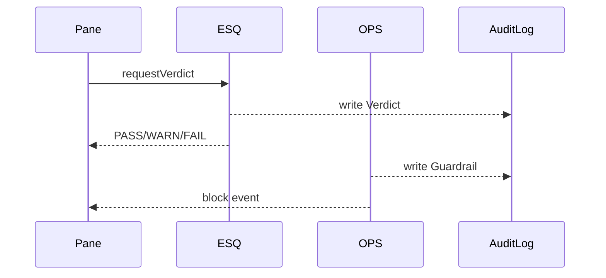

# Chapter 10: Security & Compliance Engine (HMS-ESQ + HMS-OPS)

[← Back to Chapter 9: External Integration Layer (HMS-A2A)](09_external_integration_layer__hms_a2a__.md)

---

## 1  Why Do We Need Yet *Another* Engine?

Imagine the Treasury wants to launch a **“Round-Up-Your-Change”** payment pane that lets citizens donate spare cents to national parks (run by the Fish and Wildlife Service).

Before the first penny moves, three non-negotiables must be true:

1. **Legal Fit** – Donations must follow federal charitable-giving statutes.  
2. **Operational Safety** – TLS certificates, intrusion alarms, and rate limits must be green.  
3. **Audit Proof** – Every check must leave a paper trail for the Inspector General.

If developers hard-code those rules, they will miss edge-cases or confuse new interns.

The **Security & Compliance Engine (SCE)**—a duo of  
**HMS-ESQ** (the *lawyer*) and **HMS-OPS** (the *security guard*)—guarantees:

* the **law** is codified in policies, not scattered if-statements, and  
* the **servers** obey those policies in real time.

Result: a reusable, plug-in gatekeeper for any pane, agent, or external call created in previous chapters.

---

## 2  Key Concepts (Court-House + Security-Guard Analogies)

| Engine Part | Analogy | Plain-English Role |
|-------------|---------|--------------------|
| Policy (ESQ) | Federal statute book | Declarative rule set: “Donations ≤ \$1000/day unless donor is verified.” |
| Verdict (ESQ) | Judge’s ruling | PASS / WARN / FAIL with explanation. |
| Sensor (OPS) | CCTV camera | Emits events: “TLS expiring”, “CPU spike”, “Login from Russia”. |
| Guardrail (OPS) | Locked door | Automatic reaction (throttle, block, alert). |
| Audit Log (shared) | Clerk’s ledger | Immutable record of every verdict & guardrail action. |

Keep these five nouns in mind; everything else hangs on them.

---

## 3  Running Example – “Green-Light a Donation Pane”

We’ll:

1. Write a **policy** that enforces donation limits.  
2. Register two **sensors** that watch TLS certificates and intrusion logs.  
3. Let the **payment pane** request approval.  
4. See HMS-OPS shut the pane down if a certificate expires.

*(Each code block ≤ 20 lines.)*

---

### 3.1 Define the Legal Policy (HMS-ESQ)

```js
// policies/donation.js
import { definePolicy } from 'hms-esq';

definePolicy('donation', ctx => {
  if (ctx.amount > 1000)  return ctx.fail('Above daily limit');
  if (!ctx.user.verified) return ctx.warn('Unverified donor');
  return ctx.pass();      // All good
});
```

Explanation  
• `ctx` is provided by ESQ.  
• We call `fail`, `warn`, or `pass`—ESQ turns that into a **Verdict**.

---

### 3.2 Add Operational Sensors (HMS-OPS)

```js
// sensors/tls-expiry.js
import { sensor } from 'hms-ops';

sensor('tls-expiry', () => {
  const daysLeft = checkCertDays();   // helper util
  if (daysLeft < 3) sensor.block('Cert about to expire');
});
```

```js
// sensors/intrusion.js
import { sensor } from 'hms-ops';

sensor('intrusion', () => {
  if (detectBruteForce()) sensor.alert('Brute force detected');
});
```

Explanation  
• `sensor()` runs every minute (default).  
• `block()` disables the affected service; `alert()` just pings on-call.

---

### 3.3 Ask for a Verdict in the Payment Pane

```js
// panes/donate.js   (simplified)
import { requestVerdict } from 'hms-esq';

async function donate(amount){
  const verdict = await requestVerdict('donation', { amount });
  if (verdict.fail)   return showError(verdict.reason);
  if (verdict.warn)   showBanner('Proceed with caution');
  processPayment(amount);               // happy path
}
```

Explanation  
One line asks ESQ to evaluate. The pane never touches policy code directly.

---

### 3.4 Witness HMS-OPS in Action

```js
// quick-demo.js
import { onGuardrail } from 'hms-ops';

onGuardrail(evt => console.log('GUARDRAIL!', evt));
```

Run for a few minutes, then manually set your TLS cert to expire ― you’ll see:

```
GUARDRAIL! { type:'block', reason:'Cert about to expire', target:'donation-pane' }
```

The pane is now auto-disabled until the cert is renewed.

---

## 4  What Happens Behind the Curtain?

### 4.1 Step-by-Step Flow

1. Payment pane calls `requestVerdict('donation', ctx)`.  
2. **HMS-ESQ** loads `policies/donation.js`, passes `ctx`, receives **Verdict**.  
3. Verdict is written to the shared **Audit Log** (HMS-DTA).  
4. Pane acts on the verdict.  
5. Meanwhile, **HMS-OPS Sensors** run every minute.  
6. If a sensor calls `block()`, OPS publishes a **Guardrail Event**.  
7. The host shell ([HMS-MFE](01_micro_frontend_interface__hms_mfe__.md)) hears the event and hides or disables the pane.

### 4.2 Tiny Sequence Diagram



---

## 5  Peek Inside the Engines

### 5.1 Verdict Runtime (9 lines)

```js
// hms-esq/core.js
export async function requestVerdict(name, ctx){
  const p = policies[name];
  Object.assign(ctx, helpers());     // adds pass/warn/fail
  const res = await p(ctx);
  log('verdict', name, res);         // to Audit Log
  return res;
}
```

### 5.2 Sensor Loop (11 lines)

```js
// hms-ops/core.js
const sensors = [];

export function sensor(id, fn){
  sensors.push({ id, fn });
}

setInterval(async () => {
  for (const s of sensors){
    try { await s.fn(); }
    catch(e){ log('error', s.id, e); }
  }
}, 60_000);
```

### 5.3 Guardrail Helpers (7 lines)

```js
export function block(reason){
  publish({ type:'block', reason });
  log('guardrail', 'block', reason);
}
export function alert(msg){
  publish({ type:'alert', msg });
}
```

*(`publish` is a small event emitter that the host shell subscribes to.)*

---

## 6  How SCE Integrates with Earlier Layers

| Need | Handled by |
|------|------------|
| Store verdicts & guardrails | [Central Data Repository (HMS-DTA)](06_central_data_repository__hms_dta__.md) |
| Pause risky workflows | [Human-in-the-Loop Oversight](07_human_in_the_loop_oversight__hitl__.md) uses `verdict.fail` to create a review case. |
| Tag external calls | [External Integration Layer](09_external_integration_layer__hms_a2a__.md) forwards `tags` so partners know data sensitivity. |
| Enforce ethical rules | Forwarded to the next layer: [AI Governance Values Enforcement](11_ai_governance_values_enforcement_.md). |

---

## 7  Frequently Asked Questions

1. **Do policies need redeploys?**  
   No. They’re hot-reloaded JS files; ESQ watches the folder.

2. **Can sensors run custom shell scripts?**  
   Yes—`sensor('disk', () => exec('df -h'))`. Return a value or call `block()`.

3. **What stops a malicious pane from ignoring a FAIL verdict?**  
   OPS guardrails can also *pre-register* a kill-switch:  
   `sensor('policy-violation', () => if(verdict.fail) block())`.

4. **Is the audit log tamper-proof?**  
   Entries are versioned and signed in HMS-DTA; mutations create new versions.

5. **How noisy are alerts?**  
   Sensors default to exponential back-off and deduplication; on-call gets one Slack ping, not 500.

---

## 8  Summary & What’s Next

You now know that the **Security & Compliance Engine**:

* Turns legal texts into live **Policies** (ESQ).  
* Watches servers through **Sensors** and enforces **Guardrails** (OPS).  
* Logs every action for auditors—no screenshots needed.  
* Integrates seamlessly with all previous HMS-CUR layers.

Next, we’ll zoom out from individual policies to **ethical values**—how to ensure the entire platform respects fairness, privacy, and transparency:

[Chapter 11: AI Governance Values Enforcement](11_ai_governance_values_enforcement_.md)

---

Generated by [AI Codebase Knowledge Builder](https://github.com/The-Pocket/Tutorial-Codebase-Knowledge)