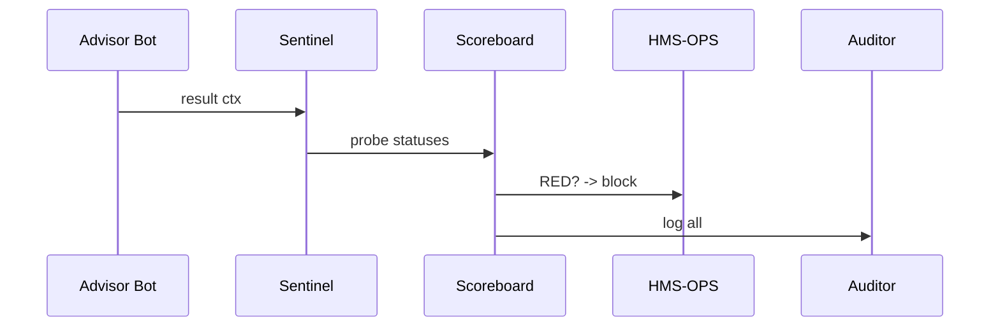

# Chapter 11: AI Governance Values Enforcement  
*(Lighting up a “green board” before any AI model takes the wheel)*  

[← Back to Chapter 10: Security & Compliance Engine (HMS-ESQ + HMS-OPS)](10_security___compliance_engine__hms_esq___hms_ops__.md)

---

## 1 Why Do We Need Yet *Another* Check?

Picture HUD (Housing & Urban Development) rolling out a **“Rental-Aid Advisor Bot.”**  
The bot interviews tenants and predicts the best subsidy plan.  
Three non-negotiables must be true **every time** it runs:

1. **Transparency** – Every prediction must show which rules or data drove it.  
2. **Fairness & Ethics** – Protected classes (race, disability) can’t tilt results.  
3. **Privacy & Safety** – No PII leak, no over-budget payouts, no wild prompts.

If any light on that “reactor panel” is red, the launch must abort.  
**AI Governance Values Enforcement (GVE)** is that very panel.

---

## 2 Key Concepts (Traffic-Light Analogies)

| GVE Term | Traffic-Light Picture | What It Means |
|----------|----------------------|---------------|
| **Value** | “No speeding” sign | A principle to enforce (truth, transparency, etc.). |
| **Probe** | Radar gun | Tiny test that measures one value. |
| **Sentinel** | Police officer | Code middleware that runs the probes. |
| **Scoreboard** | Big traffic light | Aggregates probe results → GREEN / YELLOW / RED. |
| **Auditor** | Dash-cam | Stores every probe result for inspectors. |

Remember: **Probes run inside Sentinels; Sentinels report to the Scoreboard; the Auditor writes everything down.**

---

## 3 A 3-Minute Hands-On Tour

We will:

1. Register five probes.  
2. Attach a Sentinel to the Rental-Aid Advisor Bot.  
3. See the Scoreboard block launch if any light is red.

### 3.1 Define Probes (≤ 15 lines)

```js
// probes/rental.js
import { defineProbe } from 'hms-gve';

defineProbe('transparency', ctx =>
  ctx.ok(!!ctx.explanation, 'Must explain prediction'));

defineProbe('fairness', ctx =>
  ctx.ok(!ctx.uses('race'), 'Race not allowed in model'));

defineProbe('privacy', ctx =>
  ctx.ok(ctx.output.noPII(), 'Output leaks PII'));

defineProbe('safety', ctx =>
  ctx.ok(ctx.amount <= 2000, 'Benefit cap exceeded'));

defineProbe('truth', ctx =>
  ctx.ok(ctx.confidence > 0.8, 'Low confidence'));
```

Explanation  
Each `defineProbe` is one *Yes/No* rule.  
`ctx.ok(boolean, msg)` flips the light green or red.

---

### 3.2 Wire the Sentinel (≤ 14 lines)

```js
// advisor-bot.js  (built on HMS-AGT)
import { sentinel } from 'hms-gve';

agent.handle(sentinel(async task => {
  /* …your prediction logic… */
  return {
    plan       : 'Section-8',
    amount     : 1750,
    explanation: 'Family size vs. local rent',
    confidence : 0.87
  };
}));
```

Explanation  
`sentinel()` wraps the handler, runs all probes, and halts if any fail.

---

### 3.3 Deploy & Watch the Scoreboard (≤ 10 lines)

```js
// deploy.js
import { startScoreboard, allGreen } from 'hms-gve';

startScoreboard();                    // draw ASCII lights in console
if (!await allGreen('advisor-bot'))
    throw 'Launch aborted – fix red probes first!';
```

Typical console:

```
┌────────────┬────────┐
│ Value      │ Status │
├────────────┼────────┤
│ transparency│ 🟢     │
│ fairness    │ 🟢     │
│ privacy     │ 🟡     │
│ safety      │ 🟢     │
│ truth       │ 🟢     │
└────────────┴────────┘
WARN: privacy flagged – proceeding requires waiver
```

Any **🔴** aborts deployment; **🟡** may continue only via [HITL](07_human_in_the_loop_oversight__hitl__.md).

---

## 4 What Happens Behind the Curtain?

### 4.1 Step-by-Step

1. **Sentinel** calls every registered probe with the *input + output* context.  
2. Each probe returns `GREEN / YELLOW / RED`.  
3. Sentinel streams results to the **Scoreboard Service** (in-memory or Redis).  
4. Scoreboard updates the lights and notifies:  
   • `GREEN` → nothing,  
   • `YELLOW` → ping [HITL](07_human_in_the_loop_oversight__hitl__.md),  
   • `RED` → raise `block()` in [Security Engine](10_security___compliance_engine__hms_esq___hms_ops__.md).  
5. **Auditor** writes a JSON blob (`run-id, probe, status, timestamp`) to [HMS-DTA](06_central_data_repository__hms_dta__.md).

### 4.2 Sequence Diagram (max 5 nodes)



---

## 5 Inside the Engine – Code-Light Peek

### 5.1 Sentinel Wrapper (12 lines)

```js
// hms-gve/sentinel.js
export const sentinel = fn => async task => {
  const out = await fn(task);                   // run user logic
  const ctx = { ...task, output:out, ok };
  const results = probes.map(p => p.run(ctx));
  scoreboard.push(results);
  if (results.some(r => r.red)) throw 'GVE block';
  return out;

  function ok(cond, msg){
    return cond ? {green:true} : {red:true, msg};
  }
};
```

### 5.2 Tiny Scoreboard (11 lines)

```js
// hms-gve/scoreboard.js
const state = {};          // probe → status

export function push(res){
  res.forEach(r => state[r.name] = r);
  draw();
  notify();
}

export function allGreen(bot){             // used by deploy script
  return Object.values(state).every(s => s.green);
}
```

*(`draw()` prints the ASCII table; `notify()` publishes events.)*

---

## 6 Where Does GVE Sit in the HMS-CUR Stack?

```
Micro-Frontend  →  Workflow  →  Agent  →  Sentinel (GVE)
                                      ↘  Security Engine (ESQ/OPS)
```

• **Probes** can reuse policies from [HMS-ESQ](10_security___compliance_engine__hms_esq___hms_ops__.md).  
• **YELLOW** statuses auto-spawn HITL review tickets.  
• **Audit logs** are stored in [HMS-DTA](06_central_data_repository__hms_dta__.md).  
• External calls still route through [HMS-A2A](09_external_integration_layer__hms_a2a__.md); their probes may differ.

---

## 7 Frequently Asked Questions

1. **Do probes slow my bot?**  
   Typical run < 5 ms. Heavy checks (e.g., bias analysis) can be marked `async` and cached.

2. **Can agencies add their own values?**  
   Yes—`defineProbe('environmental-impact', …)` works the same.

3. **What if probes disagree?**  
   Order is irrelevant; the *worst* status wins (RED > YELLOW > GREEN).

4. **How to test probes locally?**  
   `npx hms-gve test advisor-bot sample.json` prints the lights without running the full app.

5. **Are probe definitions versioned?**  
   Every change auto-bumps a semantic version and is kept in HMS-DTA for audits.

---

## 8 Summary & What’s Next

In this chapter you learned how **AI Governance Values Enforcement**:

* Turns *abstract principles* (truth, fairness, privacy) into runnable **probes**.  
* Runs probes through a lightweight **Sentinel** around any agent.  
* Shows a live **Scoreboard** that must be fully green before launch.  
* Logs every decision for inspectors and integrates with HITL & the Security Engine.

With our values firmly enforced, we can safely scale up the backend.  
Next we’ll explore how all these pieces live in containers and clusters in  
[Chapter 12: Microservices Infrastructure (HMS-SYS & Friends)](12_microservices_infrastructure__hms_sys___friends__.md)

---

---

Generated by [AI Codebase Knowledge Builder](https://github.com/The-Pocket/Tutorial-Codebase-Knowledge)