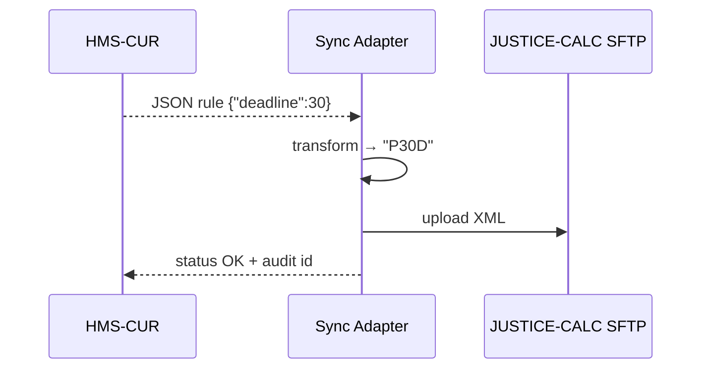

# Chapter 11: External System Sync Adapter  
*(part of the HMS-CUR tutorial series)*  

[⬅ Back to Chapter 10: Microservices Architecture Mesh](10_microservices_architecture_mesh_.md)

---

## 0. Why Do We Need a “Bilingual Messenger”?

Picture Ruth, a state conciliator who schedules **court-ordered mediations** in a 1995 COBOL program called *JUSTICE-CALC*.  
Yesterday Congress approved a rule that *all divorce cases must be mediated within 30 days*. HMS-CUR already knows the rule (thanks to [Policy / Process Module](07_policy___process_module_.md)), but *JUSTICE-CALC* is still clueless.

Without help Ruth would:

1. Export a CSV from HMS-CUR.  
2. Re-enter each date into the COBOL screen—field by field.  
3. Repeat for 89 other counties. 🙀  

The **External System Sync Adapter (ESSA)** is our *instant messenger* that speaks **modern JSON APIs on one side** and **ancient flat-file or vendor XML on the other**, pushing the 30-day deadline everywhere in seconds—no manual typing needed.

---

## 1. Key Concepts (Cargo-Train Analogy)

| Rail Yard Analogy            | ESSA Term         | One-Line Beginner Explanation                                                      |
|------------------------------|-------------------|------------------------------------------------------------------------------------|
| Loading dock                 | **Connector**     | Opens the door to an external system (FTP, SOAP, JDBC…).                           |
| Fork-lift                    | **Transformer**   | Converts HMS JSON ↔ legacy XML/CSV.                                                |
| Train schedule board         | **Scheduler**     | Decides *when* to push or pull data (cron, webhook, real-time).                    |
| Seal on each container       | **Delta Tracker** | Records what changed so we don’t resend the whole train each run.                  |
| “Lost cargo” claim office    | **Error Queue**   | Stores failed sync jobs for retries & auditing.                                    |

Stick these five in your pocket; everything else is plumbing.

---

## 2. A 5-Minute “Hello, Legacy!” Walk-Through

Goal: push the new 30-day mediation rule to *JUSTICE-CALC* (which only accepts a nightly **XML** file dropped on an SFTP server).

### 2.1 Create a Tiny Mapping File (8 lines)

`mappings/mediation_deadline.yml`
```yaml
source: /policies/divorce_mediation.deadline
target_xml_path: "/rule-set/mediation/deadline"
transform: "days_to_date_string"   # 30 -> "P30D"
```
*Explanation* – tells ESSA “take this field from HMS, convert it, insert here in XML.”

### 2.2 One-Off Push Job From the CLI (17 lines)

```bash
$ essa push mediation_deadline.yml \
      --connector sftp://justice-calc.example.com/inbox \
      --mode overwrite
```
What happens:

1. Reads current value `30`.  
2. Runs transformer → `"P30D"`.  
3. Merges into last-night’s XML template.  
4. Uploads `rules_2024-03-20.xml` via SFTP.  
5. Writes success entry to audit log.

### 2.3 What Ruth Sees Tomorrow

At 06:00 her COBOL screen shows:  
```
Mediation Deadline: P30D
```
No CSVs, no typing—done!

---

## 3. How It Works Under the Hood


Only four arrows—easy to reason about.

---

## 4. Inside the Code (All ≤ 20 Lines)

Project tree (ESSA parts only):
```
essa/
 ├─ main.py
 ├─ connectors/
 │   └─ sftp.py
 ├─ transformers.py
 ├─ delta.py
 └─ queue.py
```

### 4.1 The Heartbeat (main.py – 18 lines)

```python
import yaml, connectors.sftp as sftp, transformers, delta, queue

def push(map_path):
    m = yaml.safe_load(open(map_path))
    # 1. fetch new value
    json_val = get_from_hms(m["source"])      # stub
    # 2. check delta
    if not delta.is_new(m["source"], json_val): return
    # 3. transform
    xml_val = getattr(transformers, m["transform"])(json_val)
    # 4. apply to template
    xml_doc = load_xml_template()
    xml_doc.find(m["target_xml_path"]).text = xml_val
    # 5. send
    sftp.put(xml_doc.tostring(), m["target"])
    delta.save(m["source"], json_val)
```
*Explanation* – Five clearly-labeled steps: fetch, skip if no change, transform, merge, send.

### 4.2 A Connector (sftp.py – 12 lines)

```python
import paramiko, os, io, datetime

def put(data:str, remote_dir:str):
    host = os.environ["SFTP_HOST"]; user = os.environ["SFTP_USER"]; pw = os.environ["SFTP_PW"]
    with paramiko.Transport((host,22)) as t:
        t.connect(username=user, password=pw)
        sftp = paramiko.SFTPClient.from_transport(t)
        fname = f"rules_{datetime.date.today()}.xml"
        sftp.putfo(io.BytesIO(data.encode()), f"{remote_dir}/{fname}")
```
*Explanation* – Opens SFTP, uploads the XML as today’s filename.

### 4.3 Transformer Example (transformers.py – 6 lines)

```python
def days_to_date_string(days:int)->str:
    return f"P{days}D"   # ISO-8601 duration, e.g., 30 → “P30D”
```

### 4.4 Delta Tracker (delta.py – 10 lines)

```python
import json, pathlib, hashlib
DB = pathlib.Path("essa_delta.json")

def is_new(key, value):
    prev = json.loads(DB.read_text()) if DB.exists() else {}
    return hashlib.md5(str(value).encode()).hexdigest() != prev.get(key)

def save(key, value):
    prev = json.loads(DB.read_text()) if DB.exists() else {}
    prev[key] = hashlib.md5(str(value).encode()).hexdigest()
    DB.write_text(json.dumps(prev))
```
*Explanation* – Stores an MD5 hash per field; if unchanged, skips upload.

---

## 5. Scheduling Continuous Syncs

Add a row to ESSA’s cron table (text file):

```
0 2 * * *  push mappings/*.yml --connector sftp://justice-calc/inbox
```

Every night at 02:00 all mapping files are pushed.  
For *near-real-time* scenarios, replace cron with a webhook listener:

```bash
essa listen --source hms://policy-change --run "push %file%"
```

---

## 6. Error Handling & Auditing

1. If `put()` throws, ESSA writes the job + stack trace to `queue/errors/2024-03-20T02:00.json`.  
2. A retry worker inspects error files every hour.  
3. A clerk can view a simple dashboard (`essa errors`) showing *job id*, *retry count*, *last error*.

Auditors can replay the entire history via the XML + stored deltas—no mysteries.

---

## 7. FAQ

**Q: “Our legacy system only reads fixed-width text, not XML.”**  
Add a new transformer like `json_to_fixed()` and switch `target_format` in the mapping. No change to connectors.

**Q: “What if both sides edit the same record?”**  
Set `mode: bidirectional` + choose a **source-of-truth** strategy (`timestamp_wins` or `hms_wins`). ESSA marks conflicts in the error queue for manual review.

**Q: “Is ESSA a heavy ESB?”**  
No—think of it as **100-line adapters** plus cron. Perfect for agencies that can’t install enterprise middleware.

---

## 8. Recap

You learned how the **External System Sync Adapter**:

✓ Connects HMS-CUR to dusty mainframes or vendor suites without rewriting them.  
✓ Uses *Connectors → Transformers → Scheduler → Delta Tracker* to sync only what changed.  
✓ Provides clear error queues and audit logs so no data vanishes in the night.  
✓ Can be prototyped in under 100 lines of Python.

Ready to organize all this data into a single, queryable brain?  
Jump ahead to [Data Management & Knowledge Graph](12_data_management___knowledge_graph_.md).

---

Generated by [AI Codebase Knowledge Builder](https://github.com/The-Pocket/Tutorial-Codebase-Knowledge)